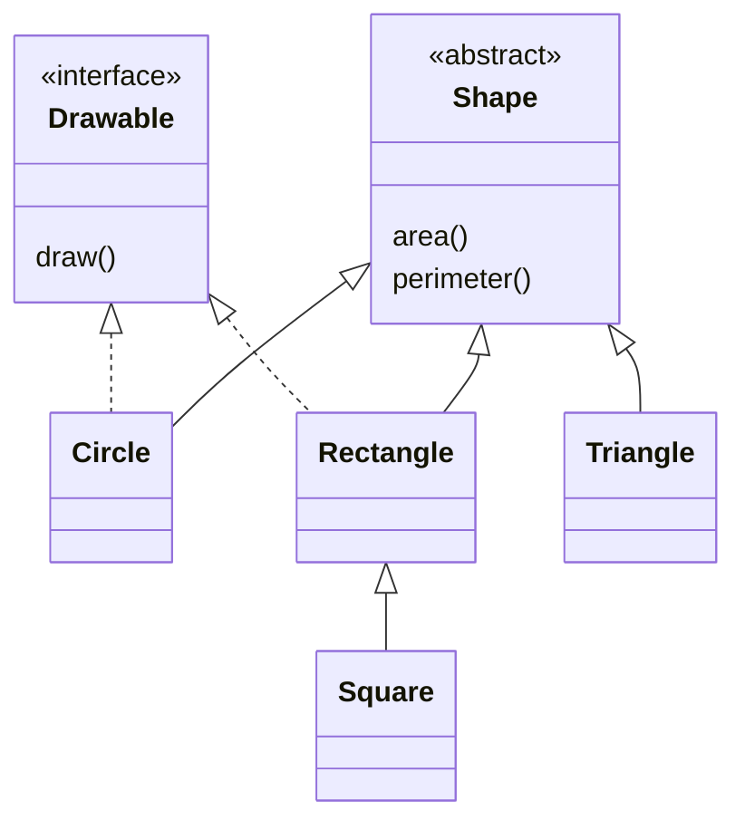

# Абстрактні класи

## Абстрактний клас і завершена ієрархія

`abstract class` не можна створити безпосередньо. Він може мати конструктор, стан, завершені методи та абстрактні члени без реалізації. Конкретний підклас зобов’язаний реалізувати всі успадковані абстрактні члени. Для абстрактного члена додатковий `open` не потрібний.

Контракт Shape вимагає скінченних додатних розмірів. Властивості розмірів у прикладі не змінюються. Тому Square може бути окремим способом створити Rectangle з рівними сторонами. Якби Rectangle обіцяв незалежну зміну width і height, такий Square міг би порушити цю обіцянку. Наслідування оцінюють за операціями й інваріантами, а не лише за формулою.



Рис. 6.2. Ієрархія незмінних фігур та інтерфейс малювання {.caption}

### Приклад 2. Фігури та поліморфний звіт

Для стислості трикутник задається трьома сторонами. Верхня межа сторін забезпечує безпечні проміжні обчислення. `Drawable` повертає текстовий опис, а не створює графічне вікно. Це інший контракт, який можуть реалізувати різні фігури.

```kotlin
import kotlin.math.PI
import kotlin.math.sqrt
import java.util.Locale

interface Drawable {
    fun draw(): String
}

abstract class Shape {
    abstract fun area(): Double
    abstract fun perimeter(): Double
}

fun positive(value: Double): Double {
    require(value.isFinite() && value in 0.001..10000.0)
    return value
}

class Circle(radius: Double) : Shape(), Drawable {
    private val radius = positive(radius)
    override fun area(): Double = PI * radius * radius
    override fun perimeter(): Double = 2 * PI * radius
    override fun draw(): String = "Circle"
}

open class Rectangle(width: Double, height: Double) :
    Shape(), Drawable {
    private val width = positive(width)
    private val height = positive(height)
    override fun area(): Double = width * height
    override fun perimeter(): Double = 2 * (width + height)
    override fun draw(): String = "Rectangle"
}

class Square(side: Double) : Rectangle(side, side)

class Triangle(a: Double, b: Double, c: Double) : Shape() {
    private val a = positive(a)
    private val b = positive(b)
    private val c = positive(c)
    init {
        require(a + b > c && a + c > b && b + c > a)
    }
    override fun perimeter(): Double = a + b + c
    override fun area(): Double {
        val s = perimeter() / 2
        return sqrt(s * (s - a) * (s - b) * (s - c))
    }
}

fun main() {
    val shapes: Array<Shape> = arrayOf(
        Circle(1.0), Rectangle(3.0, 4.0),
        Square(2.0), Triangle(3.0, 4.0, 5.0)
    )
    for (shape in shapes) {
        println(String.format(
            Locale.ROOT, "%.2f %.2f",
            shape.area(), shape.perimeter()
        ))
    }
}
```

```text
3.14 6.28
12.00 14.00
4.00 8.00
6.00 12.00
```

`Locale.ROOT` робить демонстраційний десятковий роздільник незалежним від налаштувань комп’ютера. Алгоритм обходу не містить `when` за типами фігур. Додаткова фігура повинна реалізувати контракт, а цикл звіту залишиться тим самим. При цьому перевірки коректності розмірів залишаються в моделі.

::: info Знімок екрана
Inside a Shape subclass use Ctrl+O; inspect Override Members. Abstract members may be offered through Implement Members.
:::

Рис. 6.3. Вибір членів для перевизначення {.caption}
