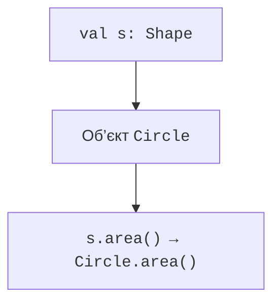

# Спільний тип і відкриті класи

## Навіщо програмі спільний тип

Нехай програма має показати площі кола, прямокутника та трикутника. Формули відрізняються, але клієнт хоче виконати однакову дію: отримати площу. Якби клієнт сам перевіряв усі назви фігур, кожне додавання нового типу змушувало б змінювати його код. Спільний контракт `Shape` переносить формулу до об’єкта, який знає свої розміри.

**Поліморфізм** – можливість працювати через спільний тип, отримуючи поведінку конкретного об’єкта. **Наслідування** створює відношення підтипу й дозволяє використати реалізацію базового класу. Це пов’язані, але не тотожні поняття: поліморфізм можливий через інтерфейс без спільного стану. <https://kotlinlang.org/docs/inheritance.html>.

Відношення «є різновидом» необхідне, але недостатнє. Підтип повинен виконувати обіцянки базового контракту. Якщо базова операція приймає будь-яку додатну відстань, підтип не має довільно відхиляти частину таких відстаней. Якщо обіцяно невід’ємну площу, підтип не може повернути від’ємне число лише тому, що формально метод скомпілювався.

Для кількох об’єктів у цій темі використовуємо `arrayOf`: вона створює масив із заданих елементів; цикл `for` послідовно обходить їх. Повний курс колекцій буде в темі 10. Тут важливо, що масив може мати тип `Array<Shape>`, хоча його елементи створені різними конструкторами.

## Класи закриті за замовчуванням

Звичайний Kotlin-клас є `final`: наслідувати його не можна, поки автор не додасть `open` або `abstract`. Методи класу також не перевизначаються автоматично. Така вимога змушує автора позначити точки розширення та визначити їхній контракт. Не додавайте `open` до кожного класу «про запас».

Після двокрапки похідний клас указує базовий тип і викликає його конструктор. Аргументи обчислюються до ініціалізації базового стану. Власні властивості похідного класу з’являються пізніше. Операція створення одного похідного екземпляра не створює два незалежні об’єкти «батька» й «нащадка».

`override` є обов’язковим маркером перевизначення. Він допомагає компілятору виявити друкарську помилку в імені або сигнатурі. Перевизначений член залишається відкритим для наступних підкласів, якщо не написати `final override`. `super.method()` викликає реалізацію базового класу, а `this.method()` використовує звичайне динамічне зв’язування.

### Приклад 1. Працівник і премія

Похідний клас використовує перевірений базовий оклад і додає премію. Навчальні суми подано цілими копійками; межі не дають переповнити `Long`. Ні базовий конструктор, ні `init` не викликають відкритий метод `pay`.

```kotlin
open class Employee(val name: String, private val base: Long) {
    init {
        require(name.isNotBlank())
        require(base in 0..100_000_000L)
    }

    open fun pay(): Long = base
    open fun describe(): String = "$name: ${pay()}"
}

class BonusEmployee(
    name: String,
    base: Long,
    private val bonus: Long
) : Employee(name, base) {
    init {
        require(bonus in 0..100_000_000L)
    }

    final override fun pay(): Long = super.pay() + bonus
    override fun describe(): String = "Bonus ${super.describe()}"
}

fun main() {
    val staff: Array<Employee> = arrayOf(
        Employee("Olena", 10000),
        BonusEmployee("Taras", 10000, 2500)
    )
    var total = 0L
    for (employee in staff) {
        println(employee.describe())
        total += employee.pay()
    }
    println("total=$total")
}
```

```text
Olena: 10000
Bonus Taras: 12500
total=22500
```

Зверніть увагу: `super.describe()` виконує базове тіло, але виклик `pay()` усередині нього все одно поліморфний. Тому результат для Taras включає премію. `super` вибирає конкретний виклик, а не вимикає поліморфізм для всіх подальших дій цього об’єкта.

## Динамічне зв’язування

Статичний тип змінної визначає, які члени дозволено викликати в коді. Фактичний тип об’єкта визначає, яке перевизначення відкритого методу виконається. Змінна `Shape` дозволяє викликати `area`, навіть якщо конкретним об’єктом є `Circle`. Водночас вона не відкриває специфічні методи кола, яких немає в контракті Shape.



Рис. 6.1. Статичний тип і фактичне виконання методу {.caption}

Наявність поліморфізму не означає, що будь-який метод вибирається динамічно. Зокрема, функції-розширення з теми 3 визначаються за статичним типом отримувача. Вони не вставляють новий віртуальний член усередину класу. Це важливо при виборі між справжнім методом контракту та допоміжним розширенням.
