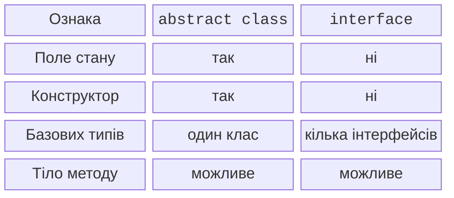
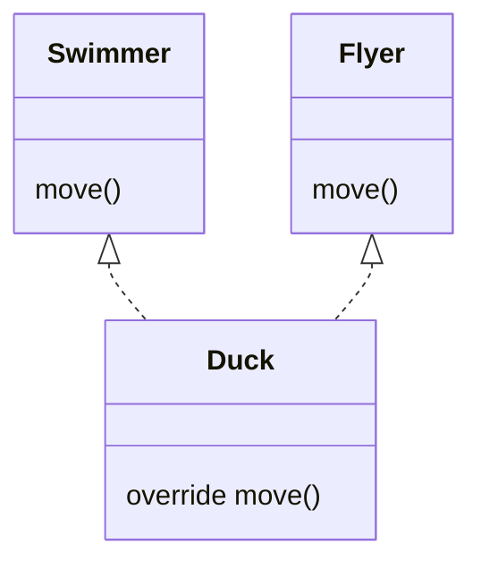

# Інтерфейси та конфлікти реалізацій

## Інтерфейс: можливість без спільного поля

Інтерфейс описує операції, які клієнт може вимагати від об’єкта. Клас може реалізувати кілька інтерфейсів, але має лише один безпосередній базовий клас. Інтерфейс не має конструктора екземпляра й поля збереження властивості. Він може оголосити властивість абстрактно або дати геттер, що обчислює значення. <https://kotlinlang.org/docs/interfaces.html>.

Властивість `val` в інтерфейсі обіцяє читання; реалізація може мати `var`, бо додавання запису не руйнує це читання. Натомість вимогу `var` не можна виконати лише `val`: клієнт контракту очікує також запис. Видимість перевизначення не можна довільно звузити, позбавивши клієнта обіцяного доступу.

Метод із тілом у інтерфейсі дає стандартну поведінку. Вона не зобов’язує кожен клас дублювати однакові рядки. Проте реалізація повинна спиратися лише на контрактні члени, а не припускати існування конкретного приватного поля. Для спільного стану та контрольованого алгоритму іноді доречніший абстрактний клас.



Рис. 6.4. Абстрактний клас і інтерфейс {.caption}

### Приклад 3. Пристрій із двома можливостями

```kotlin
interface Switchable {
    val isOn: Boolean
    fun switchOn()
    fun switchOff()
    fun status(): String = if (isOn) "on" else "off"
}

interface Chargeable {
    val charge: Int
    fun recharge(points: Int)
    fun chargeStatus(): String = "$charge%"
}

class Lamp : Switchable, Chargeable {
    override var isOn = false
        private set
    override var charge = 20
        private set

    override fun switchOn() {
        check(charge > 0) { "Empty battery" }
        isOn = true
    }
    override fun switchOff() { isOn = false }
    override fun recharge(points: Int) {
        require(points in 1..100 - charge)
        charge += points
    }
}

fun main() {
    val lamp = Lamp()
    val control: Switchable = lamp
    val battery: Chargeable = lamp
    control.switchOn()
    battery.recharge(30)
    println("${control.status()}; ${battery.chargeStatus()}")
    control.switchOff()
    println(control.status())
}
```

```text
on; 50%
off
```

Два посилання мають різні статичні типи, але вказують на один Lamp. Клієнт Switchable не бачить recharge, хоча об’єкт фізично його підтримує. Це корисне обмеження: компонент отримує лише можливості, необхідні його роботі.

## Конфлікт стандартних реалізацій

Якщо два інтерфейси дають однойменний метод, Kotlin не вгадує намір автора. Клас явно перевизначає метод і вибирає потрібну поведінку. Кваліфікований виклик `super<A>.method()` вказує конкретну базову реалізацію. Не плутайте його з приведенням типу: це спосіб вибрати тіло методу.



Рис. 6.5. Явне розв’язання конфлікту інтерфейсів {.caption}

### Приклад 4. Качка, що плаває і літає

```kotlin
interface Swimmer {
    fun move(): String = "swim"
}

interface Flyer {
    fun move(): String = "fly"
}

class Duck : Swimmer, Flyer {
    override fun move(): String =
        super<Swimmer>.move() + " then " + super<Flyer>.move()
}

fun main() {
    val duck = Duck()
    val swimmer: Swimmer = duck
    val flyer: Flyer = duck
    println(duck.move())
    println(swimmer.move())
    println(flyer.move())
}
```

```text
swim then fly
swim then fly
swim then fly
```

Усі звичайні виклики потрапляють до Duck.move незалежно від статичного типу посилання. Приведення до Swimmer не примушує викликати початкове стандартне тіло. Вибір `super` зроблено всередині самого перевизначення.
