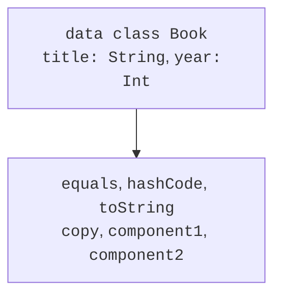
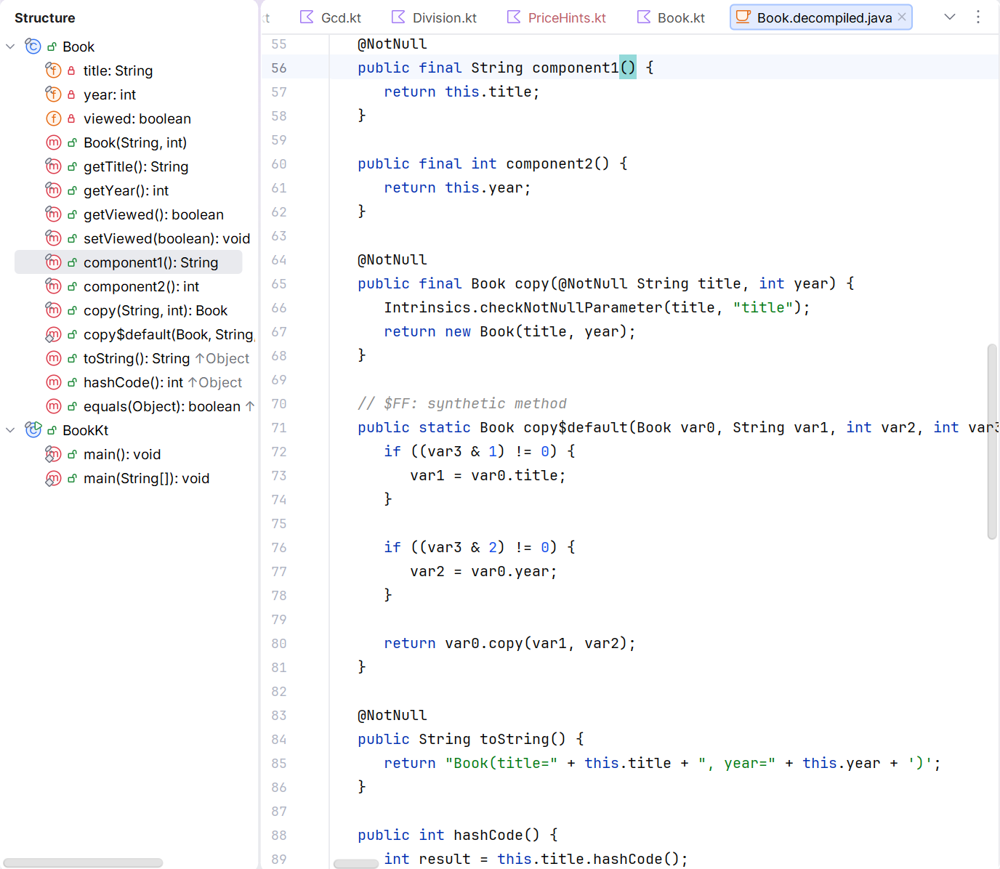

# Класи даних і копіювання

## Обираємо форму моделі за її змістом

Попередні теми дали загальний клас і засоби наслідування. Проте не кожна модель потребує ручного equals, довільної ієрархії або необмеженої кількості екземплярів. Книга з назвою та роком є структурованим значенням; день тижня належить фіксованому набору; результат операції може мати різні дані для успіху й відмови. Kotlin має окремі засоби для цих випадків.

Правильна форма типу зменшує кількість неправильних станів, які взагалі можна створити. Замість трьох nullable-полів `amount`, `trackNo`, `error` можна визначити окремі варіанти стану. Тоді компілятор допомагає перевіряти обробку, а не залишає весь контроль умовам у різних частинах програми.

Не вибирайте `data`, `sealed` або `object` лише заради короткого запису. Кожне слово змінює контракт типу: рівність, можливість створення, спосіб розширення чи доступ до стану. Спочатку визначте зміст, потім синтаксис.

## Клас даних та згенеровані операції

`data class` призначений для носія даних. Первинний конструктор повинен мати хоча б один параметр, і всі його параметри позначаються `val` або `var`. Data-клас не може бути abstract, open, sealed або inner. Він може реалізувати інтерфейс. Офіційна документація: <https://kotlinlang.org/docs/data-classes.html>.

Компілятор генерує equals і hashCode за властивостями первинного конструктора, зрозумілий toString, функцію copy та componentN для деструктуризації. Якщо клас явно визначає деякі допустимі методи, правила генерації враховують ці оголошення; власні copy і componentN для data-класу оголошувати не можна.



Рис. 7.1. Члени data-класу, похідні від первинного конструктора {.caption}

Властивості в тілі класу не беруть участі у згенерованій рівності, хеші, копіюванні й деструктуризації. Це може бути корисним для похідного кешу, але небезпечним для змістовних даних. Якщо рік видання визначає значення Book, він має бути параметром первинного конструктора, а не прихованою var у тілі.

### Приклад 1. Книги, копіювання та деструктуризація

Поля основного запису лише для читання. Copy створює інший екземпляр із частиною змінених параметрів. Ознака viewed свідомо винесена в тіло, щоб показати межу генерації; у реальній моделі стан перегляду часто належить окремому користувачеві.

```kotlin
data class Book(val title: String, val year: Int) {
    var viewed: Boolean = false

    init {
        require(title.isNotBlank())
        require(year in 1450..2100)
    }
}

fun main() {
    val first = Book("Kotlin notes", 2025)
    first.viewed = true
    val same = Book("Kotlin notes", 2025)
    val revised = first.copy(year = 2026)
    val (title, year) = revised
    println(first)
    println("equal=${first == same}")
    println("identity=${first === same}")
    println("$title / $year")
    println("viewed=${revised.viewed}")
    println("hash equal=${first.hashCode() == same.hashCode()}")
}
```

```text
Book(title=Kotlin notes, year=2025)
equal=true
identity=false
Kotlin notes / 2026
viewed=false
hash equal=true
```

Результат viewed=false не є глибоким копіюванням або помилкою компілятора: ця властивість не входить у параметри copy і отримує свій звичайний ініціалізатор нового екземпляра. Рівність першої та другої книг не враховує різницю viewed. Таке рішення має бути усвідомленим і відображеним у тестах.

Деструктуризація `val (title, year)` викликає component1 і component2 у порядку конструктора. Імена локальних змінних можуть бути іншими; зв’язування позиційне, а не за іменами. Підкреслення `_` дозволяє пропустити компонент. Не змінюйте порядок параметрів публічного типу без оцінки клієнтів.

Pair і Triple є готовими малими носіями значень. Вони зручні для локального повернення двох-трьох результатів, але поля first, second, third погано пояснюють предметний зміст. Для публічного API зазвичай ясніше Point(x,y) або ParseResult(value,position), ніж вкладені пари.



Рис. 7.2. Згенеровані члени класу даних {.caption}

## Незмінність і поверхневе копіювання

`val` закриває переприсвоєння властивості, але не гарантує незмінності об’єкта, на який вона посилається. Copy є **поверхневим**: посилання на вкладені об’єкти копіюються, а самі вкладені об’єкти автоматично не клонуються. Незмінний зовнішній запис зі змінним внутрішнім контейнером може змінюватися через інший шлях доступу.

Наступний приклад використовує звичайний змінний об’єкт Address, тому не потребує матеріалу колекцій. Два Customer після copy посилаються на ту саму адресу. Окреме створення Address дає незалежний стан лише для цього рівня вкладення.

```kotlin
class Address(var city: String)
data class Customer(val name: String, val address: Address)

fun main() {
    val original = Customer("Olena", Address("London"))
    val shared = original.copy(name = "Taras")
    shared.address.city = "Madrid"
    println(original.address.city)
    println(original.address === shared.address)
    val independent = original.copy(
        address = Address(original.address.city)
    )
    independent.address.city = "Paris"
    println(original.address.city)
    println(independent.address.city)
}
```

```text
Madrid
true
Madrid
Paris
```

Повна глибока копія потребує правил для всього графа об’єктів: що робити зі спільними посиланнями, циклами та ресурсами. Часто простіше зробити вкладені значення незмінними й замінювати їх новими значеннями. Copy тоді зручно виражає зміну стану без неочікуваного впливу на стару версію.

Змінні властивості первинного конструктора data-класу впливають на equals і hashCode. Не змінюйте їх, поки об’єкт є ключем словника або елементом множини. Компілятор дозволяє такий код, але алгоритм пошуку розраховує на стабільність ключа. Для ідентифікаторів краще незмінні значення.
