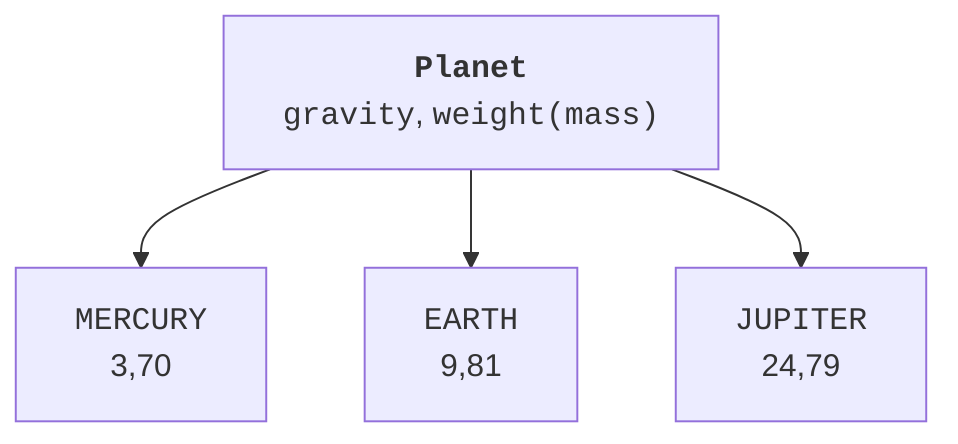
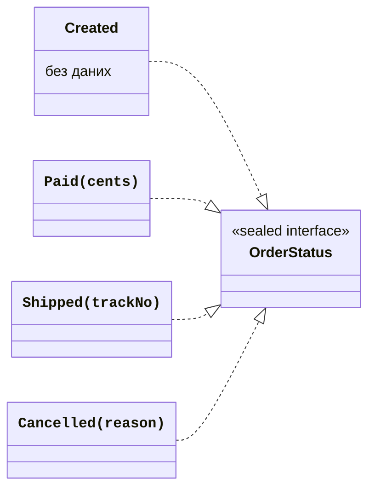

# Переліки та sealed-ієрархії

## Перелік: фіксований набір констант

`enum class` описує скінченний іменований набір екземплярів. Кожна константа є об’єктом цього типу й може мати власні аргументи конструктора. Поле name повертає оголошене ім’я, ordinal – позицію від нуля, entries – список усіх констант у порядку оголошення. <https://kotlinlang.org/docs/enum-classes.html>.

Ordinal не є стабільним ідентифікатором предметної області: вставка нового елемента змінює позиції наступних. Для збереження або обміну введіть явний code, наприклад "UAH", або явно зафіксуйте формат name. Не обчислюйте навчальну оцінку через арифметику над ordinal.

`valueOf` шукає точне ім’я константи та породжує IllegalArgumentException для невідомого рядка. Регістр має значення. Перетворення введення через uppercase є рішенням інтерфейсу, а не поведінкою самого valueOf. Для контрольованого вводу можна перебрати entries й явно повернути відсутність.



Рис. 7.3. Один тип і кілька фіксованих екземплярів {.caption}

### Приклад 2. Планети та вага

Навчальна модель зберігає прискорення вільного падіння для трьох планет. Маса тіла однакова, а сила ваги змінюється за формулою F=m×g. Значення g наближені й явно задані, тому результат відтворюваний без зовнішніх джерел даних.

```kotlin
import java.util.Locale

enum class Planet(val gravity: Double) {
    MERCURY(3.70), EARTH(9.81), JUPITER(24.79);

    fun weight(massKg: Double): Double {
        require(massKg.isFinite() && massKg in 0.0..10000.0)
        return massKg * gravity
    }
}

fun category(planet: Planet): String = when (planet) {
    Planet.MERCURY, Planet.EARTH -> "rocky"
    Planet.JUPITER -> "gas giant"
}

fun main() {
    for (planet in Planet.entries) {
        val value = String.format(
            Locale.ROOT, "%.2f", planet.weight(10.0)
        )
        println("${planet.name}: $value N, ${category(planet)}")
    }
    println(Planet.valueOf("EARTH") == Planet.EARTH)
    try {
        Planet.valueOf("Earth")
    } catch (e: IllegalArgumentException) {
        println("Unknown planet")
    }
}
```

```text
MERCURY: 37.00 N, rocky
EARTH: 98.10 N, rocky
JUPITER: 247.90 N, gas giant
true
Unknown planet
```

Коли when є виразом і має повернути значення, компілятор вимагає вичерпності. Для enum можна перелічити всі константи без else. Додавання нової константи тоді змусить переглянути обробку. Загальний else приховав би цю вимогу, повернувши стару «типову» відповідь для нового змісту.

Enum може реалізувати інтерфейс. Константи можуть мати власні тіла й реалізувати абстрактний метод переліку, наприклад операцію арифметичного калькулятора. Не використовуйте enum там, де кількість екземплярів визначає користувач під час роботи: кожен конкретний товар не є новою константою типу.

## Sealed-ієрархія та дані різних варіантів

Enum добре описує набір однаково влаштованих констант. Але стан Paid має суму, Shipped – номер відстеження, Cancelled – причину, а Created може не мати додаткових даних. `sealed class` або `sealed interface` дозволяє закритий набір варіантів із різними структурами. <https://kotlinlang.org/docs/sealed-classes.html>.

Безпосередні підтипи sealed-типу оголошуються в тому самому пакеті й модулі; вони повинні мати належні імена, тому локальні та анонімні прямі підтипи не підходять. У Multiplatform є додаткові правила наборів джерел, які розглядатимуться окремо. Для цього JVM-курсу всі варіанти моделі тримаємо разом.

Sealed обмежує безпосередні підтипи. Якщо один із них є відкритим звичайним класом, його нащадки можуть утворити ширше дерево. Тому «закритість» слід читати уважно й не відкривати проміжні вузли без потреби.



Рис. 7.4. Стани замовлення з різними наборами даних {.caption}

### Приклад 3. Стан замовлення

Created є єдиним значенням без даних, тому це data object. Інші стани є data-класами з перевіреними параметрами. Функція describe обробляє всі варіанти й використовує smart cast для доступу до відповідних властивостей.

```kotlin
sealed interface OrderStatus

data object Created : OrderStatus

data class Paid(val cents: Long) : OrderStatus {
    init { require(cents > 0) }
}

data class Shipped(val trackNo: String) : OrderStatus {
    init { require(trackNo.isNotBlank()) }
}

data class Cancelled(val reason: String) : OrderStatus {
    init { require(reason.isNotBlank()) }
}

fun describe(status: OrderStatus): String = when (status) {
    Created -> "created"
    is Paid -> "paid ${status.cents} kop"
    is Shipped -> "shipped ${status.trackNo}"
    is Cancelled -> "cancelled: ${status.reason}"
}

fun ship(status: OrderStatus, track: String): OrderStatus {
    require(status is Paid) { "Payment required" }
    return Shipped(track)
}

fun main() {
    val paid: OrderStatus = Paid(12500)
    val shipped = ship(paid, "STUDY-001")
    for (state in arrayOf(Created, paid, shipped)) {
        println(describe(state))
    }
    try {
        ship(Created, "STUDY-002")
    } catch (e: IllegalArgumentException) {
        println(e.message)
    }
    println(describe(paid))
}
```

```text
created
paid 12500 kop
shipped STUDY-001
Payment required
paid 12500 kop
```

Новий стан повертається як значення, старий Paid не змінюється. Sealed-ієрархія сама не визначає дозволені переходи: для цього потрібні функції на кшталт ship. Компілятор перевіряє набір варіантів у when, а правильність послідовності дій визначає предметний контракт і його перевірки.

Для очікуваної відмови можна повертати власний sealed-результат із Success і Failure замість винятку. Стандартний Result із теми 4 має інший контракт: успішне значення або Throwable. Не називайте власну ієрархію так само без пояснення, щоб не плутати два різні типи в імпортах і читанні коду.

::: info Знімок екрана
In a scratch copy remove Cancelled branch; show non-exhaustive when diagnostic and Add remaining branches. Restore before running.
:::

Рис. 7.5. Перевірка повноти обробки станів {.caption}
