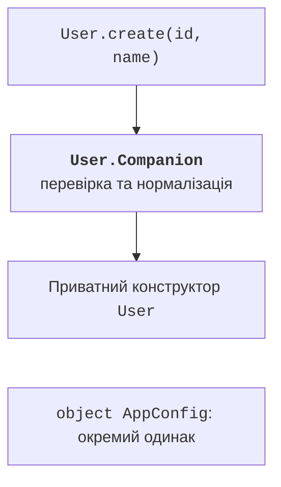

# Об’єкти-одинаки та компаньйони

## Object: один доступний екземпляр

Оголошення object одночасно визначає тип і його іменований єдиний екземпляр. Звернення має вигляд AppConfig.mode, без виклику конструктора. Ініціалізація оголошення object відбувається при першому доступі й є потокобезпечною. Це не означає, що подальші зміни його var автоматично безпечні для кількох потоків. <https://kotlinlang.org/docs/object-declarations.html>.

Глобальний змінний object створює приховану залежність. Тест, який змінив конфігурацію, може вплинути на наступний тест. Для сервісу зі станом часто краще звичайний клас, переданий через конструктор. Object доречний для незмінної політики, фіксованого маркера стану або справді спільного ресурсу з чітким життєвим циклом.

Data object надає узгоджені equals, hashCode і читабельний toString для варіанта без даних. У sealed-ієрархії це робить його симетричним до data-класів інших станів. Порівнюйте такі значення через `==`, а не будуйте логіку на `===`. Data object не має copy і componentN, бо не має набору параметрів, який потрібно копіювати чи розкладати.

## Companion object і фабричний метод

Companion object належить оголошенню класу, а не кожному екземпляру. Його члени доступні через ім’я класу. На JVM це об’єкт-компаньйон, а не просто набір статичних Java-методів. Він може реалізувати інтерфейс. Анотація `@JvmStatic` додає зручний статичний міст для Java за потреби інтеграції.

Фабрика з приватним конструктором контролює спосіб створення: може нормалізувати введення, перевірити дані й повернути придатний об’єкт. Назва create, parse або fromText пояснює намір краще за складний конструктор із багатьма прапорцями. `const val` задає константу часу компіляції для придатного простого типу; довільний об’єкт так оголосити не можна.



Рис. 7.6. Фабрика класу та окремий об’єкт конфігурації {.caption}

### Приклад 4. Типобезпечний ідентифікатор користувача

UserId обгортає Long, щоб не переплутати його з іншою сумою або номером. Фабрика не генерує випадкових чи глобальних ID: ідентифікатор явно передає клієнт, тому результат простіше перевіряти. Лічильник як object наведено в лабораторії.

```kotlin
@JvmInline
value class UserId(val value: Long) {
    init { require(value > 0) }
}

class User private constructor(
    val id: UserId,
    val name: String
) {
    companion object {
        const val MAX_NAME = 40
        fun create(id: UserId, rawName: String): User {
            val name = rawName.trim()
            require(name.isNotEmpty() && name.length <= MAX_NAME)
            return User(id, name)
        }
    }

    override fun toString(): String = "${id.value}: $name"
}

object AppConfig {
    const val TITLE = "Study users"
}

fun main() {
    println(AppConfig.TITLE)
    val user = User.create(UserId(7), "  Olena  ")
    println(user)
    try {
        User.create(UserId(8), "   ")
    } catch (e: IllegalArgumentException) {
        println("Invalid name")
    }
}
```

```text
Study users
7: Olena
Invalid name
```

Value class має одну властивість у первинному конструкторі та може мати методи, обчислювані властивості й init. На JVM потрібна анотація `@JvmInline`. Тип є окремим на рівні Kotlin, на відміну від typealias, який лише дає друге ім’я тому самому типу. Деталі представлення: <https://kotlinlang.org/docs/inline-classes.html>.

Не обіцяйте, що value class ніколи не створює обгортку. Використання як nullable, через узагальнений тип або інтерфейс може потребувати boxing. Перевага для моделі – типобезпечність, а конкретну продуктивність перевіряють вимірюванням. Для value-класів ідентичність посилань не є змістовною операцією.

::: info Знімок екрана
Open User source and Structure (Alt+7); expand Companion with MAX\_NAME and create.
:::

Рис. 7.7. Фабрика й властивості у структурі класу {.caption}

## Анонімний об’єкт як локальна реалізація

Вираз `object : Interface { ... }` створює анонімний об’єкт у місці виконання. На відміну від іменованого object, повторне виконання виразу створює новий екземпляр. Такий запис зручний для короткої локальної реалізації інтерфейсу, коли окрема назва класу не додає ясності.

```kotlin
interface Message {
    fun text(): String
}

fun createMessage(prefix: String): Message = object : Message {
    override fun text(): String = "$prefix: ready"
}

fun main() {
    val first = createMessage("A")
    val second = createMessage("A")
    println(first.text())
    println(first === second)
}
```

```text
A: ready
false
```

Зовнішній контракт функції тут Message. Додаткові члени анонімного об’єкта не стають автоматично доступними клієнту публічної функції. Якщо клієнту потрібні такі дані, оголосіть іменований тип або розширте контракт. Не змушуйте користувача здогадуватися про приховану форму результату.
