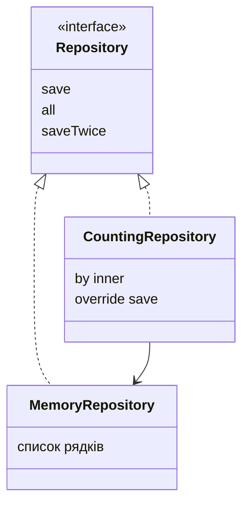

# provideDelegate і делегування класів

## ProvideDelegate: перевірка під час зв’язування

Зазвичай делегат створюється під час ініціалізації власника, а getValue викликається при читанні. Оператор provideDelegate дозволяє перевірити саме зв’язування властивості та створити об’єкт, який обслуговуватиме доступ. Наприклад, конфігураційний ключ можна перевірити один раз до першого читання.

```kotlin
import kotlin.properties.ReadOnlyProperty
import kotlin.reflect.KProperty

class RequiredText(private val values: Map<String, String>) {
    operator fun provideDelegate(
        owner: Any?, property: KProperty<*>
    ): ReadOnlyProperty<Any?, String> {
        val text = values[property.name]
        require(!text.isNullOrBlank()) { "Missing ${property.name}" }
        return ReadOnlyProperty { _, _ -> text }
    }
}

class Config(values: Map<String, String>) {
    val title: String by RequiredText(values)
}

fun main() {
    val config = Config(mapOf("title" to "Study"))
    println(config.title)
    try {
        Config(emptyMap())
    } catch (e: IllegalArgumentException) {
        println(e.message)
    }
}
```

```text
Study
Missing title
```

Обробник повертає перевірений текст і надалі не перечитує Map. Отже, контракт тут – знімок конфігурації при створенні. Інший делегат міг би читати карту щоразу; це інша семантика, яку потрібно явно описати. ProvideDelegate не замінює валідацію нових значень змінної властивості.

## Делегування реалізації інтерфейсу

Запис `class Wrapper(inner: Service) : Service by inner` генерує перенаправлення членів інтерфейсу до переданого об’єкта. Wrapper можна використовувати як Service, але він не наслідує конкретний клас реалізації. Це зручний спосіб композиції й побудови **декоратора**, що додає поведінку. <https://kotlinlang.org/docs/delegation.html>.

Окремий метод можна перевизначити в обгортці; тоді зовнішній виклик цього методу потрапляє до неї. Важлива межа: внутрішні виклики делегата виконуються на самому делегаті й не перенаправляються автоматично назад до wrapper-override. Не очікуйте, що делегування працює як віртуальне наслідування.



Рис. 8.6. Декоратор з явною залежністю від репозиторію {.caption}

### Приклад 4. Лічильний репозиторій

List тут використано як простий буфер: mutableListOf створює порожній змінний список, add додає елемент, toList повертає окрему копію списку для читання. Усі рядки незмінні, тому клієнт не отримує прямого доступу до внутрішнього контейнера.

```kotlin
interface Repository {
    fun save(text: String)
    fun all(): List<String>
    fun saveTwice(text: String) {
        save(text)
        save(text)
    }
}

class MemoryRepository : Repository {
    private val rows = mutableListOf<String>()
    override fun save(text: String) {
        require(text.isNotBlank())
        rows.add(text)
    }
    override fun all(): List<String> = rows.toList()
}

class CountingRepository(private val inner: Repository) :
    Repository by inner {
    var calls = 0
        private set
    override fun save(text: String) {
        inner.save(text)
        calls++
    }
}

fun main() {
    val repository = CountingRepository(MemoryRepository())
    repository.save("A")
    repository.saveTwice("B")
    println(repository.all())
    println("counted direct saves=${repository.calls}")
}
```

```text
[A, B, B]
counted direct saves=1
```

Результат 1 навмисний: saveTwice делегований внутрішньому репозиторію й викликає його save. Якщо контракт лічильника має рахувати всі збереження, перевизначте saveTwice так, щоб він викликав wrapper.save, або перенесіть облік у саме джерело даних. Назва лічильника повинна пояснювати, які події він насправді рахує.

Calls збільшується після успішного inner.save. Якщо збереження відхилено, лічильник успішних дій не змінюється. Для лічильника спроб порядок був би іншим. Це невелика, але важлива частина контракту декоратора, яку перевіряють окремим тестом відмови.

## Проєктування й перевірка делегування

Делегат властивості керує доступом до значення; делегування класу перенаправляє інтерфейс. Обидва використовують `by`, але мають різні ролі й методи. На UML покажіть власника, інтерфейс та делегований об’єкт, а в поясненні – момент створення і власника змінного стану.

Для оператора перевірте звичайний випадок, межу, недопустимий аргумент і незмінність операндів, якщо операція заявлена як створення нового значення. Для індексації додайте −1 та індекс після кінця. Для діапазону – порожній, одноелементний, повторний перебір і next після завершення.

Для lazy рахуйте виконання ініціалізатора при двох читаннях. Для observable перевірте момент повідомлення, для vetoable – збереження старого стану після false. Для власного делегата перевірте початкове значення й кожний шлях запису. Для декоратора порівняйте прямий виклик і внутрішній виклик делегата, щоб не приписати йому зайвої поведінки.

Перегляд декомпільованого коду може показати допоміжні поля делегатів і методи-перенаправлення. Проте точні імена та оптимізації не є контрактом вашої програми. Деякі види делегування можуть не потребувати окремого поля. Орієнтуйтеся на документовану поведінку, а не на один знімок компілятора.
