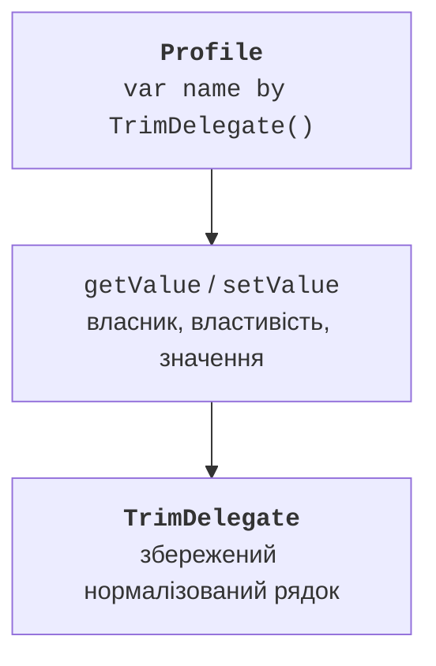
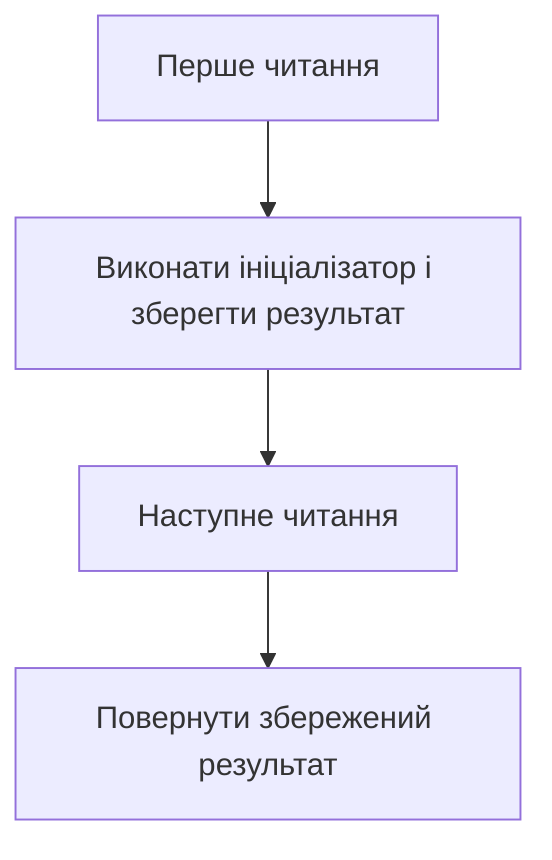

# Делеговані властивості

## Делегована властивість

Власний сетер може повторювати перевірку, журналювання або нормалізацію в багатьох класах. Делегована властивість передає реалізацію доступу окремому об’єкту після `by`. Для val потрібний getValue; для var також setValue. Це інший механізм, ніж перевизначення властивості підкласом. <https://kotlinlang.org/docs/delegated-properties.html>.

Отримувач thisRef вказує власника, property містить метадані властивості, зокрема name, а value – нове значення сетера. Тип `KProperty<*>` означає, що нам не потрібний конкретний тип параметра метаданих. Це локальне введення синтаксису, а повна варіантність належить темі 9.



Рис. 8.3. Передавання доступу до властивості делегату {.caption}

Інтерфейси ReadOnlyProperty і ReadWriteProperty надають зручні контракти для власних делегатів. Kotlin також розпізнає відповідні operator-функції без явної реалізації цих інтерфейсів. У лабораторному прикладі обрано явний ReadWriteProperty, щоб сигнатури було легко перевірити.

## Лямбда як невелика дія для делегата

Стандартні делегати приймають функції. Запис `{ ... }` тут є лямбдою: невеликим блоком, який бібліотека викличе у визначений момент. Параметри стоять до стрілки, останній вираз є результатом; `_` означає невикористаний параметр. Повний матеріал про функції вищого порядку буде в темі 11.

Для lazy блок обчислює початкове значення; для observable обробник отримує властивість, старе та нове значення; для vetoable повертає Boolean, що дозволяє або відхиляє новий запис. Не плутайте момент виклику кожного обробника.

## Lazy та режими ініціалізації

`val value by lazy { ... }` обчислюється при першому читанні й потім повертає збережений результат. Це не автоматичне оновлення кешу при зміні інших полів. Якщо вихідні дані змінні, збережений результат може застаріти. Використовуйте lazy для стабільних залежностей або явно іншу модель кешу.



Рис. 8.4. Перше та наступні читання lazy-властивості {.caption}

SYNCHRONIZED є типовим режимом на JVM і забезпечує узгоджене одноразове опублікування результату. PUBLICATION може викликати ініціалізатор кілька разів при конкуренції, але публікує один результат. NONE не синхронізує доступ і придатний лише за відповідної гарантії одного потоку. Це не робить сам повернений змінний об’єкт потокобезпечним.

Якщо ініціалізатор lazy породив виняток, наступне читання повторить спробу. Тому побічний ефект усередині має бути продуманим. Не припускайте, що повідомлення, файл або запит обов’язково виконаються рівно один раз за всіх обставин.

## Observable, vetoable та Map

Observable викликає обробник після присвоєння. Він підходить для повідомлення про вже виконану зміну, але не для її скасування. Vetoable викликає перевірку до запису й зберігає старе значення, якщо результат false. Початкове значення делегата також повинно бути правильним: обробник зміни не є автоматичною перевіркою початкового аргументу.

Делегування до Map знаходить значення за ім’ям властивості. Це зручно для перевіреного набору конфігураційних даних, але пропущений ключ або неправильний тип можуть спричинити помилку виконання. Зовнішній JSON не стає перевіреним лише через запис by map: спочатку перевірте структуру.

### Приклад 3. Налаштування та відкладений опис

Map у прикладі містить фіксовані перевірені дані; детальний курс словників буде в темі 10. Лямбди навмисно короткі. Зміна гучності понад межу відхиляється без винятку, що відповідає контракту vetoable.

```kotlin
import kotlin.properties.Delegates

class Settings(private val values: Map<String, Any>) {
    val title: String by values
    val width: Int by values

    val summary: String by lazy {
        println("compute summary")
        "$title/$width"
    }

    var theme: String by Delegates.observable("light") {
        _, old, new -> println("theme: $old -> $new")
    }

    var volume: Int by Delegates.vetoable(50) {
        _, _, new -> new in 0..100
    }
}

fun main() {
    val settings = Settings(mapOf("title" to "Study", "width" to 80))
    println(settings.summary)
    println(settings.summary)
    settings.theme = "dark"
    settings.volume = 150
    println("volume=${settings.volume}")
    settings.volume = 75
    println("volume=${settings.volume}")
}
```

```text
compute summary
Study/80
Study/80
theme: light -> dark
volume=50
volume=75
```

NotNull забезпечує пізнє встановлення ненульового значення, зокрема для типів, де lateinit не підходить. Читання до присвоєння породжує IllegalStateException. Вибирайте такий делегат лише коли життєвий цикл справді потребує відкладеного встановлення, а не щоб уникнути параметра конструктора.

Делегування до `this::other` дозволяє перенаправити властивість до іншої властивості, наприклад під час перейменування API. Не підтримуйте вручну два незалежні поля, які повинні завжди мати однакове значення. Один шлях збереження зменшує ризик розходження та пояснює власника даних.

::: info Знімок екрана
Decompile Settings bytecode; show lazy/observable delegate fields and accessor calls. Generated names may vary.
:::

Рис. 8.5. Допоміжні поля делегованих властивостей {.caption}
