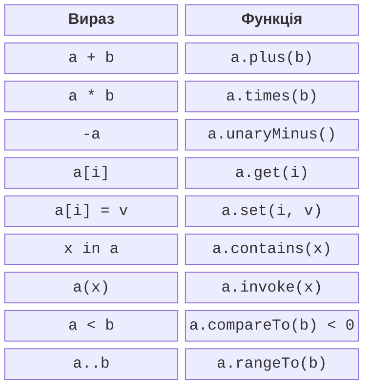

# Порівняння та складене присвоювання

## Короткий запис має зберігати зрозумілий зміст

Для векторів природно писати суму, для діапазону – належність, для матриці – доступ за індексом. Kotlin дозволяє надати власним типам таку поведінку через функції з визначеними іменами й модифікатором `operator`. Нові символи операцій створювати не можна; пріоритет і асоціативність наявних операцій також не змінюються. <https://kotlinlang.org/docs/operator-overloading.html>.

Перевантаження є угодою компілятора, а не текстовою підстановкою довільного виразу. Сигнатура має відповідати вимогам конкретної операції. Клієнтський запис стає коротшим, але автор типу все одно відповідає за перевірку аргументів і результату. Не використовуйте `+` для видалення файлів або `!` для оплати: знайомий символ створює очікування у читача.



Рис. 8.1. Операторний запис і відповідні функції {.caption}

Арифметичні імена: plus, minus, times, div, rem; унарні – unaryPlus, unaryMinus, not. Запис `a + b` шукає придатний `a.plus(b)`, а `-a` – `a.unaryMinus()`. Функція може бути членом або розширенням. Розширення має ті самі обмеження доступу до приватного стану й статичного вибору, що й у темі 3.

Вибір типу результату визначає контракт. Додавання двох Money повертає нові Money тієї самої валюти; множення вектора на скаляр повертає Vector. Добуток двох векторів неоднозначний: скалярний і векторний добутки краще мати явно названими методами dot і cross, якщо символ приховує зміст.

## Порівняння та значення рівності

`compareTo` повертає від’ємне, нульове або додатне Int. Саме знак, а не обов’язково −1 чи 1, визначає результат операцій `<`, `<=`, `>` та `>=`. Реалізація `Comparable<T>` дозволяє природний порядок типу, придатний для сортування. Не обчислюйте порівняння великих цілих через різницю: вона може переповнитися; використовуйте compareTo компонентів.

`==` використовує equals, а не compareTo. Два вектори однакової довжини можуть бути нерівними за координатами. Якщо порядок порівнює лише довжину, compareTo може повернути нуль для нерівних векторів. Це потрібно явно пояснювати користувачу та особливо уважно враховувати у відсортованих множинах.

### Приклад 1. Незмінний вектор

Координати обмежені, тому обчислення довжини та скалярне множення в демонстрації скінченні. Новий Vector проходить той самий init-контроль, що й початковий. Індекси лише 0 і 1; інші значення є помилкою доступу. Data-клас дає рівність за координатами, а Comparable порівнює довжини.

```kotlin
import kotlin.math.hypot

data class Vector(val x: Double, val y: Double) :
    Comparable<Vector> {
    init {
        require(x.isFinite() && y.isFinite())
        require(x in -1e6..1e6 && y in -1e6..1e6)
    }
    val length: Double get() = hypot(x, y)

    operator fun plus(other: Vector): Vector =
        Vector(x + other.x, y + other.y)

    operator fun times(scale: Double): Vector {
        require(scale.isFinite())
        return Vector(x * scale, y * scale)
    }

    operator fun unaryMinus(): Vector = Vector(-x, -y)

    operator fun get(index: Int): Double = when (index) {
        0 -> x
        1 -> y
        else -> throw IndexOutOfBoundsException("index=$index")
    }

    override operator fun compareTo(other: Vector): Int =
        length.compareTo(other.length)
}

fun main() {
    val a = Vector(3.0, 4.0)
    val b = Vector(1.0, 2.0)
    println(a + b)
    println(a * 2.0)
    println(-b)
    println("x=${a[0]}; length=${a.length}")
    println(a > b)
    val rotated = Vector(4.0, 3.0)
    println("order=${a.compareTo(rotated)}; equal=${a == rotated}")
}
```

```text
Vector(x=4.0, y=6.0)
Vector(x=6.0, y=8.0)
Vector(x=-1.0, y=-2.0)
x=3.0; length=5.0
true
order=0; equal=false
```

Операція `2.0 * a` не стає доступною автоматично, бо отримувачем є Double. За потреби можна додати придатне розширення для Double, яке делегує множення Vector. Комутативність математичної операції не означає симетричного пошуку методів компілятором.


Рис. 8.2. Перехід від символу операції до її реалізації {.caption}

## Складене присвоювання та інкремент

Для `a += b` можливі два різні контракти. `plusAssign` змінює стан отримувача й повертає Unit. Якщо придатного plusAssign немає, компілятор може використати plus та присвоїти результат назад; тоді змінна має бути var, а тип результату придатним для такого присвоєння.

Не оголошуйте обидва варіанти без потреби: для змінної var може виникнути неоднозначність. Для незмінних значень зазвичай достатньо plus; для контейнера, який свідомо змінюється, може бути доречний plusAssign. Можливість написати `val` біля посилання не забороняє plusAssign змінити сам об’єкт.

`inc` і `dec` повертають нове значення для переприсвоєння, а не повинні самі змінювати отримувач. Постфіксний запис повертає старе значення виразу, префіксний – нове. Не реалізуйте інкремент незмінної дати через приховану зміну спільного екземпляра, на який вказують інші змінні.

```kotlin
data class Counter(val value: Int) {
    init { require(value in 0..100) }
    operator fun plus(step: Int): Counter = Counter(value + step)
    operator fun inc(): Counter = Counter(value + 1)
}

class Bag {
    var count = 0
        private set
    operator fun plusAssign(amount: Int) {
        require(amount in 0..100 - count)
        count += amount
    }
}

fun main() {
    var counter = Counter(5)
    counter += 2
    val old = counter++
    println("old=${old.value}; new=${counter.value}")
    val bag = Bag()
    bag += 3
    println("bag=${bag.count}")
}
```

```text
old=7; new=8
bag=3
```

Приклад розділяє два підходи в різних типах. Counter створює нові значення, Bag змінює себе. Клієнт бачить однаковий символ `+=`, тому документація типу й знайома семантика особливо важливі. Після відмови Bag має зберігати попередній count.
