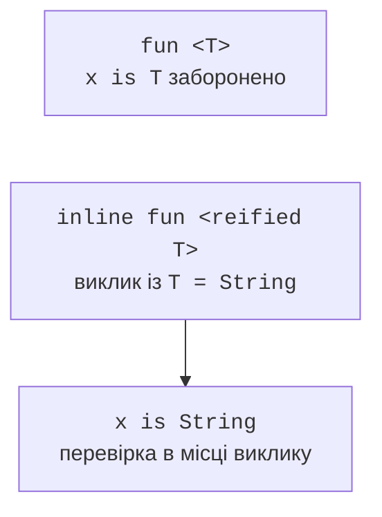

# Стирання типів і reified

## Стирання типів і reified

JVM переважно не зберігає аргумент типу в кожному узагальненому об’єкті. Перевірити `value is T` у звичайній функції неможливо: невідомо, який саме тип мав би перевірятися після стирання. Так само перевірка `value is List<String>` не може перевірити всі елементи списку звичайною перевіркою JVM-типу.

Модифікатор `reified` дозволений для параметра inline-функції. Компілятор підставляє реалізацію в місце виклику разом з інформацією про фактичний тип. Це дозволяє `is T`, `T::class` та типізовані операції, але не скасовує стирання узагальнених аргументів JVM. Зокрема вкладені аргументи `List<String>` усе ще потребують перевірки вмісту або серіалізатора зі схемою.



Рис. 9.4. Reified переносить перевірку відомого типу в місце виклику. {.caption}

### Приклад 4. Розбір трьох скалярних типів

Програма явно підтримує лише `Int`, `Double` і `Boolean`. Невідомий тип не створюється рефлексією, а відхиляється. Приведення результату зосереджене в одному місці після перевірки `T::class`; його правильність забезпечує відповідність гілок.

```kotlin
inline fun <reified T : Any> parse(text: String): T {
    val value: Any = when (T::class) {
        Int::class -> text.toInt()
        Double::class -> text.toDouble().also {
            require(it.isFinite()) { "finite number required" }
        }
        Boolean::class -> text.toBooleanStrict()
        else -> error("unsupported type: ${T::class.simpleName}")
    }
    return value as T
}

fun main() {
    println(parse<Int>("42") + 1)
    println(parse<Double>("2.5") * 2)
    println(parse<Boolean>("true"))
    try {
        parse<Boolean>("yes")
    } catch (error: IllegalArgumentException) {
        println("invalid boolean")
    }
    try {
        parse<String>("word")
    } catch (error: IllegalStateException) {
        println("unsupported")
    }
}
```

```text
43
5.0
true
invalid boolean
unsupported
```

Цей підхід не масштабується до довільних бізнес-моделей: довгий `when` стає реєстром спеціальних випадків. Там доречніше передавати функцію розбору або об’єкт `Parser<T>`. Reified виправданий тоді, коли поведінка справді залежить від статичного типу, а не лише робить сигнатуру коротшою.

::: info Знімок екрана
IntelliJ IDEA: Tools &gt; Kotlin &gt; Show Kotlin Bytecode; Decompile a reified is T example.
:::

Рис. 9.5. Підстановка перевірки типу в місце inline-виклику. {.caption}

`typeOf<T>()` повертає опис `KType`, який може містити аргументи узагальнення і nullable-ознаку. Опис типу не є автоматичною валідацією довільного об’єкта. Перевірка структури даних, отриманих із JSON, залишається завданням декодера та предметних правил.

## Sealed-результати, Nothing і псевдоніми

Узагальнена ієрархія може розділяти успішне значення та помилку. Наприклад, `Either<out L, out R>` має варіанти `Left<L>` і `Right<R>`. Порожній бік задають типом `Nothing`: він не має звичайних значень і є підтипом інших типів. Завдяки коваріантності `Right<Int>` може використовуватися як `Either<String, Int>`. Повна реалізація наведена в лабораторній роботі.

Псевдонім `typealias UserId = String` дає іншу назву тому самому типу. Він не забороняє передати довільний рядок замість ідентифікатора. Для окремої предметної сутності потрібен клас, зокрема value class, якщо його обмеження відповідають задачі. Псевдоніми корисні для довгих функціональних типів і вкладених узагальнених записів.

Типова помилка – додати `as T` до функції, яка не має доказу типу. Інша помилка – приглушити діагностику `@UnsafeVariance`, не зберігши інваріант. Такі механізми призначені для вузьких випадків реалізації бібліотек; навчальне API має обходитися правильно розділеними виробниками й споживачами.

Перевірка узагальненого класу складається з двох частин. Виконувані приклади перевіряють поведінку, порожні структури та порядок операцій. Окремі приклади, які повинні не компілюватися, перевіряють контракт типів. Їх зберігають окремо від робочого проєкту, записують очікувану діагностику і не включають у збірку.
