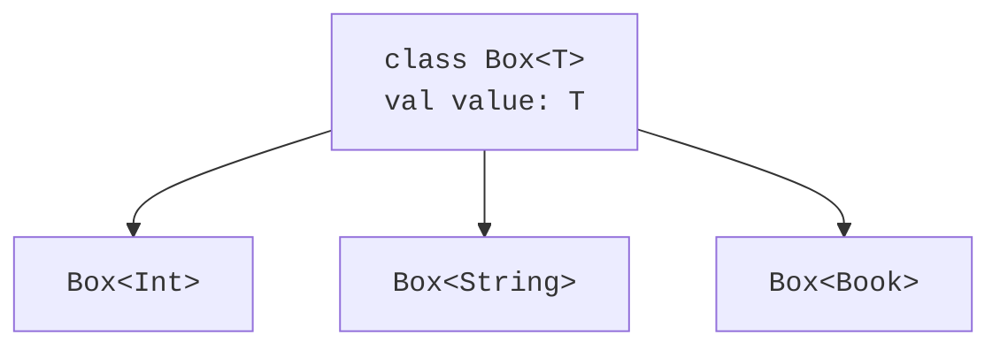

# Параметри типу та узагальнені класи

## Параметр типу як частина контракту

У записі `class Box<T>` літера `T` позначає **параметр типу**. У записі `Box<String>` тип `String` є **аргументом типу**. Так само параметр звичайної функції отримує значення аргументу, параметр узагальнення отримує тип. Проте ці два механізми мають різні моменти роботи: більшість перевірок узагальнень виконує компілятор, а не кожен окремий виклик у JVM.

```kotlin
class Box<T>(val value: T)

fun main() {
    val number = Box(42)
    val word: Box<String> = Box("Kotlin")
    val missing = Box<String?>(null)
    println(number.value + 1)
    println(word.value.length)
    println(missing.value)
}
```

Компілятор виводить `Box<Int>` із конструктора першого об’єкта. Тип результату `number.value` залишається `Int`, тому додавання не потребує приведення. У третьому об’єкті сам контейнер існує, але значення в ньому допускає `null`. Це не те саме, що `Box<String>?`: в останньому записі може бути відсутній контейнер.



Рис. 9.1. Один шаблон класу утворює різні типи контейнерів. {.caption}

Імена `T`, `E`, `K`, `V` є домовленістю: тип, елемент, ключ, значення. У складному інтерфейсі корисні описові назви `Input` і `Output`. Кілька параметрів відокремлюють комами: `class Entry<K, V>(val key: K, val value: V)`. Параметри не обов’язково є різними типами: `Entry<String, String>` цілком коректний. Зв’язок між аргументами задає оголошення, а не їхні імена.

Виведення типів не означає втрату статичної типізації. Для порожнього контейнера інколи немає значення, з якого можна вивести `T`; тоді аргумент указують явно. У відкритому API явний тип результату допомагає зберегти контракт при зміні реалізації. Не варто оголошувати все як `Any`, щоб змусити помилкову програму компілюватися: так втрачається саме та гарантія, заради якої введено параметр типу.

## Приклад 1. Стек на зв’язних вузлах

Стек дотримується правила LIFO: останній доданий елемент виходить першим. Кожен вузол зберігає значення і посилання на наступний вузол. Голова є вершиною. Додавання не обходить усю структуру: створюється один вузол, після чого змінюється голова.

Обмеження `T : Any` у цьому прикладі забороняє nullable-елементи. Тому `peekOrNull()` однозначно повідомляє `null` про порожній стек. Якби `null` був допустимим елементом, потрібна була б окрема ознака порожнечі або sealed-результат. Метод `pop()` має інший контракт: він повертає елемент або кидає `NoSuchElementException`.

```kotlin
class Stack<T : Any> {
    private class Node<T>(
        val value: T,
        val next: Node<T>?
    )

    private var head: Node<T>? = null
    var size: Int = 0
        private set

    fun push(value: T) {
        head = Node(value, head)
        size++
    }

    fun peekOrNull(): T? = head?.value

    fun pop(): T {
        val first = head
            ?: throw NoSuchElementException("empty stack")
        head = first.next
        size--
        return first.value
    }
}

fun main() {
    val numbers = Stack<Int>()
    numbers.push(10)
    numbers.push(20)
    println("${numbers.peekOrNull()} ${numbers.size}")
    println("${numbers.pop()} ${numbers.pop()}")
    println(numbers.peekOrNull())
    try {
        numbers.pop()
    } catch (error: NoSuchElementException) {
        println(error.message)
    }
    val words = Stack<String>()
    words.push("first")
    println(words.pop())
}
```

Очікуваний результат перевіряють запуском програми:

```text
20 2
20 10
null
empty stack
first
```

Інваріант стека: `size` дорівнює кількості вузлів, досяжних від `head`; порожній стек має нульовий розмір і порожню голову. Помилка `pop()` перевіряється до зміни полів, тому невдалий виклик не змінює стан. Вузли приватні: зовнішній код не може створити цикл або змінити ланцюжок, обійшовши лічильник.

Операції `push`, `pop` і `peekOrNull` мають сталу часову складність O(1). Пам’ять зростає як O(n), де n – кількість елементів. Узагальнення не змінює ці оцінки. На JVM числовий аргумент типу може вимагати упаковки значень; саме тому в наступній темі окремо розглядаються спеціалізовані масиви `IntArray`.
