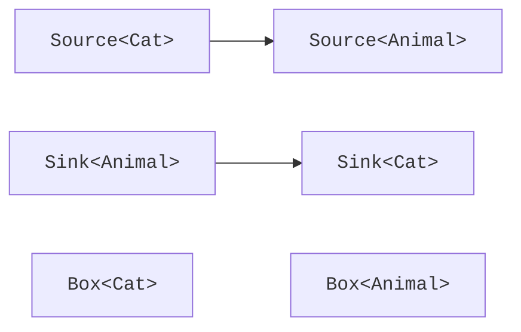

# Варіантність і проєкції

## Інваріантність: чому підтип елемента не достатній

Нехай `Cat` є підтипом `Animal`. З цього не випливає, що `MutableBox<Cat>` є підтипом `MutableBox<Animal>`. Якщо через друге посилання можна записати собаку, перше посилання більше не гарантує кота. Тому звичайний параметр класу за замовчуванням **інваріантний**.

```kotlin
class MutableBox<T>(var value: T)

fun main() {
    val words = MutableBox("hello")
    // Навмисна помилка: зніміть коментар окремо.
    // val anything: MutableBox<Any> = words
    println(words.value.length)
}
```

Помилка виникає на присвоєнні, ще до можливого неправильного запису. Властивість `val` змінної `words` не робить поле `value` незмінним: вона лише забороняє переприсвоїти саме посилання. Навіть клас лише з читанням залишається інваріантним, поки його параметр явно не позначено як `out`.

::: info Знімок екрана
IntelliJ IDEA: MutableBox&lt;String&gt; assigned to MutableBox&lt;Any&gt;; show compiler diagnostic.
:::

Рис. 9.2. Компілятор відхиляє небезпечне присвоєння контейнера. {.caption}

## Варіантність на місці оголошення

Параметр `out T` означає коваріантний контракт: інтерфейс виробляє значення `T`, але не приймає довільне `T` від клієнта. Тоді джерело котів можна використати як джерело тварин. Параметр `in T` означає контраваріантний контракт: споживач приймає `T`, але не обіцяє повернути його. Споживач усіх тварин придатний і для котів.

Правило «виробник – out, споживач – in» допомагає читати API, але перевіряти треба всі доступні операції. Параметр функції є вхідною позицією, результат – вихідною. Властивість `var` має getter і setter, а тому використовує тип в обох напрямках.



Рис. 9.3. Напрям дозволених присвоєнь для виробника й споживача. {.caption}

### Приклад 3. Постачальники й споживачі

```kotlin
open class Animal(val name: String)
class Cat(name: String) : Animal(name)

fun interface Source<out T> {
    fun next(): T
}

fun interface Sink<in T> {
    fun accept(value: T)
}

fun <T> transfer(source: Source<T>, sink: Sink<T>) {
    sink.accept(source.next())
}

fun main() {
    val cats: Source<Cat> = Source { Cat("Murka") }
    val animals: Source<Animal> = cats
    val printer: Sink<Animal> = Sink { println(it.name) }
    val catPrinter: Sink<Cat> = printer
    catPrinter.accept(cats.next())
    transfer(animals, printer)
}
```

```text
Murka
Murka
```

Лямбди тут лише створюють реалізації функціональних інтерфейсів з одним методом; докладний синтаксис функціонального програмування розглядається в темі 11. Приклад можна переписати звичайними класами, не змінюючи жодної гарантії варіантності.

Варіантність не перетворює об’єкт і не копіює його. Посилання `cats` і `animals` указують на те саме джерело, але відкривають різні статичні контракти. Так само `Sink<Animal>` не починає приймати тільки котів: обмежується лише те, як його використовують через конкретну змінну.

## Проєкції на місці використання

Іноді клас не можна змінити або він закономірно інваріантний. `Array<T>` і контейнер із getter/setter мають обидва напрями. Проєкція `out T` обмежує конкретне використання читанням; `in T` дозволяє передавати значення `T`, а результат читання доводиться трактувати як загальний верхній тип.

```kotlin
fun copyFirst(from: Array<out Number>, to: Array<in Int>) {
    require(from.isNotEmpty() && to.isNotEmpty())
    val first: Number = from[0]
    to[0] = first.toInt()
}

fun main() {
    val source = arrayOf(7, 8)
    val target = arrayOf<Any>("old")
    copyFirst(source, target)
    println(target[0])
}
```

Проєкція не доводить, що числове перетворення безпечне для всіх значень: `toInt()` може втратити дробову частину. Це окремий предметний контракт. У демонстрації джерело ціле; універсальне копіювання без перетворення краще описувати одним параметром `T`.

Зіркова проєкція `Box<*>` означає невідомий, але узгоджений аргумент типу. Вона не дорівнює `Box<Any?>`. Значення можна читати з урахуванням верхньої межі, але довільне значення записувати не можна. Для `Foo<out T : Upper>` вона поводиться як `Foo<out Upper>`; для споживача безпечний вхід звужується до `Nothing`.

Запис `is Box<*>` перевіряє зовнішній клас. Він не доводить, що всередині `String`. Зірку варто використовувати, коли алгоритму справді не потрібен точний елементний тип, наприклад для друку діагностичного подання. Вона не має підмінювати конкретний аргумент у звичайному прикладному API.
