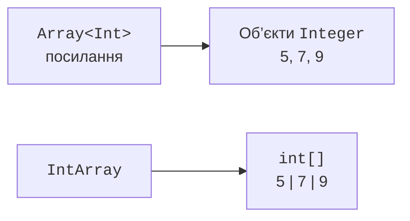

# Масиви

## Масиви: розмір і тип комірки

`Array<T>` зберігає фіксовану кількість елементів. Індекси починаються з нуля, останній допустимий індекс дорівнює `size - 1`. Властивість `indices` дає діапазон усіх допустимих індексів, а `lastIndex` для порожнього масиву має значення -1. Доступ за неправильним індексом спричиняє виняток.

```kotlin
fun main() {
    val names = arrayOf("Ada", "Bohdan")
    names[1] = "Olena"
    val squares = IntArray(4) { index -> index * index }
    println(names.contentToString())
    println(squares.contentToString())
    println(squares.getOrNull(4))
    val copy = squares.copyOf()
    println(squares == copy)
    println(squares.contentEquals(copy))
}
```

```text
[Ada, Olena]
[0, 1, 4, 9]
null
false
true
```

Лямбда конструктора тут задає значення за індексом. Її повний синтаксис вивчається далі; на цьому етапі достатньо читати вираз як правило заповнення кожної комірки. Масив залишається змінюваним, хоча змінна оголошена через `val`.

Для масивів `==` не означає порівняння всіх елементів. Використовуйте `contentEquals`, а для вкладених масивів – `contentDeepEquals`. Для друку відповідно застосовують `contentToString` і `contentDeepToString`. Звичайний `toString()` може дати технічне подання посилання, яке не є звітом про вміст.



Рис. 10.1. Загальний масив посилань і спеціалізований числовий масив. {.caption}

На JVM `Array<Int>` відповідає масиву посилань на упаковані числа, а `IntArray` – `int[]`. Аналогічно існують `DoubleArray`, `LongArray` та інші спеціалізовані масиви. Вони не є підтипами `Array<Number>` або `Array<Int>`. Перетворення `toTypedArray()` створює інше подання і може спричинити упаковку.

## Приклад 1. Температури тижня

Для семи скінченних температур розрахуємо мінімум, максимум і середнє. Окрема функція працює з довільним непорожнім масивом; відсутність даних є помилкою контракту, а не середнім нулем. Використання циклу робить послідовність обчислень явною.

```kotlin
data class Summary(
    val minimum: Double,
    val maximum: Double,
    val mean: Double
)

fun summarize(values: DoubleArray): Summary {
    require(values.isNotEmpty()) { "empty data" }
    var minimum = Double.POSITIVE_INFINITY
    var maximum = Double.NEGATIVE_INFINITY
    var total = 0.0
    for (value in values) {
        require(value.isFinite()) { "non-finite value" }
        if (value < minimum) minimum = value
        if (value > maximum) maximum = value
        total += value
    }
    require(total.isFinite()) { "sum overflow" }
    return Summary(minimum, maximum, total / values.size)
}

fun main() {
    val week = doubleArrayOf(10.0, 12.0, 9.0, 11.0,
        13.0, 14.0, 15.0)
    println(summarize(week))
    check(summarize(doubleArrayOf(-3.0)).mean == -3.0)
    try {
        summarize(doubleArrayOf())
    } catch (error: IllegalArgumentException) {
        println(error.message)
    }
}
```

```text
Summary(minimum=9.0, maximum=15.0, mean=12.0)
empty data
```

Значення `NaN` небезпечне для мінімуму й максимуму: звичайні порівняння з ним не дають очікуваного числового порядку. Тому перевірка скінченності виконується до агрегування. Для дуже великих наборів із різними масштабами потрібні чисельно стійкі алгоритми підсумовування; цей приклад має навчальний контракт невеликого набору вимірювань.

## Двовимірні масиви

Матриця `Array<IntArray>` є масивом рядків. Кожен рядок – окремий об’єкт і може мати власну довжину. Отже, тип сам по собі не гарантує прямокутність. Перед транспонуванням або доступом за двома індексами перевіряють однакову довжину рядків.

Правильне створення `Array(rows) { IntArray(columns) }` формує новий внутрішній масив на кожному кроці. Якщо один створений рядок покласти в усі позиції, зміна комірки буде видима через кожне посилання. Копіювання лише зовнішнього масиву теж не копіює рядки. Глибину потрібної копії визначає контракт власності.
