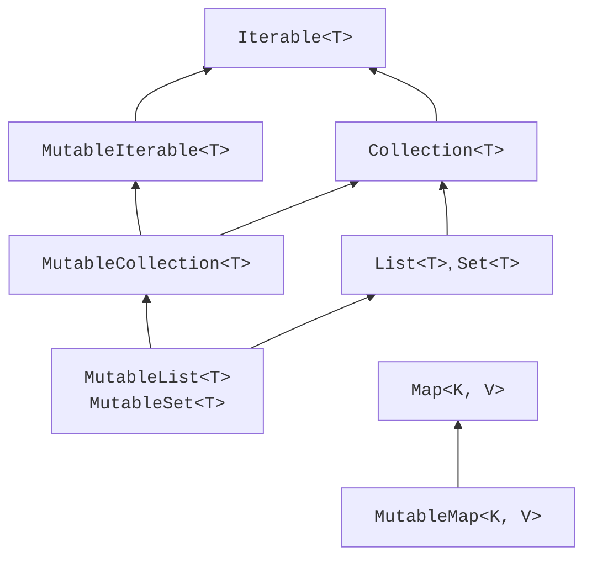
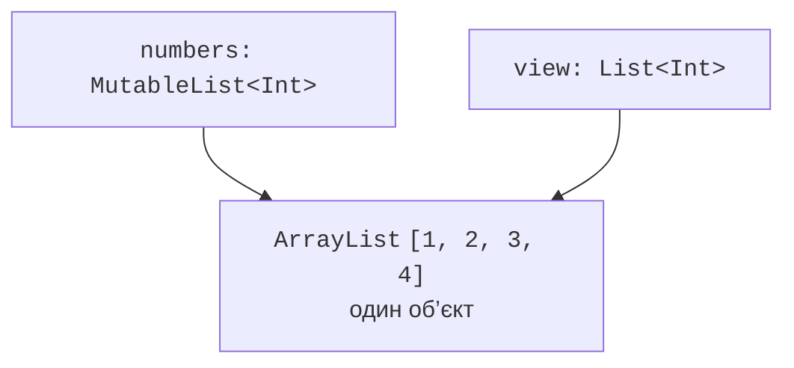

# Ієрархія колекцій і списки

## Ієрархія колекцій

`Iterable<T>` дозволяє отримати ітератор. `Collection<T>` додає розмір, перевірку порожнечі та належності. `List<T>` уточнює позиційний доступ і порядок; `Set<T>` – унікальність. `Map<K,V>` утворює окрему гілку, оскільки його елементом є відповідність ключа значенню, а не просто один `T`.



Рис. 10.2. Основні контракти колекцій; змінювані інтерфейси розширюють відповідні інтерфейси читання. {.caption}

Інтерфейси `MutableList`, `MutableSet` і `MutableMap` відкривають операції зміни. Якщо функція лише читає список, параметр `List<T>` точніше виражає її потребу, ніж `MutableList<T>`. Коваріантність `List<out T>` дозволяє передавати список підтипів; змінювані списки інваріантні, щоб не допустити неправильного вставлення.

У словника значення коваріантні в інтерфейсі читання, а ключ не слід механічно вважати коваріантним. Найкраща практика – приймати мінімальний достатній інтерфейс і не робити припущень про фактичну реалізацію. Інтерфейс `List` не обіцяє сталого часу доступу за індексом для всіх можливих реалізацій.

## Лише для читання не означає незмінний

Посилання типу `List<Int>` не має методу `add`, але той самий об’єкт може змінюватися через інше посилання. `val` забороняє заміну посилання, а не зміну вмісту. Це три різні властивості: сталість змінної, доступність операцій через інтерфейс і фактична незмінність об’єкта.

```kotlin
fun main() {
    val numbers = mutableListOf(1, 2, 3)
    val view: List<Int> = numbers
    val snapshot: List<Int> = numbers.toList()
    numbers.add(4)
    println(view)
    println(snapshot)
}
```

```text
[1, 2, 3, 4]
[1, 2, 3]
```



Рис. 10.3. Два посилання відкривають різні інтерфейси того самого списку. {.caption}

`toList()` створює знімок елементів, але не клонує об’єкти всередині. Якщо елемент містить змінювані поля, обидві колекції можуть бачити їхню зміну. Повернення захисної копії доречне на межі класу, коли клієнт не повинен отримати доступ до внутрішньої структури.

Для стійких незмінних структур існує бібліотека `kotlinx.collections.immutable`. Вона виходить за межі обов’язкової роботи; не слід називати будь-який `listOf` глибоко незмінною структурою. У документації власного API варто прямо написати, чи повертається живе подання, знімок або незалежна глибока копія.

## Списки та позиційні операції

`listOf` створює список для читання, `mutableListOf` – змінюваний. `ArrayList` явно задає поширену реалізацію на динамічному масиві. `buildList` дозволяє заповнити список у локальному будівнику і повернути інтерфейс читання; посилання на будівник не слід виносити за межі його лямбди.

`get(index)` або квадратні дужки потребують правильного індексу; `getOrNull(index)` повертає `null`, якщо позиції немає. `indexOf(value)` повертає -1 для відсутнього елемента. Метод `remove(value)` видаляє перший рівний елемент, `removeAt(index)` видаляє за позицією. Для списку цілих ця різниця особливо важлива.

Оператори `+` і `-` зазвичай формують нову колекцію. Вираз `items + value` без присвоєння результату не змінює початковий список. Поведінка `+=` залежить від статичного типу та доступних операторів, тому в навчальному коді `add` або явне присвоєння часто краще показує намір.

### Приклад 2. Список покупок

```kotlin
class ShoppingList {
    private val items = mutableListOf<String>()

    fun add(name: String) {
        val normalized = name.trim()
        require(normalized.isNotEmpty()) { "empty name" }
        items.add(normalized)
    }

    fun removeFirst(name: String): Boolean = items.remove(name)

    fun rename(index: Int, name: String) {
        require(index in items.indices) { "bad index" }
        require(name.isNotBlank()) { "empty name" }
        items[index] = name.trim()
    }

    fun snapshot(): List<String> = items.toList()
}

fun main() {
    val shopping = ShoppingList()
    shopping.add("bread")
    shopping.add("milk")
    shopping.add("bread")
    val before = shopping.snapshot()
    println(shopping.removeFirst("bread"))
    shopping.rename(0, "water")
    println(before)
    println(shopping.snapshot())
    println(shopping.removeFirst("tea"))
}
```

```text
true
[bread, milk, bread]
[water, bread]
false
```

Клас свідомо допускає дублікати. Якщо предметна задача вимагає одного товару з кількістю, правильнішою структурою буде словник назва → кількість. Не потрібно силоміць пристосовувати список до контракту, який природно виражається іншою колекцією.

`subList(from, to)` є поданням ділянки, де ліва межа включена, а права ні. Зміна через подання може змінити початковий список. Структурна зміна батьківського списку поза поданням може зробити подальше використання подання некоректним. Для незалежного результату явно створюйте копію через `toList()`.
