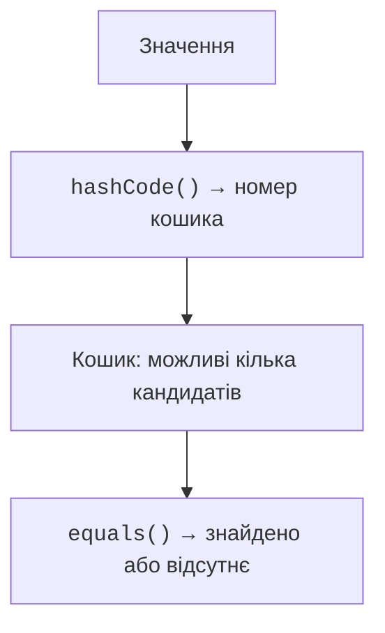

# Множини та словники

## Множини та рівність

`Set<T>` зберігає не більше одного елемента з певною рівністю. Додавання дубля не збільшує розмір. `HashSet` зазвичай забезпечує швидкий пошук, але не обіцяє порядок обходу. `LinkedHashSet` зберігає порядок вставлення. `sortedSetOf` на JVM утворює відсортовану множину за природним порядком або компаратором.



Рис. 10.4. Хеш звужує пошук до кошика, а рівність розрізняє колізії. {.caption}

Схема не задає точну формулу конкретної реалізації: відображення хешу на кошик залежить від структури й розміру таблиці. Рівні об’єкти повинні мати однаковий `hashCode`. Однаковий хеш не доводить рівність: колізії нормальні, і в кошику потрібна перевірка `equals`.

Якщо поле, від якого залежить рівність і хеш, змінити після вставлення, елемент може залишитися в «старому» кошику. Пошук і видалення стануть ненадійними. Тому ключі й елементи хеш-множин мають бути стабільними за рівністю протягом перебування в колекції.

### Приклад 3. Унікальні слова

```kotlin
fun words(text: String): Set<String> {
    val result = linkedSetOf<String>()
    for (part in text.lowercase().split(' ')) {
        val word = part.trim('.', ',', '!', '?')
        if (word.isNotEmpty()) result.add(word)
    }
    return result
}

fun main() {
    val first = words("Cat dog cat owl.")
    val second = words("Dog fox!")
    println(first)
    println(first intersect second)
    println(first union second)
    println(first subtract second)
    check(words("   ").isEmpty())
}
```

```text
[cat, dog, owl]
[dog]
[cat, dog, owl, fox]
[cat, owl]
```

Контракт розбору обмежений пробілами й указаними знаками на краях слова. Це не універсальна лінгвістична токенізація: дефіси, апострофи й різні види пробілів потребують окремого правила. Об’єднання, перетин і різниця повертають нові множини, не змінюючи початкових даних. Різниця несиметрична: `A subtract B` і `B subtract A` можуть давати різні результати.

Для відсортованої множини унікальність визначає порівняння. Якщо компаратор порівнює людей лише за віком, двоє різних людей однакового віку можуть вважатися одним елементом. Компаратор має відповідати тому, що предметна задача вважає тотожністю ключа.

## Словники: ключ, відсутність і значення

`Map<K,V>` пов’язує кожен ключ максимум з одним значенням. Вставлення за вже наявним ключем замінює значення. Конструктор `mapOf("Ada" to 90)` використовує інфіксну функцію `to`, яка створює пару; це не окремий синтаксис словника.

`map[key]` повертає nullable-результат. Якщо `V` сам nullable, `null` може означати як відсутній ключ, так і записане порожнє значення. Для розрізнення застосовують `containsKey`. `getValue` кидає виняток, якщо ключа немає; `getOrDefault` повертає запасне значення для відсутнього ключа.

`getOrPut` зручний для створення вкладеної колекції. Він викликає функцію початкового значення, коли наявне значення відсутнє або дорівнює `null`. Звичайний змінюваний словник із цією операцією не слід вважати потокобезпечним; паралельна взаємодія розглядається окремо в темі корутин.

### Приклад 4. Частотний словник

```kotlin
fun frequencies(text: String): Map<String, Int> {
    val counts = mutableMapOf<String, Int>()
    for (word in text.lowercase().split(' ')) {
        if (word.isBlank()) continue
        counts[word] = counts.getOrDefault(word, 0) + 1
    }
    return counts.toSortedMap()
}

fun main() {
    val counts = frequencies("red blue red green blue red")
    for ((word, count) in counts) {
        println("$word: $count")
    }
    val positions = mutableMapOf<String, MutableList<Int>>()
    val tokens = listOf("red", "blue", "red")
    for ((index, word) in tokens.withIndex()) {
        positions.getOrPut(word) { mutableListOf() }.add(index)
    }
    println(positions)
    println(counts["black"])
}
```

```text
blue: 2
green: 1
red: 3
{red=[0, 2], blue=[1]}
null
```

Сортування за ключами забезпечує відтворюваний звіт. Внутрішню структуру можна обрати за швидкістю оновлення, а порядок для користувача задати на етапі виведення. Для `HashMap` не можна покладатися на випадково стабільний порядок конкретного запуску.

`keys`, `values` і `entries` є поданнями словника. У змінюваному словнику видалення через відповідне змінюване подання впливає на сам словник. Копія `toMap()` відділяє структуру відповідностей, але вкладені змінювані списки можуть залишатися спільними.

::: info Знімок екрана
IntelliJ IDEA Debug: expand positions map, red entry and its list; show sizes and values.
:::

Рис. 10.5. Вкладений словник позицій у налагоджувачі. {.caption}
