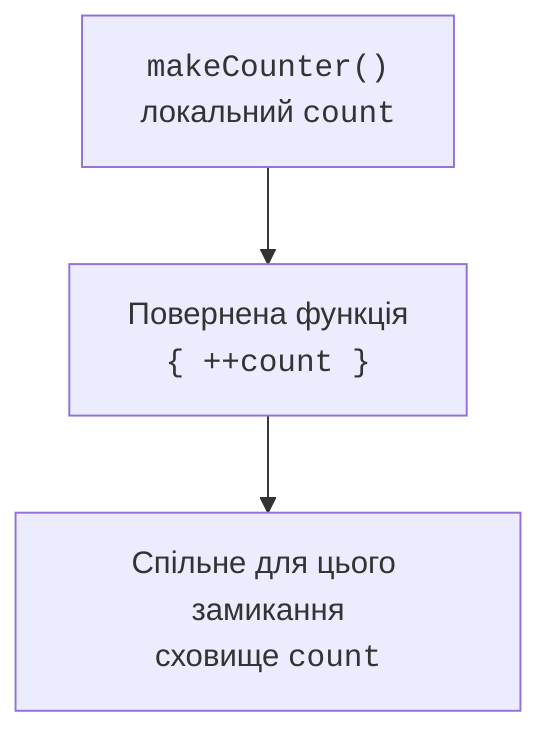

# Замикання та inline-функції

## Замикання та час життя стану

Лямбда може звертатися до локальних змінних зовнішньої функції. Разом із потрібним оточенням вона утворює **замикання**. Захоплений стан може жити довше за виклик функції, що його створила. Кожен виклик фабрики замикання може мати власне незалежне оточення.



Рис. 11.2. Повернена функція зберігає доступ до захопленого стану. {.caption}

Захоплення `var` не створює незмінного знімка його значення. Якщо кілька лямбд посилаються на ту саму змінну, вони можуть бачити спільні зміни. Це зручно для локального лічильника, але робить порядок викликів частиною поведінки. Такий стан сам по собі не є потокобезпечним.

Функція вищого порядку може не лише отримувати функцію, а й повертати її. Наприклад, фабрика знижок захоплює відсоток, а повернена функція отримує суму. Перевірку відсотка варто виконати під час створення стратегії, а перевірку суми – при застосуванні.

Композиція поєднує дві функції: спочатку `f`, потім `g`. Тип результату першої повинен збігатися з типом входу другої. Узагальнена сигнатура `(A) -> B` і `(B) -> C` дає результат `(A) -> C`. Порядок композиції слід прямо назвати, щоб не переплутати математичну й програмну домовленості.

```kotlin
fun <A, B, C> then(
    first: (A) -> B,
    second: (B) -> C
): (A) -> C = { value -> second(first(value)) }

fun main() {
    val normalizedLength = then(
        { text: String -> text.trim() },
        { text: String -> text.length }
    )
    println(normalizedLength("  Kotlin  "))
}
```

## Inline та керування поверненням

`inline` дозволяє компілятору підставляти тіло функції та відповідних лямбд у місце виклику. Це може прибрати частину об’єктів функцій і непрямих викликів, але збільшує згенерований код. Модифікатор не є універсальною командою «зробити швидше»; його використовують для малих функцій вищого порядку й reified-параметрів.

У лямбді для `forEach`, яка є inline-функцією, `return` може завершити зовнішню функцію. `return@forEach` завершує лише поточний виклик лямбди й переходить до наступного елемента. Це не повний аналог `break`: для переривання пошуку часто краще підійде `firstOrNull` або звичайний цикл.

```kotlin
fun containsZero(values: List<Int>): Boolean {
    values.forEach { value ->
        if (value == 0) return true
    }
    return false
}

fun main() {
    listOf(-1, 0, 2).forEach { value ->
        if (value < 0) return@forEach
        println(value)
    }
    println(containsZero(listOf(1, 0, 3)))
}
```

`noinline` забороняє підстановку конкретного параметра-функції. Це потрібно, коли його зберігають як значення або передають далі до звичайного API. `crossinline` дозволяє підстановку, але забороняє нелокальне повернення, оскільки виклик може опинитися в іншому контексті, наприклад усередині об’єкта `Runnable`.

```kotlin
inline fun task(crossinline action: () -> Unit): Runnable =
    Runnable { action() }

inline fun combine(
    first: () -> Unit,
    noinline later: () -> Unit
): () -> Unit {
    first()
    return later
}

fun main() {
    task { println("task") }.run()
    val later = combine({ println("now") }, { println("later") })
    later()
}
```

Цей приклад не запускає потік: `run()` виконує дію в поточному потоці. Слова `later` і `task` описують порядок викликів, а не паралельність. Збережений callback має власний час життя й може утримувати захоплені об’єкти, навіть якщо їх уже не видно в іншій частині програми.
