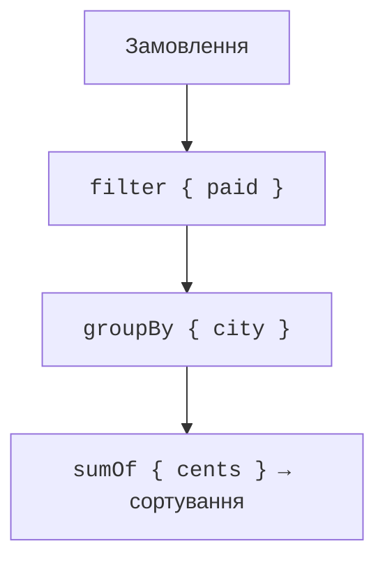

# Операції над колекціями

## Перетворення й відбір

`map` повертає по одному результату для кожного елемента. `mapNotNull` додатково вилучає nullable-результати. `filter` залишає елементи, що задовольняють предикат. `forEach` виконує дії та повертає `Unit`: його не використовують замість `map`, коли потрібна колекція результатів.

`any`, `all` і `none` перевіряють умови, зупиняючись, щойно результат відомий. Для порожньої колекції `all` і `none` істинні, а `any` хибний. Якщо предметна вимога містить «є хоча б один елемент і всі придатні», перевірка `all` сама по собі недостатня.

`first` кидає виняток при відсутності результату; `firstOrNull` повертає `null`. `maxByOrNull` також дозволяє природно обробити порожній набір. `count` рахує елементи, `sumOf` обчислює суму вибраних значень. Для грошей зручно зберігати цілі копійки й вибирати `Long`, перевіряючи допустимий діапазон сум.

::: info Знімок екрана
IntelliJ IDEA editor: filter/map chain; enable Kotlin lambda and chain type inlay hints.
:::

Рис. 11.4. Типи параметрів і результатів ланцюжка в редакторі. {.caption}

## Групування, індекси та згортання

`groupBy` створює словник списків: усі елементи зі спільним ключем залишаються в групі. `associateBy` створює один елемент на ключ; повторний ключ заміщує попередній. Не застосовуйте його як перевірку унікальності без окремої перевірки повторів.

`groupingBy().eachCount()` рахує кількість за ключем, не створюючи для клієнта списку кожної групи. `partition` повертає пару списків: спочатку ті, що пройшли предикат, потім решту. `associate` будує пару ключ/значення для кожного елемента і теж має політику заміни повторних ключів.

`fold(initial)` починає з заданого акумулятора і коректно працює на порожніх даних. `reduce` використовує перший елемент як початок і без окремої політики не підходить для порожнього набору. Тип акумулятора `fold` може відрізнятися від типу елемента.

### Приклад 3. Звіт про замовлення

```kotlin
data class Order(
    val id: Int,
    val city: String,
    val cents: Long,
    val paid: Boolean
)

fun totals(orders: List<Order>): List<Pair<String, Long>> {
    require(orders.all { it.cents in 0..1_000_000 })
    require(orders.size <= 100_000)
    require(orders.map { it.id }.toSet().size == orders.size)
    return orders.filter { it.paid }
        .groupBy { it.city }
        .map { (city, values) -> city to values.sumOf { it.cents } }
        .sortedWith(
            compareByDescending<Pair<String, Long>> { it.second }
                .thenBy { it.first }
        )
}

fun main() {
    val orders = listOf(
        Order(1, "Kyiv", 500, true),
        Order(2, "Lviv", 700, true),
        Order(3, "Kyiv", 200, true),
        Order(4, "Odesa", 900, false)
    )
    println(totals(orders))
    println(totals(emptyList()))
    println(orders.groupingBy { it.paid }.eachCount())
    println(orders.fold(0L) { sum, order -> sum + order.cents })
}
```

```text
[(Kyiv, 700), (Lviv, 700)]
[]
{true=3, false=1}
2300
```



Рис. 11.5. Звіт відбирає оплачені замовлення, групує й агрегує. {.caption}

Другий ключ сортування потрібний для відтворюваного порядку нічиєї. Верхні межі кількості й ціни дозволяють довести, що сума вміщується в `Long`. Порожній результат не є помилкою, а означає відсутність оплачених замовлень. Початковий список при цьому не змінюється.

`zip` поєднує елементи двох колекцій за позиціями й зупиняється на коротшій. Якщо довжини мають збігатися, їх потрібно перевірити окремо. `flatMap` перетворює кожен елемент на набір і об’єднує ці набори. `chunked(n)` ділить на блоки, а `windowed(n)` утворює ковзні вікна; параметри кроку й неповних вікон змінюють результат.

`distinctBy` залишає перший елемент для кожного ключа. Це також політика втрати повторних записів, тому її треба обирати свідомо. Наприклад, якщо потрібне останнє вимірювання датчика, перший елемент початкового списку може бути неправильним вибором.
