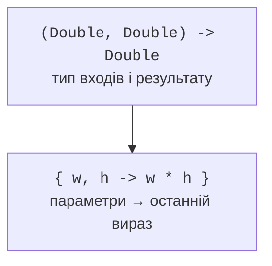

# Функціональні типи та лямбди

## Функціональні типи

Тип `(Int, Int) -> Int` описує функцію з двома цілими параметрами й цілим результатом. Тип `() -> Unit` описує дію без параметрів і корисного результату. Тип `(String) -> Boolean` часто називають предикатом. Сам тип не говорить, чи функція змінює зовнішній стан; це потрібно документувати окремо.

```kotlin
typealias IntOperation = (Int, Int) -> Int

fun sum(a: Int, b: Int): Int = a + b

fun apply(a: Int, b: Int, operation: IntOperation): Int =
    operation(a, b)

fun main() {
    val add: IntOperation = ::sum
    val multiply: IntOperation = { a, b -> a * b }
    println(apply(3, 4, add))
    println(apply(3, 4, multiply))
    val optional: (() -> String)? = null
    println(optional?.invoke() ?: "no action")
}
```

```text
7
12
no action
```

Дужки nullable-функції важливі. `(() -> String)?` – відсутня або наявна функція, а `() -> String?` – завжди наявна функція, яка може повернути `null`. Виклик `invoke()` еквівалентний круглим дужкам виклику; безпечний виклик корисний для nullable-функції.

Псевдонім спрощує читання, але не створює нового типу. Дві функції з однаковими сигнатурами можуть мати зовсім різний предметний зміст. Якщо API має розрізняти стратегію оплати і форматування, окремі функціональні інтерфейси можуть краще виразити намір.

## Синтаксис лямбди

Лямбда має фігурні дужки, необов’язковий список параметрів, стрілку й тіло. Значення останнього виразу стає результатом. Типи параметрів можна опустити, якщо вони відомі з очікуваного функціонального типу. Для одного параметра часто доступне ім’я `it`, але у вкладених лямбдах явні імена зменшують плутанину.



Рис. 11.1. Функціональний тип задає контракт, лямбда – реалізацію. {.caption}

Якщо останній параметр функції є функціональним, лямбду можна винести за круглі дужки: `values.filter { it > 0 }`. Якщо це єдиний аргумент, круглі дужки можна опустити. Символ `_` позначає параметр, який свідомо не використовується, наприклад при деструктуризації пари ключа й значення.

Посилання `::function` передає вже оголошену функцію. Посилання `::ClassName` може передавати конструктор. `object::method` зв’язує функцію з конкретним об’єктом-приймачем. Посилання на перевантажену функцію іноді потребує явного очікуваного типу, щоб компілятор вибрав потрібну сигнатуру.

Анонімна функція `fun(x: Int): Int { return x * x }` відрізняється від лямбди правилами `return`. Її звичайний `return` завершує саму анонімну функцію. Лямбда, передана inline-функції, за певних умов може виконати нелокальне повернення з зовнішньої функції.

## Приклад 1. Калькулятор зі словником операцій

Словник пов’язує текстову команду з поведінкою. Таблиця операцій відокремлена від перевірки аргументів і пошуку команди. Для ділення введено предметну відмову при нульовому дільнику; скінченність перевіряється і для входів, і для результату.

```kotlin
typealias Operation = (Double, Double) -> Double

val operations: Map<String, Operation> = mapOf(
    "+" to { a, b -> a + b },
    "-" to { a, b -> a - b },
    "*" to { a, b -> a * b },
    "/" to { a, b ->
        require(b != 0.0) { "division by zero" }
        a / b
    }
)

fun calculate(symbol: String, a: Double, b: Double): Double {
    require(a.isFinite() && b.isFinite()) { "invalid input" }
    val operation = operations[symbol]
        ?: throw IllegalArgumentException("unknown operation")
    val result = operation(a, b)
    require(result.isFinite()) { "result overflow" }
    return result
}

fun main() {
    println(calculate("+", 2.0, 3.0))
    println(calculate("/", 9.0, 2.0))
    try {
        calculate("/", 1.0, 0.0)
    } catch (error: IllegalArgumentException) {
        println(error.message)
    }
    try {
        calculate("?", 1.0, 2.0)
    } catch (error: IllegalArgumentException) {
        println(error.message)
    }
}
```

```text
5.0
4.5
division by zero
unknown operation
```

Усі функції в словнику мають один контракт типів, але власні передумови. Додавання нової операції не вимагає зміни механізму пошуку. Натомість зміна типу чисел або політики округлення є зміною загального контракту й потребує перегляду всіх стратегій.
