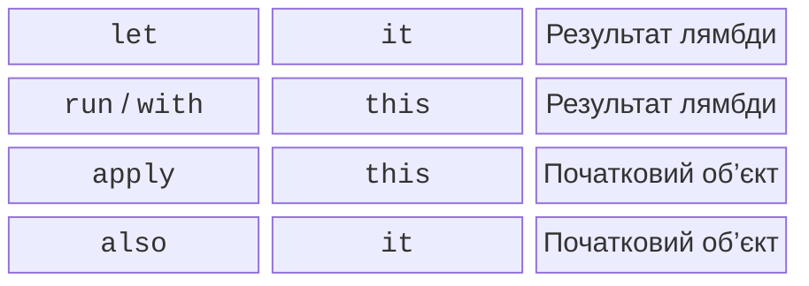

# Функції області видимості

## Лямбди з приймачем і функції області видимості

Тип `StringBuilder.() -> Unit` додає об’єкт-приймач до лямбди. У тілі його методи доступні як виклики `this`, часто без явного імені. `buildString` створює будівник, виконує лямбду та повертає готовий рядок. Такий підхід лежить в основі невеликих предметних DSL.



Рис. 11.3. Вибір функції за доступом до об’єкта та типом результату. {.caption}

`let` зручно використовувати після `?.` для роботи з наявним nullable-значенням. `run` підходить для обчислення результату в контексті об’єкта. `with(obj)` групує виклики вже наявного об’єкта. `apply` повертає налаштований об’єкт, а `also` дозволяє додаткову дію з ним через `it`. `takeIf` повертає об’єкт, якщо предикат істинний, або `null`; `takeUnless` має протилежну умову.

Не варто вкладати кілька функцій із неявними `this` і `it` без потреби. Якщо важко визначити власника поля, явно назвіть параметр або використайте звичайну змінну. Функції області видимості не створюють нового потоку, не копіюють об’єкт і не змінюють правила null-безпеки.

### Приклад 2. Налаштування об’єкта

```kotlin
class ReportOptions {
    var title: String = "Report"
    var limit: Int = 10
}

fun options(rawTitle: String?): ReportOptions {
    val title = rawTitle?.trim()?.takeIf { it.isNotEmpty() }
    return ReportOptions().apply {
        this.title = title ?: "Untitled"
        limit = 5
    }.also { value ->
        require(value.limit > 0)
    }
}

fun main() {
    val configured = options("  Sales  ")
    val text = with(configured) { "$title: $limit" }
    println(text)
    println(options(null).title)
    val message = buildString {
        append("Title=")
        append(configured.title)
    }
    println(message)
}
```

```text
Sales: 5
Untitled
Title=Sales
```

У `apply` локальна змінна `title` і властивість мають однакове ім’я, тому `this.title` явно вказує на об’єкт. Перевірка `also` не змінює значення, що проходить далі. Якби потрібним результатом був готовий текст, доречнішим був би `run`, а не `apply`.
