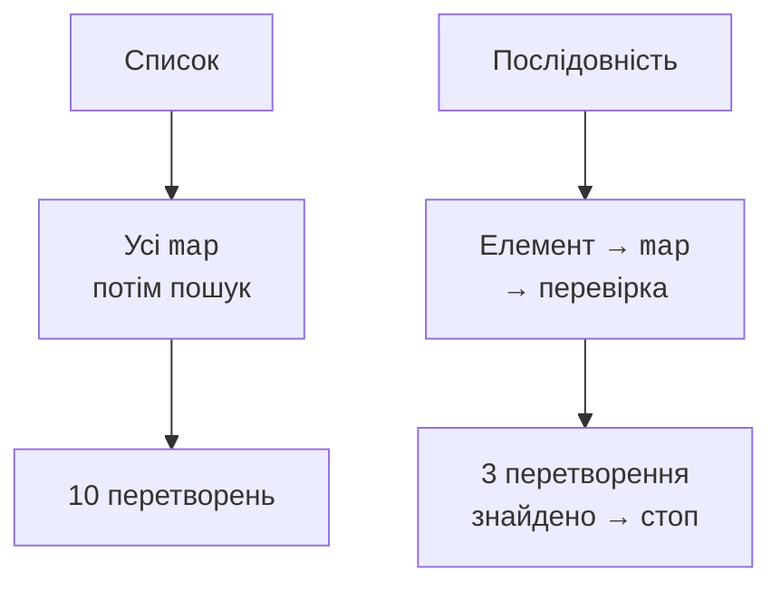

# Послідовності та SAM-інтерфейси

## Послідовності та лінива обробка

Операції над звичайними колекціями переважно виконуються одразу й створюють проміжні колекції. `Sequence<T>` описує поелементне отримання значень. Проміжні `map` і `filter` налаштовують конвеєр; кінцеві `toList`, `first`, `sum` запускають його.



Рис. 11.6. Список обробляє етапами, послідовність – шляхом окремого елемента до результату. {.caption}

Лінивість дозволяє зупинити роботу, коли знайдено потрібну кількість. Проте `sorted` повинен побачити всі елементи, щоб видати перший у правильному порядку. Нескінченну послідовність не можна безумовно сортувати або перетворювати на список.

Послідовність не обов’язково швидша за список. Для малого набору додаткові об’єкти й непрямі виклики можуть переважати користь від відсутності проміжних списків. Порівнювати потрібно реальне навантаження, з однаковим результатом і прогріванням JVM.

### Приклад 4. Прості числа та межа обчислень

Генератор видає прості числа до явно заданої межі. Умова `divisor <= number / divisor` уникає переповнення множення `divisor * divisor`. Навчальну верхню межу обмежено для передбачуваного часу роботи.

```kotlin
fun isPrime(number: Int): Boolean {
    if (number < 2) return false
    var divisor = 2
    while (divisor <= number / divisor) {
        if (number % divisor == 0) return false
        divisor++
    }
    return true
}

fun primes(limit: Int): Sequence<Int> = sequence {
    require(limit in 0..1_000_000)
    for (number in 2..limit) {
        if (isPrime(number)) yield(number)
    }
}

fun main() {
    println(primes(100).take(5).toList())
    println(primes(1).toList())
    var eagerCalls = 0
    val eager = (1..10).map { eagerCalls++; it * it }
        .first { it >= 9 }
    var lazyCalls = 0
    val lazy = (1..10).asSequence()
        .map { lazyCalls++; it * it }
        .first { it >= 9 }
    println("$eager $eagerCalls")
    println("$lazy $lazyCalls")
}
```

```text
[2, 3, 5, 7, 11]
[]
9 10
9 3
```

Лічильники в прикладі додані лише для спостереження порядку. У прикладному конвеєрі `map` бажано робити чистим перетворенням: повторний обхід може повторити всі побічні дії. `sequence {}` зазвичай запускає тіло заново для нового обходу; окремі джерела можуть дозволяти лише один обхід. Перевіряйте контракт джерела.

`generateSequence(seed) { next }` зручно задає рекурентне правило. Повернення `null` завершує генерацію. Для чисел Фібоначчі потрібно визначити поведінку до переповнення `Long`; нескінченний за задумом математичний ряд не стає нескінченним машинним числовим типом.

::: info Знімок екрана
IntelliJ IDEA Debug: break after first; show eagerCalls=10 and lazyCalls=3. Use stream trace only if supported for this Kotlin chain.
:::

Рис. 11.7. Спостереження кількості обчислень у лінивому конвеєрі. {.caption}

Лінивий ресурс не повинен переживати власника. Якщо послідовність рядків походить із відкритого файлу, її потрібно обробити до закриття reader. Повернення такої послідовності з `use` створює об’єкт, який спробує читати вже закритий ресурс. У наступній темі цей контракт буде показаний на `useLines`.

## Функціональні інтерфейси й Java SAM

`fun interface Predicate<T> { fun test(value: T): Boolean }` має один абстрактний метод і допускає створення лямбдою. На відміну від псевдоніма функціонального типу, це окремий тип контракту з власним ім’ям і можливими допоміжними методами. Java-інтерфейси на кшталт `Runnable` також підтримують SAM-перетворення.

При передачі лямбди до Java API звертайте увагу на nullable-типи, винятки й час виконання. API може зберегти callback та викликати його пізніше або в іншому потоці. Захоплений змінюваний стан тоді потребує іншого аналізу, ніж локальний послідовний `map`.

Практичне правило вибору просте: цикл добре показує складне керування станом і ранні виходи; операції колекцій добре показують відбір, перетворення й агрегування; послідовність доречна, коли корисні лінивість і коротке замикання. Кожен варіант слід перевірити на порожньому наборі, повторних ключах і межах числових типів.
