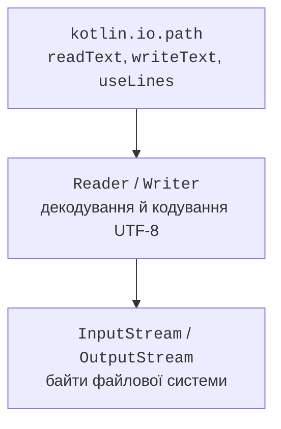

# Файли, текст і байти

## Шлях і робоча тека

`java.nio.file.Path` описує шлях, але не відкриває файл і не доводить його існування. Функція `kotlin.io.path.Path("data", "books.json")` зручно будує шлях із компонентів. `resolve` приєднує відносну частину, `parent` дає батьківську теку, а `fileName` – останній компонент. Абсолютний шлях визначає розташування незалежно від поточної робочої теки.

Відносний шлях обчислюється від робочої теки процесу, а не від теки вихідного файла `.kt`. IntelliJ IDEA, Gradle і запуск JAR можуть мати різні налаштування цієї теки. Для діагностики надрукуйте `Path("").toAbsolutePath()`, а в інтерфейсі програми краще приймайте вхідний і вихідний шляхи аргументами.

`normalize()` прибирає синтаксичні сегменти `.` і `..`, але не встановлює реальну тотожність через символічні посилання. `toRealPath()` звертається до файлової системи й може кинути виняток. Якщо програма обмежує роботу певною текою, перевірки лише текстового префікса недостатньо для всіх файлових ситуацій.

`exists()` корисний для повідомлення, але не гарантує успіху наступного читання: між перевіркою й відкриттям стан може змінитися. Основну операцію все одно потрібно виконати з обробкою помилок. `createDirectories()` створює відсутні батьківські теки; для вже наявної теки це звичайний успішний випадок.



Рис. 12.1. Високорівневе читання спирається на кодування й ресурси нижчого рівня. {.caption}

## Текст, байти та закриття ресурсів

Текстові дані зберігаються як байти в конкретному кодуванні. У прикладах явно використовується UTF-8. Одна літера Unicode може займати кілька байтів, а `String.length` на JVM рахує UTF-16-кодові одиниці, не обов’язково видимі символи. Тому розмір файла в байтах, довжина рядка і кількість графем – різні показники.

`readText` завантажує весь файл у рядок; `readLines` – у список рядків. Для невеликих конфігурацій це зручно. `useLines` дає ліниву послідовність рядків усередині блоку та закриває reader після завершення, включно з виходом через виняток.

```kotlin
import java.nio.file.Files
import kotlin.io.path.readText
import kotlin.io.path.useLines
import kotlin.io.path.writeText

fun main() {
    val file = Files.createTempFile("lines-", ".txt")
    try {
        file.writeText("Ada\nBohdan\n", Charsets.UTF_8)
        val count = file.useLines(Charsets.UTF_8) { lines ->
            lines.count()
        }
        println(count)
        println(file.readText(Charsets.UTF_8).startsWith("Ada"))
    } finally {
        Files.deleteIfExists(file)
    }
}
```

```text
2
true
```

Не повертайте `lines` із `useLines`: після виходу з блоку ресурс уже закритий. Усередині потрібно обчислити результат або матеріалізувати потрібні дані. `use` застосовується до ресурсу, що закривається, наприклад buffered reader, writer чи stream. Він не означає транзакційність запису та не скасовує вже записані байти.

`writeText` замінює вміст файла, а `appendText` додає до кінця. Перед викликом переконайтеся, що така політика відповідає задачі. Для звіту з вхідного файла не використовуйте той самий шлях без спеціально реалізованої безпечної заміни.

## Приклад 1. Журнал подій

Кожен запис має просту структуру `LEVEL|message`, один запис на рядок. Повідомлення не може містити переноси чи роздільник. Програма дописує кілька подій і рахує лише рядки рівня ERROR. Тимчасовий файл робить демонстрацію незалежною від попередніх запусків.

```kotlin
import java.nio.file.Files
import java.nio.file.Path
import kotlin.io.path.appendText
import kotlin.io.path.useLines

fun appendEvent(path: Path, level: String, message: String) {
    require(level in setOf("INFO", "WARN", "ERROR"))
    require(message.isNotBlank())
    require(message.none { it == '\n' || it == '\r' || it == '|' })
    path.appendText("$level|$message\n", Charsets.UTF_8)
}

fun errorCount(path: Path): Int =
    path.useLines(Charsets.UTF_8) { lines ->
        lines.count { it.startsWith("ERROR|") }
    }

fun main() {
    val path = Files.createTempFile("events-", ".log")
    try {
        appendEvent(path, "INFO", "start")
        appendEvent(path, "ERROR", "missing item")
        appendEvent(path, "WARN", "retry")
        println(errorCount(path))
        try {
            appendEvent(path, "INFO", "bad\nmessage")
        } catch (error: IllegalArgumentException) {
            println("invalid message")
        }
        println(errorCount(path))
    } finally {
        Files.deleteIfExists(path)
    }
}
```

```text
1
invalid message
1
```

Перевірка повідомлення виконується до запису, тому неправильний запис не додає часткового рядка. Це не повноцінна багатопроцесна система журналювання: одночасні writers, ротація й синхронізація потребують окремого рішення. Для прикладного журналу часто використовують спеціалізовану бібліотеку, а не власний текстовий файл.
