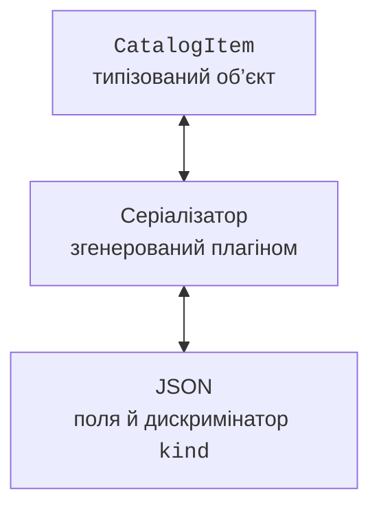

# Серіалізація JSON

## Підключення kotlinx.serialization і тестів

Плагін компілятора генерує серіалізатори для позначених класів, а runtime-бібліотека виконує кодування й декодування. Версія плагіна збігається з Kotlin 2.4.20, версія runtime має власну нумерацію. Тут зафіксовано стабільну kotlinx.serialization 1.11.0 та JUnit 6.0.3. Реліз-кандидат бібліотеки не є вимогою курсу.

Повний `build.gradle.kts` для прикладів теми:

```kotlin
import org.jetbrains.kotlin.gradle.dsl.JvmTarget

plugins {
    kotlin("jvm") version "2.4.20"
    kotlin("plugin.serialization") version "2.4.20"
}

repositories { mavenCentral() }

kotlin {
    jvmToolchain(27)
    compilerOptions { jvmTarget.set(JvmTarget.JVM_26) }
}
tasks.withType<JavaCompile>().configureEach {
    options.release.set(26)
}

dependencies {
    implementation(
        "org.jetbrains.kotlinx:kotlinx-serialization-json:1.11.0"
    )
    testImplementation(kotlin("test"))
    testImplementation(platform("org.junit:junit-bom:6.0.3"))
    testImplementation("org.junit.jupiter:junit-jupiter")
    testRuntimeOnly("org.junit.platform:junit-platform-launcher")
}

tasks.test { useJUnitPlatform() }
```

JDK 27 є toolchain і середовищем запуску. Ціль байт-коду26 задана явно відповідно до підтримки компілятора Kotlin 2.4.20; це не підміна встановленої JDK. Gradle у перевіреному середовищі запускається на сумісній JVM 25, а задачі використовують toolchain27. Шлях до локальної JDK задають у налаштуваннях IDE або локальному `gradle.properties`, не копіюючи чужий абсолютний шлях у проєкт.

У `settings.gradle.kts` достатньо задати назву проєкту. Для командного запуску основного класу можна додати плагін `application`, а тести працюють через задачу `test` і без нього. Якщо версії винесено в `gradle/libs.versions.toml`, збережіть одну узгоджену версію Kotlin для JVM і serialization-плагінів.

::: info Знімок екрана
IntelliJ IDEA: build.gradle.kts with Kotlin JVM/serialization2.4.20, JSON1.11.0 and JUnit6.0.3; Gradle sync successful.
:::

Рис. 12.2. Плагін серіалізації та залежності в Gradle. {.caption}

## JSON і серіалізовані моделі

Анотація `@Serializable` дозволяє плагіну створити серіалізатор. Виклик `Json.encodeToString(value)` формує JSON, а `decodeFromString<Type>(text)` відновлює значення відповідно до схеми типу. Декодер не повинен здогадуватися про довільний клас із зовнішнього імені; доступні моделі визначає програма.



Рис. 12.3. Згенерований серіалізатор узгоджує модель і JSON-подання. {.caption}

`prettyPrint` змінює оформлення, а не зміст. `encodeDefaults` визначає запис полів зі значеннями за замовчуванням. `ignoreUnknownKeys` дозволяє пропустити невідомі поля; для конфігурації це може допомогти сумісності, але також приховати друкарську помилку. `explicitNulls` керує явними null у JSON; вимкнення може вплинути на round-trip для nullable-полів із не-null значенням за замовчуванням.

`@SerialName` задає зовнішнє ім’я поля або типу. Це дозволяє змінити назву Kotlin-властивості без зміни формату файла. `@Transient` виключає властивість зі схеми; вона повинна мати значення за замовчуванням. Не плутайте цю анотацію з іншими анотаціями JVM зі схожою назвою: імпорт має значення.

### Приклад 3. Каталог із sealed-поліморфізмом

Книги й аудіокниги мають різні поля, але зберігаються в одному списку базового типу. Дискримінатор `kind` указує варіант схеми. Стабільні зовнішні імена `printed` і `audio` не залежать від повного імені класу в пакеті.

```kotlin
import kotlinx.serialization.SerialName
import kotlinx.serialization.Serializable
import kotlinx.serialization.encodeToString
import kotlinx.serialization.json.Json

@Serializable
sealed interface CatalogItem {
    val title: String
}

@Serializable
@SerialName("printed")
data class PrintedBook(
    override val title: String,
    val pages: Int
) : CatalogItem {
    init { require(title.isNotBlank() && pages > 0) }
}

@Serializable
@SerialName("audio")
data class AudioBook(
    override val title: String,
    val minutes: Int
) : CatalogItem {
    init { require(title.isNotBlank() && minutes > 0) }
}

fun main() {
    val format = Json {
        classDiscriminator = "kind"
        prettyPrint = true
    }
    val items: List<CatalogItem> = listOf(
        PrintedBook("Kobzar", 200),
        AudioBook("Forest", 90)
    )
    val text = format.encodeToString(items)
    println(text)
    val restored = format.decodeFromString<List<CatalogItem>>(text)
    println(restored == items)
    check(restored.size == 2)
}
```

```text
[
    {
        "kind": "printed",
        "title": "Kobzar",
        "pages": 200
    },
    {
        "kind": "audio",
        "title": "Forest",
        "minutes": 90
    }
]
true
```

JSON вище відформатований параметром `prettyPrint`, щоб кожний об’єкт і поле було зручно читати в редакторі. Статичний тип `List<CatalogItem>` важливий для поліморфного кодування: він повідомляє, що елементи є варіантами базового контракту. Відкрита ієрархія замість sealed потребуватиме реєстрації допустимих підтипів у `SerializersModule`.

::: info Знімок екрана
IntelliJ IDEA: data/books.json with printed/audio entries, kind discriminator and Project tree; no personal data.
:::

Рис. 12.4. Відформатований каталог у редакторі JSON. {.caption}

Для невідомої або частково відомої схеми можна декодувати `JsonElement`, перевірити `JsonObject` і читати потрібні поля. Це дерево JSON, а не автоматично типобезпечна предметна модель. Після перевірки структури все одно потрібно перевірити допустимість значень і перетворити їх у модель.

JVM API `encodeToStream` дозволяє писати в `OutputStream` без створення великого проміжного рядка. У використаній версії експериментальні API вимагають відповідного `@OptIn`. Stream потрібно закрити через `use`; передача stream до серіалізатора не передає йому автоматично політику володіння.

## Дати та власний серіалізатор

`java.time.LocalDate` представляє календарну дату без часу й часового поясу. Для строки ISO `2026-09-17` природний контракт – `LocalDate.parse` і `toString`. Серіалізатор повинен явно задати примітивний рядковий дескриптор, а не покладатися на внутрішні поля JDK-класу.

```kotlin
import java.time.LocalDate
import kotlinx.serialization.KSerializer
import kotlinx.serialization.Serializable
import kotlinx.serialization.descriptors.PrimitiveKind
import kotlinx.serialization.descriptors.PrimitiveSerialDescriptor
import kotlinx.serialization.encoding.Decoder
import kotlinx.serialization.encoding.Encoder
import kotlinx.serialization.encodeToString
import kotlinx.serialization.json.Json

object DateSerializer : KSerializer<LocalDate> {
    override val descriptor = PrimitiveSerialDescriptor(
        "LocalDate", PrimitiveKind.STRING
    )
    override fun serialize(encoder: Encoder, value: LocalDate) {
        encoder.encodeString(value.toString())
    }
    override fun deserialize(decoder: Decoder): LocalDate =
        LocalDate.parse(decoder.decodeString())
}

@Serializable
data class Deadline(
    @Serializable(with = DateSerializer::class)
    val date: LocalDate
)

fun main() {
    val value = Deadline(LocalDate.of(2026, 9, 17))
    val text = Json.encodeToString(value)
    println(text)
    println(Json.decodeFromString<Deadline>(text) == value)
}
```

```text
{"date":"2026-09-17"}
true
```

`@Contextual` є іншим способом: серіалізатор шукається в модулі конкретного `Json`. Це доречно, коли вибір подання належить конфігурації формату. Без реєстрації потрібного contextual-серіалізатора декодування не стане працювати саме собою. Для першої реалізації явне `with = DateSerializer::class` легше простежити.
