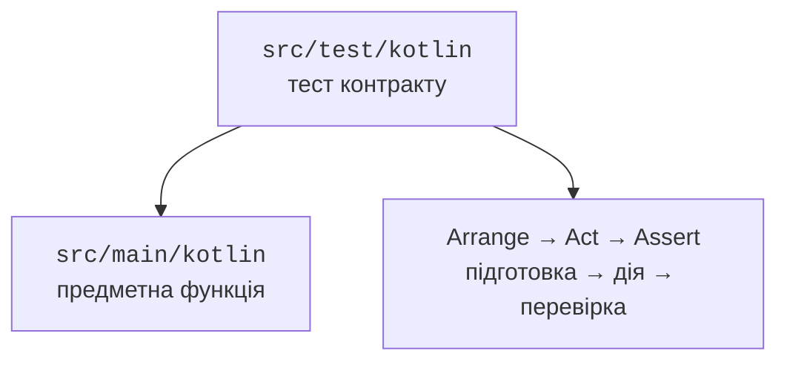

# Модульне тестування

## Модульний тест як виконуваний контракт

Модульний тест перевіряє конкретну поведінку з відомим входом. Він має підготовку Arrange, дію Act і перевірку Assert. Очікуване значення визначається незалежно від алгоритму, а не обчислюється тією самою функцією, яку тестуємо.



Рис. 12.5. Вихідний код і тест мають окремі ролі й окремі теки. {.caption}

Основний код міститься в `src/main/kotlin`, тести – у `src/test/kotlin`. `kotlin.test` надає `assertEquals`, `assertTrue` і `assertFailsWith`. JUnit Platform знаходить і запускає тести, а Jupiter є рушієм їх виконання. `useJUnitPlatform()` потрібний для правильного запуску відповідної тестової платформи в Gradle.

### Приклад 4. Калькулятор оцінок і параметризований тест

Файл `GradeCalculator.kt` у теці основного коду:

```kotlin
fun passed(score: Int): Boolean {
    require(score in 0..100) { "score outside 0..100" }
    return score >= 60
}

fun averageScore(scores: List<Int>): Double {
    require(scores.isNotEmpty()) { "empty scores" }
    require(scores.all { it in 0..100 })
    return scores.map { it.toDouble() }.average()
}
```

Файл `GradeCalculatorTest.kt` у теці тестів:

```kotlin
import kotlin.test.Test
import kotlin.test.assertEquals
import kotlin.test.assertFailsWith
import kotlin.test.assertTrue
import org.junit.jupiter.params.ParameterizedTest
import org.junit.jupiter.params.provider.CsvSource

class GradeCalculatorTest {
    @ParameterizedTest
    @CsvSource("0,false", "59,false", "60,true", "100,true")
    fun boundaries(score: Int, expected: Boolean) {
        assertEquals(expected, passed(score))
    }

    @Test
    fun mean() {
        val input = listOf(50, 70, 90)
        val result = averageScore(input)
        assertEquals(70.0, result)
        assertTrue(passed(result.toInt()))
    }

    @Test
    fun invalid() {
        assertFailsWith<IllegalArgumentException> { passed(-1) }
        assertFailsWith<IllegalArgumentException> { passed(101) }
        assertFailsWith<IllegalArgumentException> {
            averageScore(emptyList())
        }
    }
}
```

Чотири рядки `CsvSource` створюють чотири тестові виклики, тому клас має шість виконаних тестів. Межі59 і60 перевіряють саме перехід правила, а0 і100 – включення крайніх допустимих значень. Неправильні значення перевіряються як відмова, а не як довільний Boolean.

`@BeforeTest` і `@AfterTest` задають підготовку й очищення для окремого тесту. Тести не повинні залежати від порядку виконання або змінювати спільний користувацький файл. Для файлових перевірок JUnit `@TempDir` надає окрему тимчасову теку, яка очищується після тесту. Повний приклад репозиторію наведено в лабораторній.

::: info Знімок екрана
IntelliJ IDEA: run GradeCalculatorTest; show six passing invocations. Demonstrate one deliberate failed assertion only in a separate temporary change.
:::

Рис. 12.6. Результати параметризованих і звичайних тестів. {.caption}

## Запуск, звіт і покриття

Запустіть `./gradlew test` або у Windows `.\gradlew.bat test`. Gradle повертає ненульовий код при невдалих тестах. HTML-звіт міститься в `build/reports/tests/test/index.html`; XML-результати зручно читаються системою автоматичної перевірки. Збережений звіт стосується конкретного запуску, а не майбутніх змін.

::: info Знімок екрана
Browser: local build/reports/tests/test/index.html; show tests, failures, packages and test classes.
:::

Рис. 12.7. HTML-звіт Gradle із фактичними результатами тестів. {.caption}

Покриття показує, які рядки або гілки були виконані. Воно не доводить правильність очікувань. Тест, який викликає функцію й нічого не перевіряє, може дати високе покриття та пропустити серйозну помилку. Спочатку перевіряють поведінку й межі, а потім використовують звіт для пошуку невиконаних важливих гілок.

::: info Знімок екрана
IntelliJ IDEA Run with Coverage: GradeCalculator.kt gutter and Coverage tool window; show actual percentages, no invented values.
:::

Рис. 12.8. Покриття допомагає знайти неперевірені гілки. {.caption}

Kover є окремим інструментом покриття для Kotlin; його підключення не є обов’язковим для цієї лабораторної. Якщо вимірюєте покриття, зафіксуйте інструмент і конфігурацію, а не порівнюйте числа з різних режимів як однаковий показник.

Файлові тести мають перевіряти round-trip, відсутній файл, пошкоджений формат і недопустимі предметні дані. При помилці збереження важливо перевірити стан попереднього файла, а не лише тип винятку. Для JSON-схеми перевіряють також значення за замовчуванням, невідомі поля й невідомий дискримінатор типу.
