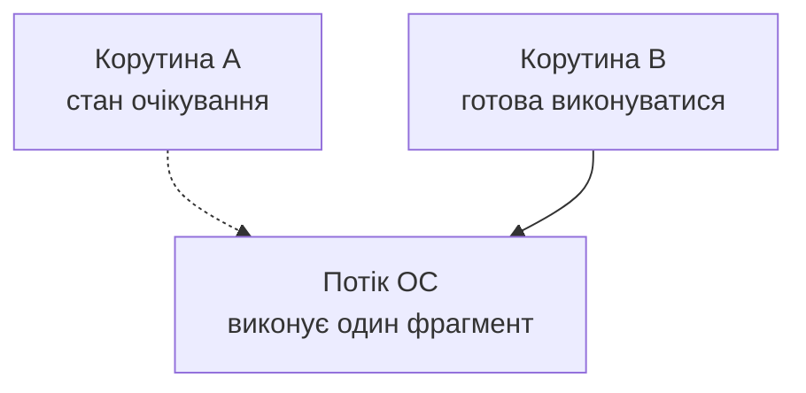
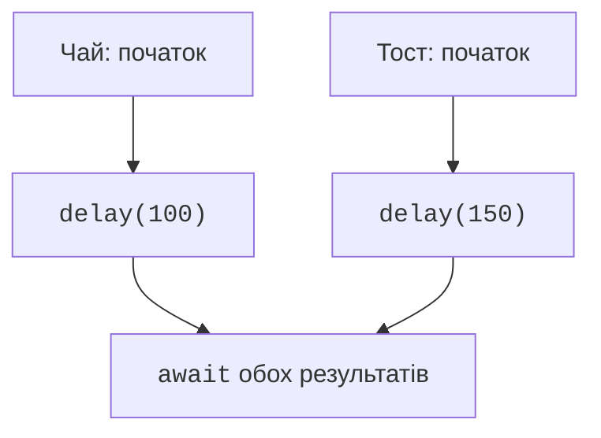

# Корутини та suspend-функції

## Навіщо програмі корутини

Поки програма очікує відповідь мережі, завершення таймера або новий запис, процесор може виконувати іншу роботу. **Конкурентність** (*concurrency*) означає, що кілька задач просуваються протягом одного проміжку часу. **Паралельність** (*parallelism*) означає одночасне виконання на кількох ядрах. Конкурентна програма може працювати на одному потоці; сама наявність корутин не гарантує прискорення.

**Корутина** (*coroutine*) – обчислення, яке можна призупинити та відновити. Потік ОС виконує її код між точками призупинення. Коли корутина викликає неблокувальне очікування `delay`, потік може виконати іншу корутину. `Thread.sleep` натомість утримує потік. Не кожний виклик `suspend` реально призупиняє виконання: готовий результат може повернутися відразу.

Підтримка `suspend` є частиною Kotlin, а `launch`, `async`, `Flow` та диспетчери належать бібліотеці **kotlinx.coroutines**. Офіційний вступ: <https://kotlinlang.org/docs/coroutines-overview.html>. У прикладах використовуємо `kotlinx-coroutines-core:1.11.0`. Версія цієї бібліотеки не дорівнює версії компілятора Kotlin.



Рис. 13.1. Потік виконує код; корутина зберігає стан очікування {.caption}

### Підключення та перший запуск

У JVM-проєкті теми 1 додайте залежність. Кожну повну програму цієї лекції запускайте окремо: замінюйте `Main.kt`, щоб не створювати кілька функцій `main` в одному пакеті. Обгортка Gradle та JDK залишаються такими, як налаштовано на початку курсу.

```kotlin
dependencies {
    implementation(
        "org.jetbrains.kotlinx:kotlinx-coroutines-core:1.11.0"
    )
    testImplementation(kotlin("test"))
    testRuntimeOnly("org.junit.platform:junit-platform-launcher")
    testImplementation(
        "org.jetbrains.kotlinx:kotlinx-coroutines-test:1.11.0"
    )
}
tasks.test { useJUnitPlatform() }
```

Після *Load Gradle Changes* імпорти `kotlinx.coroutines` мають розпізнаватися. Додавання залежності в інший модуль не допоможе файлу поточного модуля. Повідомлення про невідомий імпорт спочатку перевіряють у Gradle, а вже потім у налаштуваннях редактора.

## Suspend-функції та будівники

Модифікатор `suspend` дозволяє функції викликати інші функції призупинення. Її викликають із корутини або іншої `suspend`-функції. Компілятор перетворює виконання на машину станів: зберігає місце продовження й потрібні локальні значення. Це не створення нового потоку на кожний виклик і не обіцянка виконати код у фоні.

`runBlocking` створює корутину й блокує поточний потік до її завершення. Він зручний на межі звичайного консольного `main` і асинхронного коду. Усередині `suspend`-функції застосовують `coroutineScope`, а не вкладений `runBlocking`. У графічному обробнику блокування головного потоку заморожує вікно.

`launch` повертає **Job** – керування життєвим циклом задачі. `join()` чекає завершення, але не повертає результату обчислення. `async` повертає **Deferred**; `await()` чекає й повертає `T` або кидає виняток. Обидва будівники за замовчуванням запускаються відразу, коли диспетчер дозволить виконання.

Послідовність `async { ... }.await()` перед створенням другої задачі залишається послідовною. Для перекриття очікувань спочатку створюють обидва `Deferred`, потім читають результати. Порядок `await` не визначає порядок фактичного завершення задач.

### Приклад 1. Приготування сніданку

Дві незалежні дії імітуються затримками. Це модель очікування, а не реальне керування обладнанням. Функції повертають рядки; виведення виконує батьківська корутина після обох результатів.

```kotlin
import kotlinx.coroutines.*
import kotlin.time.measureTime

suspend fun tea(): String {
    delay(100)
    return "чай"
}

suspend fun toast(): String {
    delay(150)
    return "тост"
}

suspend fun breakfast(): List<String> = coroutineScope {
    val drink = async { tea() }
    val food = async { toast() }
    listOf(drink.await(), food.await())
}

fun main() = runBlocking {
    var sequential: List<String> = emptyList()
    val first = measureTime {
        sequential = listOf(tea(), toast())
    }
    var concurrent: List<String> = emptyList()
    val second = measureTime { concurrent = breakfast() }
    check(sequential == concurrent)
    println(concurrent.joinToString(" + "))
    println("Послідовно: $first")
    println("Конкурентно: $second")
}
```

Перший рядок – `чай + тост`. Часові рядки залежать від машини, навантаження та прогрівання JVM; їх не слід перевіряти точним порівнянням. Модель передбачає приблизно суму затримок для послідовного варіанта й найбільшу затримку для конкурентного. Вимірювання однієї ітерації не є повноцінним бенчмарком.



Рис. 13.2. Очікування двох дій перекриваються {.caption}
