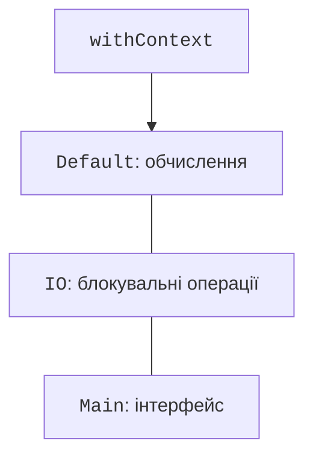

# Диспетчери та спільний стан

## Контекст і диспетчери

Контекст містить `Job`, диспетчер, ім’я корутини та інші елементи. `withContext` тимчасово змінює контекст і повертає результат блоку. Це звичайний спосіб винести блокувальне читання файлу з потоку інтерфейсу або виконати обчислення на робочому пулі.

- `Dispatchers.Default` – обчислювальна робота на пулі потоків.
- `Dispatchers.IO` – блокувальні файлові, мережеві, JDBC-операції.
- `Dispatchers.Main` – потік графічного інтерфейсу за наявності відповідного модуля платформи.
- `Dispatchers.Unconfined` починає виконання без прив’язки до певного потоку; після призупинення відновлення залежить від операції. Це спеціальний інструмент, не універсальний «швидкий» режим.



Рис. 13.4. Диспетчер обирають за характером роботи {.caption}

`limitedParallelism(n)` обмежує паралельне виконання певного представлення диспетчера. Це не семафор для цілого `suspend`-блоку: після призупинення можуть просуватися інші задачі. Для обмеження кількості одночасних операцій, включно з їхнім очікуванням, застосовують `Semaphore.withPermit`. Для взаємного виключення – `Mutex`.

`CoroutineName("download")` допомагає розрізняти задачі в журналі. Ім’я потоку не є надійним ідентифікатором корутини: вона може відновитися на іншому потоці того самого диспетчера.

## Спільний змінний стан

Операція `balance += amount` складається з читання, додавання та запису. Дві корутини на різних потоках можуть прочитати однакове старе значення і втратити одне оновлення. `volatile` забезпечує видимість доступу, але не робить таку послідовність атомарною. Для простого лічильника придатний `AtomicInteger`; для кількох пов’язаних полів потрібна одна захищена критична секція.

`Mutex` – взаємне виключення для корутин. Очікування зайнятого м’ютекса призупиняє корутину. `withLock` звільняє його і при винятку. Один м’ютекс має захищати всі доступи до конкретного інваріанта; локальний новий `Mutex()` у кожному виклику нічого не синхронізує між викликами.

### Приклад 3. Поповнення рахунку

Усі суми подаємо цілими копійками. Немає округлень `Double`. Після `joinAll` діти вже завершені, тому батько може перевірити кінцевий баланс. Випадкові затримки для правильності не потрібні.

```kotlin
import kotlinx.coroutines.*
import kotlinx.coroutines.sync.Mutex
import kotlinx.coroutines.sync.withLock

class Account {
    private val mutex = Mutex()
    private var cents = 0L

    suspend fun deposit(amount: Long) {
        require(amount > 0)
        mutex.withLock {
            cents = Math.addExact(cents, amount)
        }
    }

    suspend fun balance(): Long = mutex.withLock { cents }
}

fun main() = runBlocking {
    val account = Account()
    List(20) {
        launch(Dispatchers.Default) {
            repeat(100) { account.deposit(1) }
        }
    }.joinAll()
    check(account.balance() == 2000L)
    println("Баланс: ${account.balance()} коп.")
}
```

```text
Баланс: 2000 коп.
```

Нульове чи від’ємне поповнення порушує передумову й не змінює баланс. `Math.addExact` запобігає тихому переповненню `Long`. Для переказу між двома рахунками захист лише одного поля вже недостатній: операція має зберігати сумарний баланс. У темі 14 цей інваріант захищатиме транзакція бази даних.

### Канали як передавання роботи

`Channel<T>` передає елементи від виробника споживачеві. `send` та `receive` можуть призупиняти виконання; місткість обмежує накопичення. Кілька споживачів одного каналу ділять елементи між собою, а не отримують кожен усі повідомлення. Виробник закриває канал після завершення; цикл `for (x in channel)` вичитує залишок і закінчується. Скасування власника має також завершувати виробників та споживачів.

Канал зручний для черги замовлень, але для потоку показань із перетвореннями краще починати з `Flow`. `select` дозволяє очікувати кілька альтернативних операцій; у цьому курсі це оглядовий інструмент. Не слід додавати його, коли звичайна структурована область та один канал виражають задачу простіше.
