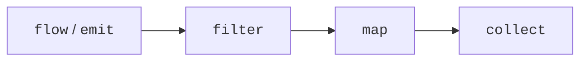
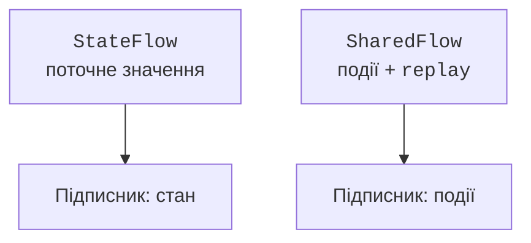

# Асинхронні потоки Flow

## Холодний потік Flow

**Flow** – асинхронна послідовність значень. Звичайний `flow { }` є **холодним**: його тіло починає виконуватися під час збирання результатів. Два незалежні `collect` повторять роботу виробника. Створити змінну з потоком ще не означає запустити датчик або запит.

`emit` передає наступне значення. `collect`, `toList` і `first` є кінцевими операторами; `map` і `filter` будують новий потік. Звичайний конвеєр виконує виробництво й обробку послідовно, доки спеціальний оператор не вводить додаткову конкурентність.



Рис. 13.5. Дані проходять конвеєром під час collect {.caption}

### Приклад 4. Датчик температури

Відкидаємо від’ємні значення за правилом цієї моделі, а не як загальне правило для температури. Потік перетворює градуси Цельсія на Фаренгейта; окремий `StateFlow` зберігає останній результат. Виробник завершується після трьох вимірювань.

```kotlin
import kotlinx.coroutines.*
import kotlinx.coroutines.flow.*

fun readings(): Flow<Int> = flow {
    for (value in listOf(-2, 0, 20)) {
        delay(5)
        emit(value)
    }
}

fun main() = runBlocking {
    val current = MutableStateFlow<Double?>(null)
    readings()
        .filter { it >= 0 }
        .map { it * 9.0 / 5 + 32 }
        .flowOn(Dispatchers.Default)
        .collect {
            current.value = it
            println("F = $it")
        }
    println("Останнє: ${current.value}")
    check(current.value == 68.0)
}
```

```text
F = 32.0
F = 68.0
Останнє: 68.0
```

`flowOn` змінює контекст розташованої вище частини конвеєра, а не нижнього `collect`. Усередині `flow` не слід викликати `emit` з довільного `withContext`: потік зберігає свій контекст. Для конкурентного виробництва з різних корутин існує `channelFlow`.

### Оператори та швидкість споживання

`transform` може видати нуль, один або кілька елементів на один вхідний. `take(n)` обмежує потік і скасовує непотрібне виробництво. `onEach` зручний для журналу, але сам по собі нічого не запускає. `buffer` дозволяє виробникові просуватися, поки споживач обробляє попередній елемент; необмежений буфер ризикує накопичити забагато даних.

`conflate` залишає останній доступний елемент, коли споживач повільний. Це придатно для поточного показника, але непридатно для всіх платежів: пропущений платіж змінить підсумок. `collectLatest` скасовує попередній блок обробки, коли приходить нове значення. Переривана дія має бути безпечною до скасування.

`debounce` пропускає значення після паузи у надходженні нових: зручний для пошукового рядка. У використаному API цей оператор позначений `FlowPreview`, тому приклад має явний `@OptIn`. Це локальна згода на попередній API, а не вимкнення всіх перевірок. Для нового запиту можна застосувати `mapLatest`, щоб старий повільний результат не замінив новий.

`zip` утворює пари відповідних елементів і завершується, коли один потік вичерпаний. `combine` після першого значення кожного джерела використовує останні значення під час кожного оновлення. Для ціни й кількості товару доречний `combine`; для парного читання двох однаково впорядкованих наборів – `zip`.

### Помилки потоку

`catch` обробляє помилки верхньої частини конвеєра. Він не ловить помилку нижнього `collect` і не перехоплює скасування потоку. Після помилки можна видати резервне значення, проте це не продовження з місця збою попереднього виробника. `retry` повторно запускає джерело: зовнішні дії можуть повторитися.

Повторюють лише тимчасові помилки, з обмеженою кількістю спроб і затримкою; неправильний пароль або некоректний формат не виправляться від нескінченного повторення. `onCompletion` придатний для спостереження за завершенням і його причиною. Він не є замінником `finally` для всіх ресурсів поза життєвим циклом потоку.

## StateFlow і SharedFlow

`StateFlow<T>` завжди має поточне `value`. Новий підписник отримує актуальний стан. Однакові за `equals` значення об’єднуються, а повільний споживач може пропустити проміжні зміни. Тому стан лічильника придатний для `StateFlow`, а журнал кожного кліку – ні. Зберігайте приватний `MutableStateFlow` і відкривайте `asStateFlow()`.

`update { old -> ... }` атомарно обчислює новий стан. Його лямбда може виконатися повторно при конкуренції; усередині не можна надсилати лист або збільшувати сторонній лічильник як побічний ефект. Для data-класу створюють `copy`, а не змінюють вкладений список того самого об’єкта: зміна повинна бути помітна механізму рівності.



Рис. 13.6. Поточний стан і розсилка подій мають різні контракти {.caption}

`SharedFlow` розсилає значення активним підписникам. `replay` визначає, скільки останніх значень отримує новий підписник. Без підписників і без replay подія може бути втрачена: це не стійка черга повідомлень. Для важливого результату збереження краще представляти підтвердження в стані, поки UI його не обробить.

`stateIn` і `shareIn` перетворюють холодний потік на спільний, але потребують області та політики запуску. `WhileSubscribed` пов’язує виробництво з наявністю підписників; тайм-аут зупинки допомагає пережити коротку перепідписку екрана. Гарячий потік зазвичай не завершується; у тесті його обмежують `take`, збирають у `backgroundScope` або явно скасовують збирача.
