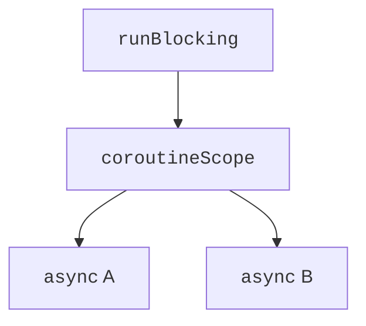

# Структурована паралельність

## Структурована паралельність

**Область корутин** (*coroutine scope*) задає контекст і межі життя дочірніх задач. `coroutineScope` не повертається, доки не завершаться його діти. Якщо одна звичайна дочірня задача завершується помилкою, область скасовує інші та передає помилку викликачеві. Так дочірня робота не продовжує непомітно змінювати стан після повернення функції.

Батько очікує дітей навіть тоді, коли код його власного блоку вже дійшов кінця. `join` потрібний для конкретної точки синхронізації, а не для того, щоб узагалі змусити область чекати дітей. `GlobalScope` втрачає цю локальну межу: відповідальність за зупинку задачі перекладається на весь застосунок. У навчальних прикладах усі задачі мають явного власника.



Рис. 13.3. Батько володіє дочірніми задачами {.caption}

Власний `CoroutineScope` доречний для компонента з визначеним життєвим циклом. Наприклад, контролер відкритого вікна скасовує свою область під час закриття. Створювати область в кожній функції, не зберігаючи її та не скасовуючи, означає приховувати фонову роботу. У темі 16 цю відповідальність розглянемо для `ViewModel`.

## Кооперативне скасування

`cancel()` надсилає запит на скасування. Він не зупиняє довільну інструкцію силою. Функції `delay`, `yield`, очікування каналів та інші скасовувані операції перевіряють стан задачі й кидають `CancellationException`. Для довгого циклу обчислення вставляють `ensureActive()` або перевіряють `isActive`.

Скасування – звичайна частина життєвого циклу, а не повідомлення «сервер зламався». Якщо `catch (e: Exception)` потрібний для предметної помилки, `CancellationException` слід повторно кинути. Інакше задача продовжить роботу після закриття екрана або тайм-ауту. `cancelAndJoin()` поєднує запит і очікування фактичного завершення.

Блок `finally` виконується і під час скасування. Звичайне закриття ресурсу можна виконати без додаткового контексту. Якщо очищення саме потребує призупинення, короткий блок `withContext(NonCancellable)` дозволяє його завершити. Довгу роботу там виконувати не слід: власник чекатиме її навіть після скасування.

### Приклад 2. Завантаження з обмеженням часу

Моделюємо джерело, яке потребує 500 мс, але даємо йому 80 мс. `withTimeoutOrNull` повертає `null` для власного тайм-ауту. Зовнішнє скасування не перетворюється на успішну відповідь.

```kotlin
import kotlinx.coroutines.*

suspend fun download(): String {
    try {
        delay(500)
        return "дані"
    } finally {
        println("Ресурс закрито")
    }
}

fun main() = runBlocking {
    val result = withTimeoutOrNull(80) { download() }
    println(result ?: "Час вичерпано")
    val fast = withTimeoutOrNull(500) {
        delay(1)
        "готово"
    }
    check(fast == "готово")
    println(fast)
}
```

```text
Ресурс закрито
Час вичерпано
готово
```

`withTimeout` натомість кидає `TimeoutCancellationException`. Тайм-аут не гарантує переривання блокувального JDBC-виклику чи довільного Java API. Для таких операцій потрібні власні тайм-аути драйвера, а для придатних до переривання викликів – `runInterruptible`. Не слід обіцяти миттєву зупинку всього вводу-виводу.

## Помилки та супервізія

У звичайній області помилка дитини скасовує батька незалежно від того, чи вже викликано `await`. `try/catch` навколо `await` не перетворює автоматично всю область на незалежні задачі. Якщо одна невдала перевірка не повинна скасовувати інші, межу незалежності задають через `supervisorScope` або `SupervisorJob`.

У супервізованій області невдалий `async` зберігає виняток у `Deferred`; кожний результат потрібно прочитати й обробити. Невдалий `launch` не має `await`, тому його необроблена помилка потребує належного обробника. `CoroutineExceptionHandler` служить для останнього повідомлення про необроблену помилку; він не відновлює завершену корутину і не замінює локальну обробку.

Супервізор не робить дітей незалежними від самого власника: скасування області скасовує всіх. Це важливо для екрана перевірки кількох серверів: збій одного сервера можна показати окремо, але закриття екрана має зупинити всі перевірки. Приклад такого розподілу відповідальності наведено в лабораторній.
