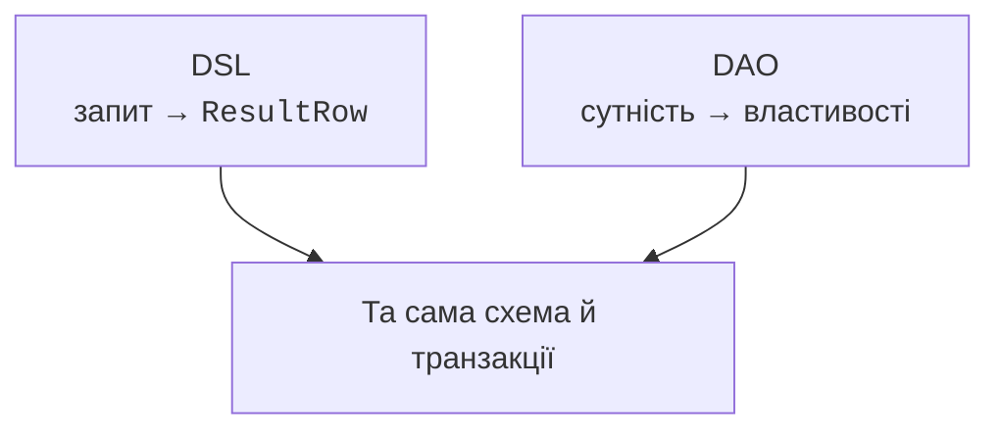
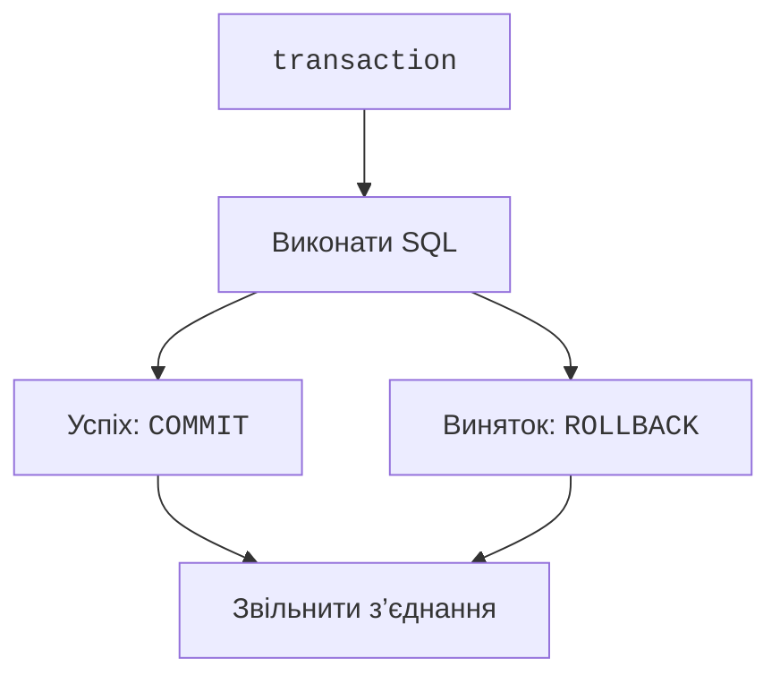

# DAO і транзакції

## DAO: рядок як об’єкт

**DAO** (*data access object*) у Exposed представляє рядок сутністю з делегованими властивостями. `IntEntity` зберігає ідентифікатор, `IntEntityClass` виконує пошук і створення, `by Table.column` пов’язує властивість зі стовпцем. Це зручно для навігації зв’язками, але не робить дані незалежними від транзакції та кешу сутностей.



Рис. 14.7. Два стилі доступу до тієї самої реляційної моделі {.caption}

### Приклад 3. Невеликий DAO-каталог

Це окремий проєкт із модулем `exposed-dao`. Дані читаються в транзакції й перетворюються на звичайний рядок перед виходом. У прикладі немає повернення «живої» DAO-сутності в інтерфейс.

```kotlin
import java.nio.file.Files
import org.jetbrains.exposed.v1.core.dao.id.*
import org.jetbrains.exposed.v1.dao.*
import org.jetbrains.exposed.v1.jdbc.*
import org.jetbrains.exposed.v1.jdbc.transactions.transaction

object Editions : IntIdTable("editions") {
    val title = varchar("title", 120)
}

class Edition(id: EntityID<Int>) : IntEntity(id) {
    companion object : IntEntityClass<Edition>(Editions)
    var title by Editions.title
}

fun main() {
    val path = Files.createTempFile("editions-", ".db")
    val db = Database.connect("jdbc:sqlite:$path",
        "org.sqlite.JDBC")
    val text = transaction(db) {
        SchemaUtils.create(Editions)
        val book = Edition.new { title = "Атлас" }
        book.title = "Навчальний атлас"
        "${book.id.value}: ${book.title}"
    }
    println(text)
    path.toFile().deleteOnExit()
}
```

```text
1: Навчальний атлас
```

Зв’язок `referencedOn` відображає посилання на одну сутність, `referrersOn` – колекцію дочірніх; `via` описує зв’язок багато-до-багатьох через проміжну таблицю. Ліниве читання зв’язку в циклі може спричинити проблему **N+1**: один запит списку і ще один для кожного рядка. Жадібне завантаження `with` або один явний join роблять кількість запитів передбачуваною.

DSL добре підходить для звітів, агрегатів і явного контролю SQL; DAO – для роботи з пов’язаними сутностями. Обидва підходи можна використовувати в одному проєкті, але для конкретної операції слід чітко визначити джерело актуального стану й межу кешування. У лабораторній основним стилем залишається DSL.

## Транзакція як межа цілісності

**Транзакція** – група операцій, що фіксується або відкочується разом. Переказ повинен одночасно зменшити один баланс і збільшити інший. Якщо друга дія не вдалася, збереження тільки першої порушує інваріант. Виняток має вийти з `transaction`, щоб вона відкотила зміни; перехопити його всередині й продовжити – інший сценарій.



Рис. 14.8. Фіксація або відкат усієї операції {.caption}

Атомарність не означає відсутність конкурентних конфліктів. Ізоляція визначає, які зміни інших транзакцій видно читачеві. Підтримувані рівні й блокування залежать від СКБД. SQLite серіалізує записи; серверні СКБД мають інші моделі конкурентності. Не тримайте транзакцію відкритою, поки користувач заповнює форму.

Вкладений `transaction` зазвичай використовує поточну транзакцію; окремі savepoint-сценарії потребують явного налаштування. Вкладений блок не обов’язково дає незалежний COMMIT. Повторні спроби також важливі: якщо тіло транзакції запускається знову, зовнішній лист або платіж не повинен виконатися двічі.

Пул з’єднань, наприклад HikariCP, повторно використовує обмежену кількість з’єднань. Пул не є кешем запитів і не збільшує можливості SQLite до необмеженої кількості одночасних записувачів. Його власник закриває пул при завершенні застосунку.
