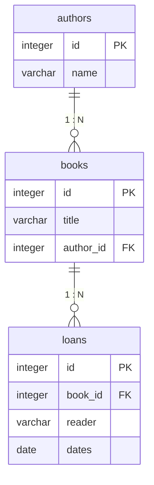

# Зв’язки та з’єднання

## Зв’язки та з’єднання

Один автор може мати багато книг, а книга – багато історичних видач. Замість повторення імені автора у кожній книзі зберігають зовнішній ключ. Це зменшує суперечності при перейменуванні. `ON DELETE` має відображати предметне правило: видалити залежні дані, заборонити видалення або очистити nullable-посилання.



Рис. 14.5. Зв’язки навчальної бібліотеки {.caption}

`innerJoin` залишає тільки рядки з відповідністю з обох боків. `leftJoin` залишає всі рядки лівої таблиці; поля відсутнього правого рядка будуть NULL. Тому звіт «усі автори, навіть без книг» потребує зовнішнього з’єднання. Умову на правій таблиці слід розташовувати уважно, щоб WHERE не відкинув NULL-рядки.

### Приклад 2. Каталог та кількість книг

Створимо двох авторів і три книги. Перший запит виведе назву та автора; другий – число книг автора. Обидва запити мають явний порядок. Для зручності кожний ResultRow одразу читається в межах транзакції.

```kotlin
import java.nio.file.Files
import org.jetbrains.exposed.v1.core.*
import org.jetbrains.exposed.v1.jdbc.*
import org.jetbrains.exposed.v1.jdbc.transactions.transaction

object Authors : Table("authors") {
    val id = integer("id").autoIncrement()
    val name = varchar("name", 100)
    override val primaryKey = PrimaryKey(id)
}

object Books : Table("books") {
    val id = integer("id").autoIncrement()
    val title = varchar("title", 120)
    val author = integer("author_id").references(Authors.id)
    override val primaryKey = PrimaryKey(id)
}

fun main() {
    val path = Files.createTempFile("library-", ".db")
    val db = Database.connect(
        "jdbc:sqlite:$path?foreign_keys=on", "org.sqlite.JDBC"
    )
    transaction(db) {
        SchemaUtils.create(Authors, Books)
        val a = Authors.insert { it[name] = "Автор A" }[Authors.id]
        val b = Authors.insert { it[name] = "Автор B" }[Authors.id]
        for ((title, author) in listOf(
            "Весна" to a, "Літо" to a, "Осінь" to b
        )) {
            Books.insert {
                it[Books.title] = title
                it[Books.author] = author
            }
        }
        (Books innerJoin Authors)
            .select(Books.title, Authors.name)
            .orderBy(Books.id)
            .forEach {
                println("${it[Books.title]}: ${it[Authors.name]}")
            }
        val count = Books.id.count()
        (Authors innerJoin Books)
            .select(Authors.name, count)
            .groupBy(Authors.id, Authors.name)
            .orderBy(Authors.id)
            .forEach { println("${it[Authors.name]}: ${it[count]}") }
    }
    path.toFile().deleteOnExit()
}
```

```text
Весна: Автор A
Літо: Автор A
Осінь: Автор B
Автор A: 2
Автор B: 1
```

Агрегат `count` є об’єктом SQL-виразу; його зберігають у змінній і використовують для читання того самого стовпця результату. `sum` та `avg` можуть повертати NULL для порожньої групи. Перетворення NULL на нуль повинно бути явним предметним рішенням.

Якщо таблиця приєднується двічі, наприклад відправник і одержувач переказу, потрібні псевдоніми `alias`. Без них однакові стовпці не розрізняються. Для великих звітів перевіряють план запиту й індекси, а не завантажують усі рядки для Kotlin `groupBy`.


Рис. 14.6. Таблиці та зовнішні ключі у клієнті бази даних {.caption}
