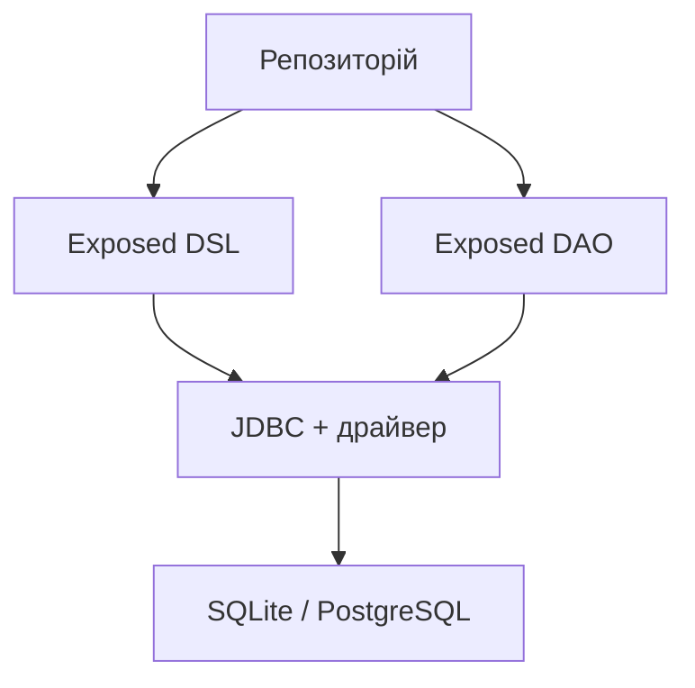

# База даних і підключення

## Від колекції до бази даних

Список у пам’яті зникає після завершення програми. JSON-файл зберігає значення, але сам не забезпечує зовнішні ключі, конкурентне оновлення та атомарний переказ між двома записами. **Реляційна база даних** представляє інформацію таблицями, підтримує обмеження та виконує запити мовою SQL.

Рядок – один факт або об’єкт; стовпець – його властивість. **Первинний ключ** (*primary key*) однозначно визначає рядок. **Зовнішній ключ** (*foreign key*) посилається на ключ іншої таблиці. Назва книги не є надійним ключем: різні видання можуть мати однакову назву. Числовий `id` відділяє ідентичність від тексту.

**JDBC** – стандартний Java API доступу до реляційних БД. Драйвер перекладає його виклики на протокол конкретної СКБД. **Exposed** – Kotlin-бібліотека JetBrains із типізованим DSL і DAO. Вона допомагає будувати SQL, але не скасовує потреби розуміти ключі, транзакції та вартість запиту. <https://www.jetbrains.com/help/exposed/home.html>.



Рис. 14.1. Місце Exposed у JVM-застосунку {.caption}

У цій темі використовуємо Exposed 1.4.0 та SQLite. Файл SQLite легко передати разом із лабораторною; окремий сервер не потрібний. PostgreSQL є серверною альтернативою для багатьох клієнтів. Результати слід перевіряти на цільовій СКБД: сумісний Kotlin-код не гарантує однакових SQL-типів, правил сортування й блокувань. <https://sqlite.org/docs.html>.

## Підготовка проєкту та підключення

До JVM-проєкту додайте модулі однакової версії. `exposed-core` містить вирази та опис схеми, `exposed-jdbc` – виконання через JDBC, `exposed-dao` – об’єктне представлення рядків. `exposed-java-time` додає типи `java.time`, якщо їх потребує схема. Залежність драйвера обов’язкова: Exposed не містить SQLite всередині.

```kotlin
dependencies {
    val exposed = "1.4.0"
    implementation("org.jetbrains.exposed:exposed-core:$exposed")
    implementation("org.jetbrains.exposed:exposed-jdbc:$exposed")
    implementation("org.jetbrains.exposed:exposed-dao:$exposed")
    implementation(
        "org.jetbrains.exposed:exposed-java-time:$exposed"
    )
    implementation("org.xerial:sqlite-jdbc:3.53.1.0")
    implementation(
        "org.jetbrains.kotlinx:kotlinx-coroutines-core:1.11.0"
    )
}
```

Пакети Exposed 1.x починаються з `org.jetbrains.exposed.v1`. Приклади зі старими `org.jetbrains.exposed.sql` не слід змішувати з новими імпортами. DSL-конструкції знаходяться у `core`, виконання запитів – у `jdbc`, транзакції – у `jdbc.transactions`. Сторінка міграції: <https://www.jetbrains.com/help/exposed/migration-guide-1-0-0.html>.

`Database.connect` створює опис доступу до БД. Реальні операції виконуються в `transaction(db)`. Для кількох баз передавайте `db` явно: прихований «останній зареєстрований» зв’язок складно перевіряти. JDBC URL `jdbc:sqlite:library.db` означає файл відносно робочої теки процесу, а не теки з `Main.kt`.

SQLite потребує ввімкнення перевірки зовнішніх ключів для кожного з’єднання. У прикладах використовується параметр драйвера `?foreign_keys=on`. Одноразова команда PRAGMA в іншому SQL-клієнті не налаштовує автоматично з’єднання вашої програми.

### Серверна альтернатива: PostgreSQL

Офіційне джерело інсталятора – <https://www.postgresql.org/download/windows/>. У майстрі оберіть сервер і командні засоби, зафіксуйте порт та адміністративний пароль. Для навчального застосунку створіть окрему базу й окремого користувача з потрібними правами. Не використовуйте адміністратора для повсякденної роботи програми.

У DataGrip відкрийте *File → New → Data Source → PostgreSQL*, вкажіть `localhost`, налаштований порт, базу й користувача. Після *Download missing driver files* виконайте *Test Connection*. Далі відкрийте консоль запитів і перевірте поточну базу. <https://www.jetbrains.com/help/datagrip/connecting-to-a-database.html>.

JDBC URL має форму `jdbc:postgresql://localhost:5432/library`; потрібний драйвер `org.postgresql:postgresql` узгодженої версії. Пароль читають зі змінної середовища або локальної конфігурації, що не потрапляє до Git. Повідомлення про помилку не повинно друкувати весь URL, якщо він містить секрети.

::: info Знімок екрана
Official Windows installer, Select Components; no password.
:::

Рис. 14.2. Компоненти серверної інсталяції PostgreSQL {.caption}

::: info Знімок екрана
PostgreSQL localhost library, Test Connection; hide secrets.
:::

Рис. 14.3. Перевірка навчального джерела даних у DataGrip {.caption}
