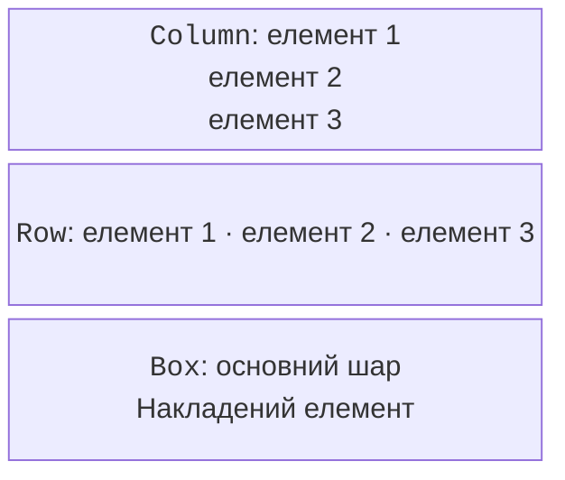
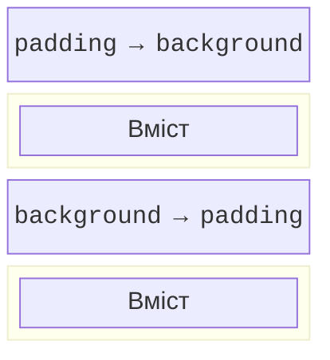

# Composable-функції та компонування

## Composable-функція та локальний стан

Анотація `@Composable` дозволяє функції брати участь у композиції. Вона описує UI, а не повертає готовий віджет для подальшої зміни. Composable викликають з іншої composable-функції або відповідного контексту, наприклад вмісту `Window`. Звичайна предметна функція без UI не потребує цієї анотації.

`remember` зберігає значення між рекомпозиціями у конкретному місці композиції. `mutableStateOf` створює спостережуваний стан. Делегування `by` дає синтаксис звичайної змінної, але читання та запис працюють через Compose State. Імпорти `getValue` і `setValue` потрібні для цього делегування.

### Приклад 1. Лічильник

Кнопка змінює стан; текст автоматично показує нове значення. Межа 100 запобігає переповненню в навчальному інтерфейсі. Скидання – звичайна подія, а не повторне створення вікна.

```kotlin
import androidx.compose.foundation.layout.*
import androidx.compose.material3.*
import androidx.compose.runtime.*
import androidx.compose.ui.Modifier
import androidx.compose.ui.unit.dp
import androidx.compose.ui.window.*

@Composable
fun Counter() {
    var count by remember { mutableStateOf(0) }
    Column(Modifier.padding(20.dp)) {
        Text("Кількість: $count")
        Row(horizontalArrangement = Arrangement.spacedBy(8.dp)) {
            Button(onClick = { count++ }, enabled = count < 100) {
                Text("Додати")
            }
            Button(onClick = { count = 0 }) { Text("Скинути") }
        }
    }
}

fun main() = application {
    Window(onCloseRequest = ::exitApplication,
        title = "Лічильник") {
        MaterialTheme { Counter() }
    }
}
```

Початковий екран показує `Кількість: 0`; після трьох натискань – `Кількість: 3`; після скидання – знову нуль. Закриття й повторний запуск також дають нуль: `remember` не зберігає дані на диску. Не використовуйте випадковий ключ remember, якщо стан має пережити звичайну рекомпозицію.


Рис. 15.4. Лічильник після трьох натискань {.caption}

`rememberSaveable` зберігає придатний до серіалізації стан через механізм saveable state власника. Це не автоматична база даних і не обіцянка відновлення після будь-якого перезапуску desktop. Для сталих налаштувань використовуйте файл або репозиторій.

## Компонування та Modifier

`Column` розміщує дітей вертикально, `Row` – горизонтально, `Box` – шарами. `Arrangement` визначає проміжки й розподіл уздовж головної осі; `Alignment` – вирівнювання по іншій осі. `Spacer` залишає місце. Абсолютні координати зазвичай зайві: вікно може змінювати розмір, а текст – довжину.



Рис. 15.5. Column, Row і Box вирішують різні задачі {.caption}

**Modifier** – впорядкований ланцюжок поведінки й оформлення. `padding`, `size`, `fillMaxWidth`, `background`, `border` і `clickable` не переставляються довільно. Зовнішній padding перед background залишає незабарвлене поле; padding після background входить до забарвленої області.



Рис. 15.6. Порядок модифікаторів змінює область оформлення {.caption}

`weight` застосовується в області `Row` або `Column`, яка розподіляє залишок місця. Сам по собі він не задає піксельну ширину. `BoxWithConstraints` дозволяє обрати компонування залежно від доступного місця; важливо перевіряти вузьке вікно, а не лише початковий розмір.

Розміри UI задають у `dp`, текст – у `sp`. Це логічні одиниці, а не вимога до кількості фізичних пікселів на кожному дисплеї. Висота текстового поля має враховувати системний масштаб і шрифт. Обрізаний підпис не виправляють зменшенням шрифту до нечитабельного.
