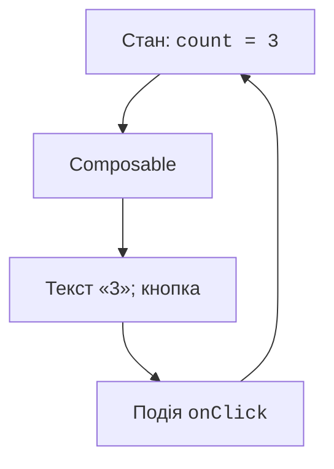
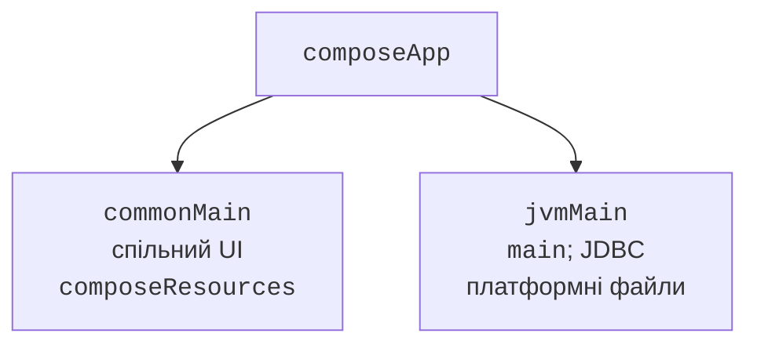

# Декларативний інтерфейс і проєкт

## Декларативний інтерфейс

У консольній програмі код визначає послідовність введення. У графічній програмі користувач може змінити будь-яке поле, повернутися до попереднього кроку чи закрити вікно. Інтерфейс реагує на події, а обчислювальна модель зберігає актуальні дані.

**Compose Multiplatform** – декларативний UI-фреймворк JetBrains. Розробник описує, який інтерфейс відповідає поточному стану, а система оновлює потрібні частини після змін. Замість «знайти напис і вручну замінити його текст» пишуть `Text(value)`. <https://www.jetbrains.com/compose-multiplatform/>.

Compose Multiplatform використовує підходи та багато API Jetpack Compose. Проте Android-залежність не обов’язково працює на desktop. Файли, дозволи, життєвий цикл, навігація та пакування мають платформні особливості. У лабораторній ціллю є **desktop JVM**; Android, iOS і web згадуються як можливості розділення коду.



Рис. 15.1. Подія змінює стан, стан визначає інтерфейс {.caption}

**Рекомпозиція** – повторне виконання потрібних composable-функцій для нового стану. Це не обов’язково повне перемальовування вікна і не гарантований виклик усіх функцій у фіксованому порядку. Тому читання файла, запис у базу або збільшення лічильника не повинні виконуватися як довільні побічні дії тіла composable.

## Проєкт і точка входу

У IntelliJ IDEA можна використати майстер Kotlin Multiplatform або офіційний генератор <https://kmp.jetbrains.com/>. Оберіть desktop-ціль і спільний Compose UI. Назви пунктів майстра залежать від установленої версії плагіна; після створення перевірте цілі та залежності у Gradle, а не лише дерево проєкту.

У Multiplatform-модулі спільні composable-функції розміщують у `commonMain`, desktop-вхід і JVM-бібліотеки – у `jvmMain` або `desktopMain`, залежно від назви цілі. Exposed JDBC не можна імпортувати в довільний спільний код для iOS чи web.



Рис. 15.2. Спільний UI відділяється від desktop-входу {.caption}

Щоб приклади були короткими й повністю самостійними, нижче використано один JVM-модуль із `src/main/kotlin/Main.kt`. Це desktop-застосунок Compose Multiplatform без зайвих цілей. Зміна розкладки тек не змінює принципів стану та компонування. Не змішуйте цей Gradle-файл з незміненим шаблоном KMP-модуля.

```kotlin
import org.jetbrains.kotlin.gradle.dsl.JvmTarget

plugins {
    kotlin("jvm") version "2.4.20"
    id("org.jetbrains.kotlin.plugin.compose") version "2.4.20"
    id("org.jetbrains.compose") version "1.11.1"
}
repositories {
    google()
    mavenCentral()
}
kotlin {
    jvmToolchain(27)
    compilerOptions { jvmTarget.set(JvmTarget.JVM_26) }
}
tasks.withType<JavaCompile>().configureEach {
    options.release.set(26)
}
dependencies {
    implementation(compose.desktop.currentOs)
    implementation("org.jetbrains.compose.material3:material3:1.9.0")
    implementation(
        "org.jetbrains.kotlinx:kotlinx-coroutines-swing:1.11.0"
    )
}
compose.desktop {
    application { mainClass = "MainKt" }
}
```

Версія Compose compiler plugin збігається з Kotlin, а версія UI-бібліотек Compose задається окремо. Material 3 також має власну версію: тут явно зафіксовано 1.9.0, яку використовує перевірена конфігурація Compose 1.11.1. JDK 27 виконує застосунок; ціль байткоду 26 узгоджена з можливостями компілятора курсу. Gradle запускається на окремому сумісному JDK, як описано в темі 1. Офіційна сумісність: <https://kotlinlang.org/docs/multiplatform/compose-compatibility-and-versioning.html>.

У `settings.gradle.kts` достатньо назви проєкту. Запуск – `./gradlew run` або `.\gradlew.bat run` у Windows. Кожна повна програма замінює `Main.kt`, а не додає ще одну однойменну точку входу. `application` керує життям застосунку, `Window` створює вікно, `onCloseRequest = ::exitApplication` завершує застосунок після запиту закриття.

::: info Знімок екрана
Current Kotlin Multiplatform wizard; Desktop selected.
:::

Рис. 15.3. Вибір desktop-цілі в майстрі проєкту {.caption}
