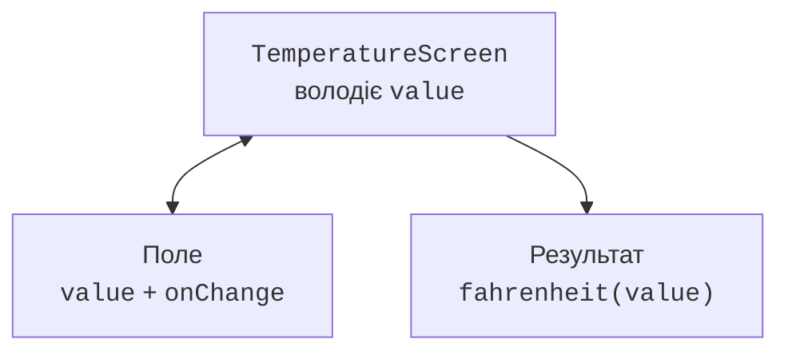

# Підняття стану та списки

## Підняття стану та перевірка введення

**Підняття стану** (*state hoisting*) переносить стан до спільного власника, а дочірнім компонентам передає значення та обробник події. Поле не вирішує самостійно, як зберігати дані, а повідомляє `onValueChange`. Це робить компонент повторно використовуваним і полегшує тестування.



Рис. 15.7. Один власник узгоджує поле та результат {.caption}

Текстове поле повинно зберігати введений рядок, включно з тимчасовими `-` чи порожнім значенням. Примусове перетворення в число на кожному символі заважає редагувати. Числовий результат обчислюється окремо через `toDoubleOrNull`, перевірку скінченності та предметні обмеження.

### Приклад 2. Конвертер температур

```kotlin
import androidx.compose.foundation.layout.*
import androidx.compose.material3.*
import androidx.compose.runtime.*
import androidx.compose.ui.Modifier
import androidx.compose.ui.unit.dp
import androidx.compose.ui.window.*

fun fahrenheit(text: String): Double? {
    val c = text.replace(',', '.').toDoubleOrNull() ?: return null
    if (!c.isFinite() || c < -273.15) return null
    return (c * 9 / 5 + 32).takeIf { it.isFinite() }
}

@Composable
fun TemperatureInput(value: String, onChange: (String) -> Unit) {
    OutlinedTextField(value = value, onValueChange = onChange,
        label = { Text("Градуси Цельсія") },
        isError = value.isNotEmpty() && fahrenheit(value) == null)
}

@Composable
fun TemperatureScreen() {
    var value by remember { mutableStateOf("20") }
    val result = fahrenheit(value)
    Column(Modifier.padding(20.dp)) {
        TemperatureInput(value, onChange = { value = it })
        Text(result?.let { "$it °F" } ?: "Введіть коректне число")
    }
}

fun main() = application {
    Window(onCloseRequest = ::exitApplication,
        title = "Температура") {
        MaterialTheme { TemperatureScreen() }
    }
}
```

Для `20` результат дорівнює `68.0 °F`, для `0` – `32.0 °F`. Порожній рядок, `NaN` і значення нижче абсолютного нуля не породжують число. Предметна функція не знає про Compose, тому її можна перевірити звичайним модульним тестом без відкриття вікна.

`derivedStateOf` корисний, коли вихідний стан часто змінюється, а потрібний UI-результат – значно рідше, наприклад ознака прокручування за певну межу. Для простого додавання двох чисел це зайвий механізм. `remember(key)` кешує обчислення до зміни ключа, але не перетворює дороге блокувальне обчислення на фонове.

## Списки, ключі та картки

`LazyColumn` створює потрібні для видимої області елементи; `LazyRow` працює горизонтально, `LazyVerticalGrid` – сіткою. Це доречно для каталогу, який може зростати. Звичайний `Column` зручний для короткої форми й не є автоматично прокручуваним.

Стабільний `key` ідентифікує елемент між вставками та перестановками. Індекс списку ненадійний, якщо перед ним додають новий запис. Ключ має бути унікальним і пов’язаним з об’єктом, наприклад `id`. Зміна назви не повинна змінювати ідентичність товару.

### Приклад 3. Картки товарів

```kotlin
import androidx.compose.foundation.layout.*
import androidx.compose.foundation.lazy.grid.*
import androidx.compose.material3.*
import androidx.compose.runtime.Composable
import androidx.compose.ui.Modifier
import androidx.compose.ui.unit.dp
import androidx.compose.ui.window.*

data class Product(val id: Int, val name: String, val cents: Int)

@Composable
fun Products() {
    val products = listOf(
        Product(1, "Чай", 4500), Product(2, "Кава", 7200),
        Product(3, "Какао", 6300)
    )
    LazyVerticalGrid(columns = GridCells.Adaptive(160.dp),
        contentPadding = PaddingValues(12.dp),
        horizontalArrangement = Arrangement.spacedBy(8.dp),
        verticalArrangement = Arrangement.spacedBy(8.dp)) {
        items(products, key = { it.id }) { product ->
            Card(Modifier.fillMaxWidth()) {
                Column(Modifier.padding(12.dp)) {
                    Text(product.name)
                    Text("${product.cents} коп.")
                }
            }
        }
    }
}

fun main() = application {
    Window(onCloseRequest = ::exitApplication,
        title = "Товари") {
        MaterialTheme { Products() }
    }
}
```

Сітка змінює кількість колонок при зміні ширини. Ціни зберігаються цілими копійками; форматування гривень можна винести у звичайну функцію. У цьому прикладі дані сталі, тому створення короткого списку при рекомпозиції не впливає на правильність; для завантаження з БД потрібний окремий власник стану.
