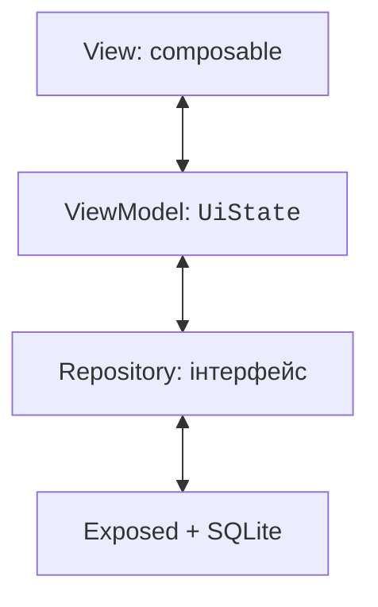
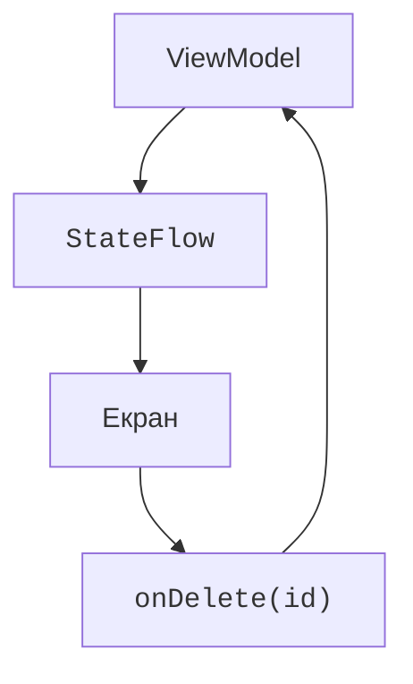

# MVVM і односпрямований потік

## Чому одного composable недостатньо

Локальний лічильник зручно зберігати через `remember`. Каталог із пошуком, помилками читання, збереженням і кількома екранами потребує явних меж відповідальності. Якщо SQL-запит, валідація та всі компоненти розміщені в одній функції, зміну інтерфейсу складно відрізнити від зміни предметних правил.

**MVVM** (*Model–View–ViewModel*) розділяє ці ролі. **View** показує стан і передає події. **ViewModel** готує стан екрана й координує дії. **Model** охоплює предметні дані та правила; репозиторій приховує спосіб їх отримання. Назва папки сама по собі не створює архітектуру: важливі напрямки залежностей.



Рис. 16.1. Екран залежить від стану, а доступ до БД має окрему межу {.caption}

У простому проєкті пакети `ui`, `domain`, `data` роблять межі видимими. ViewModel не імпортує `Button`, `NavHostController` або JDBC-таблиці. Репозиторій не показує діалогів. Предметний клас не потребує `@Composable`. Ручне передавання залежностей конструктором достатнє для лабораторної; Koin є можливим інструментом для більших проєктів, але не вимогою MVVM.

Офіційний посібник ViewModel: <https://kotlinlang.org/docs/multiplatform/compose-viewmodel.html>. Архітектурні принципи й приклади: <https://developer.android.com/topic/architecture>. Android-орієнтовані приклади адаптуйте до desktop-життєвого циклу.

## Узгоджені залежності

Використайте desktop Gradle-проєкт теми 15. Додайте плагін серіалізації тієї самої версії, що Kotlin, та наведені залежності. Navigation Compose 2.9.2 використано як конкретну перевірювану гілку API з `NavHost`, а не як твердження про найновішу навігацію. Navigation 3 має інший підхід; змішувати їхні приклади не потрібно.

```kotlin
// У plugins:
kotlin("plugin.serialization") version "2.4.20"

// У dependencies:
implementation(
    "org.jetbrains.androidx.lifecycle:" +
        "lifecycle-viewmodel-compose:2.10.0"
)
implementation(
    "org.jetbrains.androidx.navigation:navigation-compose:2.9.2"
)
implementation(
    "org.jetbrains.kotlinx:kotlinx-serialization-json:1.9.0"
)
implementation("org.jetbrains.exposed:exposed-core:1.4.0")
implementation("org.jetbrains.exposed:exposed-jdbc:1.4.0")
implementation("org.xerial:sqlite-jdbc:3.53.1.0")
testImplementation(kotlin("test"))
testImplementation(
    "org.jetbrains.kotlinx:kotlinx-coroutines-test:1.11.0"
)
testRuntimeOnly("org.junit.platform:junit-platform-launcher")
```

На desktop модуль `kotlinx-coroutines-swing` із попередньої теми потрібний для `Dispatchers.Main`, який використовує `viewModelScope`. Наявність лише `kotlinx-coroutines-core` не встановлює головний диспетчер графічної платформи. Для тестів `tasks.test { useJUnitPlatform() }` запускає kotlin.test через JUnit Platform.

Кожний повний приклад нижче запускається окремо як `Main.kt`. Довгі рядки координат Gradle можна винести в каталог версій: це не впливає на пакети Kotlin-імпортів. Спільні залежності зберігайте в одному місці, щоб уникати випадкових різних версій.

## Односпрямований потік даних

ViewModel відкриває незмінний `StateFlow<UiState>`. Екран читає його через `collectAsState` і відправляє події звичайними callback-функціями. Після події ViewModel перевіряє дані, викликає репозиторій і публікує новий стан. UI не змінює внутрішній MutableStateFlow самостійно.



Рис. 16.2. Стан рухається до екрана, події повертаються власникові {.caption}

`UiState` має описувати те, що потрібно відобразити: дані, ознаку завантаження, чернетку, помилку. Набір незалежних boolean може дозволити суперечливе поєднання «Loading і Error одночасно». Для взаємовиключних станів придатна sealed-ієрархія `Loading`, `Success`, `Error`; для форми з даними й фоновим збереженням зручний data-клас із чіткими інваріантами.

### Приклад 1. Лічильник із ViewModel

`viewModel { ... }` пов’язує екземпляр із поточним ViewModelStoreOwner. Звичайний виклик конструктора в composable створював би новий об’єкт під час повторного виконання. Локальний стан focus або відкритого простого меню при цьому може залишатися у View через remember.

```kotlin
import androidx.compose.foundation.layout.*
import androidx.compose.material3.*
import androidx.compose.runtime.*
import androidx.compose.ui.Modifier
import androidx.compose.ui.unit.dp
import androidx.compose.ui.window.*
import androidx.lifecycle.ViewModel
import androidx.lifecycle.viewmodel.compose.viewModel
import kotlinx.coroutines.flow.*

class CounterViewModel : ViewModel() {
    private val mutable = MutableStateFlow(0)
    val count = mutable.asStateFlow()
    fun increment() { mutable.update { (it + 1).coerceAtMost(100) } }
    fun reset() { mutable.value = 0 }
}

@Composable
fun CounterScreen(model: CounterViewModel = viewModel {
    CounterViewModel()
}) {
    val count by model.count.collectAsState()
    Column(Modifier.padding(20.dp)) {
        Text("Кількість: $count")
        Button(onClick = model::increment, enabled = count < 100) {
            Text("Додати")
        }
        Button(onClick = model::reset) { Text("Скинути") }
    }
}

fun main() = application {
    Window(onCloseRequest = ::exitApplication, title = "MVVM") {
        MaterialTheme { CounterScreen() }
    }
}
```

ViewModel не означає автоматичного збереження після закриття процесу. Поточне значення живе, доки живе його власник. `onCleared` викликається при очищенні сховища; `viewModelScope` скасовується. Не зберігайте в ViewModel посилання на вікно, компонент або довільний UI-контекст довше його життя.
