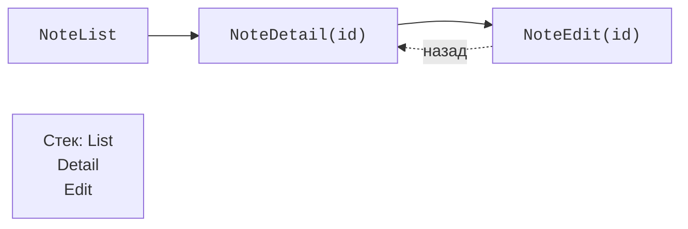

# Навігація як стан історії

## Навігація як стан історії

Окремі екрани мають маршрути, аргументи та правила повернення. **Стек повернення** зберігає історію переходів. `navigate` додає призначення, `popBackStack` повертає до попереднього. Кнопка «Назад» не повинна створювати новий екземпляр списку поверх старої історії на кожне натискання.



Рис. 16.3. До деталей передають id, повернення прибирає верхній запис {.caption}

Типобезпечний маршрут – `@Serializable` object або data-клас. Для деталей передавайте id, а не весь змінний об’єкт. Дані читаються за цим id з репозиторію; якщо запис видалений, екран показує «не знайдено». Це захищає від застарілої копії та великих серіалізованих аргументів.

### Приклад 2. Нотатки: список і деталі

```kotlin
import androidx.compose.foundation.layout.*
import androidx.compose.material3.*
import androidx.compose.runtime.Composable
import androidx.compose.ui.Modifier
import androidx.compose.ui.unit.dp
import androidx.compose.ui.window.*
import androidx.navigation.compose.*
import androidx.navigation.toRoute
import kotlinx.serialization.Serializable

@Serializable object NoteList
@Serializable data class NoteDetail(val id: Int)

@Composable
fun NotesNavigation() {
    val notes = mapOf(1 to "Підготувати звіт", 2 to "Прочитати тему")
    val navigation = rememberNavController()
    NavHost(navigation, startDestination = NoteList) {
        composable<NoteList> {
            Column(Modifier.padding(20.dp)) {
                Text("Нотатки")
                for ((id, title) in notes) {
                    Button(onClick = {
                        navigation.navigate(NoteDetail(id))
                    }) { Text(title) }
                }
            }
        }
        composable<NoteDetail> { entry ->
            val route = entry.toRoute<NoteDetail>()
            Column(Modifier.padding(20.dp)) {
                Text(notes[route.id] ?: "Нотатку не знайдено")
                Button(onClick = { navigation.popBackStack() }) {
                    Text("Назад")
                }
            }
        }
    }
}

fun main() = application {
    Window(onCloseRequest = ::exitApplication,
        title = "Навігація нотаток") {
        MaterialTheme { NotesNavigation() }
    }
}
```

Після вибору другого рядка екран показує «Прочитати тему»; повернення відновлює список. При невідомому id показується явне повідомлення. Маршрут не повинен мовчки підставляти перший запис. Офіційний посібник: <https://kotlinlang.org/docs/multiplatform/compose-navigation.html>.

У великій програмі екран деталей отримує `id` і `onBack`, а не весь NavController. Тоді UI можна перевірити без реального графа. Для редагування створюють окремий маршрут з id або nullable id нового запису; після збереження повертаються лише після підтвердженого результату репозиторію.
