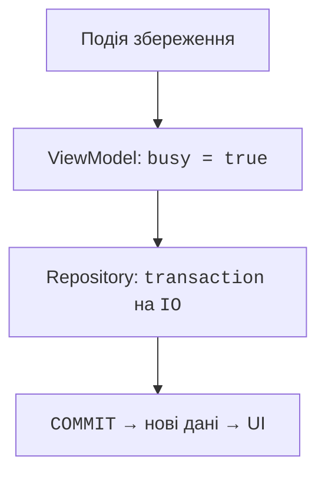

# Репозиторій і завантаження даних

## Межа репозиторію та життєвий цикл завантаження

Інтерфейс репозиторію описує предметні операції. Реалізація Exposed відкриває короткі транзакції на IO, а підроблена реалізація повертає контрольовані дані для тесту. ViewModel отримує інтерфейс конструктором; створення SQLite та вибір реалізації відбуваються в корені застосунку.

SQLite-файл зберігають у доступній користувачеві теці, а не поруч з інсталятором. У JVM-прикладі використаємо `user.home/.course-notes/notes.db`. Це навчальний шлях, який потрібно пояснити користувачеві. У справжньому KMP-проєкті вибір системної теки можна приховати за платформним API або `expect`/`actual`; спільний екран не повинен знати Windows-шлях.



Рис. 16.4. Зміна UI відбувається після завершення транзакції {.caption}

Після зміни даних репозиторій може випустити нове значення Flow або ViewModel явно перезавантажує список. Exposed JDBC сам по собі не перетворює кожний SELECT на реактивне спостереження. У невеликому застосунку повторне читання після успішного запису просте й достатнє; зовнішні зміни потребують іншої політики оновлення.

### Приклад 3. Нотатки з постійною SQLite-базою

Наступна програма самостійна: містить схему, репозиторій, ViewModel, екран і точку входу. Для читабельності залишено додавання, перегляд і видалення; маршрут редагування додається за принципом попереднього прикладу. Повторні натискання блокуються під час операції, а чернетка очищається лише після успіху.

```kotlin
import java.nio.file.Files
import java.nio.file.Path
import androidx.compose.foundation.layout.*
import androidx.compose.foundation.lazy.LazyColumn
import androidx.compose.foundation.lazy.items
import androidx.compose.material3.*
import androidx.compose.runtime.*
import androidx.compose.ui.Modifier
import androidx.compose.ui.unit.dp
import androidx.compose.ui.window.*
import androidx.lifecycle.ViewModel
import androidx.lifecycle.viewModelScope
import androidx.lifecycle.viewmodel.compose.viewModel
import kotlinx.coroutines.*
import kotlinx.coroutines.flow.*
import org.jetbrains.exposed.v1.core.*
import org.jetbrains.exposed.v1.jdbc.*
import org.jetbrains.exposed.v1.jdbc.transactions.transaction

data class Note(val id: Int, val title: String)

interface NoteRepository {
    suspend fun all(): List<Note>
    suspend fun add(title: String)
    suspend fun delete(id: Int)
}

object NotesTable : Table("notes") {
    val id = integer("id").autoIncrement()
    val title = varchar("title", 120)
    override val primaryKey = PrimaryKey(id)
}

class SqliteNotes(private val db: Database) : NoteRepository {
    suspend fun initialize() = withContext(Dispatchers.IO) {
        transaction(db) { SchemaUtils.create(NotesTable) }
    }

    override suspend fun all(): List<Note> =
        withContext(Dispatchers.IO) {
            transaction(db) {
                NotesTable.selectAll().orderBy(NotesTable.id).map {
                    Note(it[NotesTable.id], it[NotesTable.title])
                }
            }
        }
    override suspend fun add(title: String): Unit =
        withContext(Dispatchers.IO) {
            require(title.trim().length in 1..120)
            transaction(db) {
                NotesTable.insert {
                    it[NotesTable.title] = title.trim()
                }
            }
        }
    override suspend fun delete(id: Int): Unit =
        withContext(Dispatchers.IO) {
            transaction(db) {
                val deleted = NotesTable.deleteWhere {
                    NotesTable.id eq id
                }
                check(deleted == 1)
            }
        }
}

data class NotesState(
    val notes: List<Note> = emptyList(),
    val draft: String = "",
    val busy: Boolean = false,
    val error: String? = null
)

class NotesViewModel(private val repository: NoteRepository)
    : ViewModel() {
    private val mutable = MutableStateFlow(NotesState())
    val state = mutable.asStateFlow()

    fun edit(text: String) {
        if (!mutable.value.busy) {
            mutable.update { it.copy(draft = text, error = null) }
        }
    }

    fun reload() = perform { repository.all() }

    fun add() {
        val text = mutable.value.draft.trim()
        if (text.length !in 1..120) {
            mutable.update {
                it.copy(error = "Потрібно 1–120 символів")
            }
            return
        }
        perform(clearDraft = true) {
            repository.add(text)
            repository.all()
        }
    }

    fun delete(id: Int) = perform {
        repository.delete(id)
        repository.all()
    }

    private fun perform(clearDraft: Boolean = false,
        action: suspend () -> List<Note>) {
        if (mutable.value.busy) return
        mutable.update { it.copy(busy = true, error = null) }
        viewModelScope.launch {
            try {
                val notes = action()
                mutable.update {
                    it.copy(notes = notes,
                        draft = if (clearDraft) "" else it.draft)
                }
            } catch (e: CancellationException) {
                throw e
            } catch (e: Exception) {
                mutable.update {
                    it.copy(error = "Операція не вдалася")
                }
            } finally {
                mutable.update { it.copy(busy = false) }
            }
        }
    }
}

@Composable
fun NotesScreen(model: NotesViewModel) {
    val state by model.state.collectAsState()
    LaunchedEffect(model) { model.reload() }
    Column(Modifier.padding(16.dp)) {
        OutlinedTextField(state.draft, onValueChange = model::edit,
            label = { Text("Нова нотатка") }, enabled = !state.busy)
        Row {
            Button(onClick = model::add, enabled = !state.busy) {
                Text("Додати")
            }
            Button(onClick = model::reload, enabled = !state.busy) {
                Text("Оновити")
            }
        }
        if (state.busy) LinearProgressIndicator()
        state.error?.let { Text(it) }
        if (state.notes.isEmpty() && !state.busy) {
            Text("Нотаток немає")
        }
        LazyColumn {
            items(state.notes, key = { it.id }) { note ->
                Row {
                    Text(note.title, Modifier.weight(1f))
                    TextButton(enabled = !state.busy,
                        onClick = { model.delete(note.id) }) {
                        Text("Видалити")
                    }
                }
            }
        }
    }
}

fun main() {
    val directory = Path.of(System.getProperty("user.home"),
        ".course-notes")
    Files.createDirectories(directory)
    val db = Database.connect(
        "jdbc:sqlite:${directory.resolve("notes.db")}",
        "org.sqlite.JDBC")
    val repository = SqliteNotes(db)
    runBlocking { repository.initialize() }
    application {
        Window(onCloseRequest = ::exitApplication,
            title = "Нотатки") {
            val model = viewModel { NotesViewModel(repository) }
            MaterialTheme { NotesScreen(model) }
        }
    }
}
```

Ініціалізація БД виконується перед відкриттям вікна; `runBlocking` тут є межею запуску, а не обробником UI. Для повільної міграції можна показати окремий стартовий стан. Якщо створення теки чи бази не вдалося, програма не повинна починати роботу з удавано порожнім каталогом і потім перезаписати дані користувача.

Після успішного INSERT наступний SELECT теоретично також може завершитися помилкою. Повідомлення «операція не вдалася» тоді не доводить, що запису немає. Кнопка «Оновити» дозволяє перевірити стан; у критичних операціях застосовують ідентифікатор запиту та ідемпотентність, щоб повтор не створював дублікатів.

::: info Знімок екрана
Run persistent Notes; add two titles; show enabled controls.
:::

Рис. 16.5. Нотатки, прочитані з SQLite {.caption}

::: info Знімок екрана
Run navigation example, select second note, show Back.
:::

Рис. 16.6. Деталі нотатки та явне повернення {.caption}

::: info Знімок екрана
Open the demo SQLite file in DataGrip; no personal records.
:::

Рис. 16.7. Підтвердження збереження в таблиці notes {.caption}
