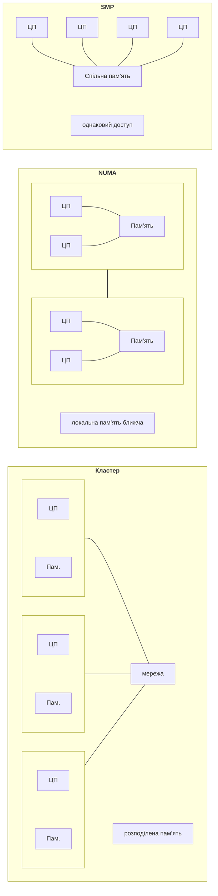
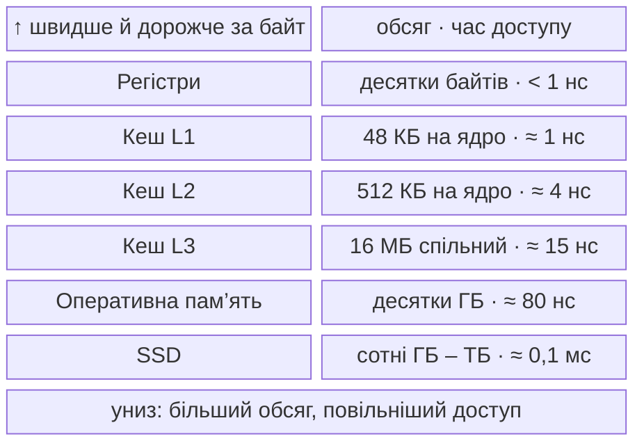
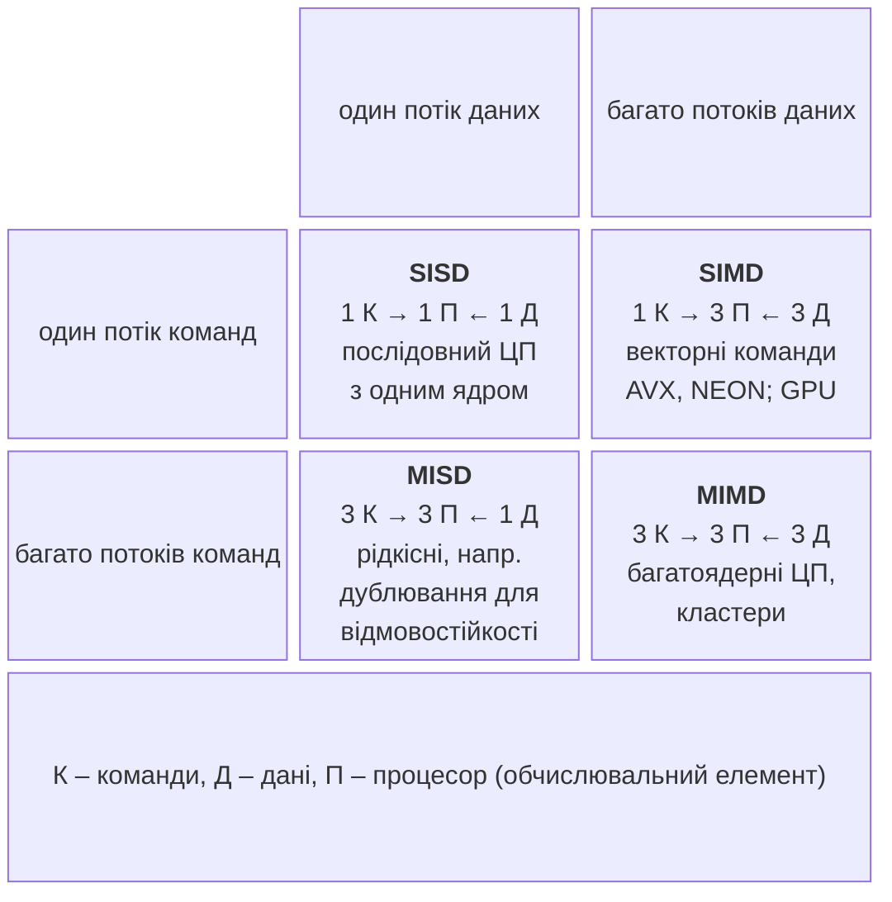

# Архітектури паралельних систем

## Системи зі спільною пам’яттю

У **системі зі спільною пам’яттю** (*shared memory*) усі процесори звертаються до однієї оперативної пам’яті, тому потоки можуть обмінюватися даними через спільні змінні (рис. 1.1). Саме такі системи розглядаються в модулі 1.

Рис. 1.1. Системи зі спільною (SMP, NUMA) та розподіленою пам’яттю {.caption}

- **SMP** (*symmetric multiprocessing*) – усі процесори рівноправні й мають однаково швидкий доступ до всієї пам’яті. Сучасний багатоядерний процесор настільного комп’ютера – SMP-система на одному кристалі.
- **NUMA** (*non-uniform memory access*) – пам’ять розділена між **вузлами NUMA**: кожен процесор (сокет) має власну локальну пам’ять і звертається до пам’яті іншого вузла повільніше, через міжпроцесорне з’єднання. NUMA характерна для серверів із кількома сокетами; програма працює швидше, якщо потік обробляє дані, розміщені в пам’яті «свого» вузла (тема 10).
- **SMT** (*simultaneous multithreading*), у процесорах Intel – **Hyper-Threading**, – одне фізичне ядро виконує два апаратні потоки, тобто операційна система бачить два **логічні процесори**. Другий потік використовує простої ядра (очікування даних із пам’яті), тому дає зазвичай 10–30 % додаткової продуктивності, а не подвоєння.
- **Гібридні процесори** (Intel з 12-го покоління, Apple M, багато процесорів ARM) мають продуктивні **P-ядра** (*performance cores*) і енергоефективні **E-ядра** (*efficient cores*) різної швидкості. Планувальник ОС розподіляє між ними потоки, тому час однакових частин паралельної програми може відрізнятися. Процесор лабораторних комп’ютерів гібридним не є.

Кількість ядер і логічних процесорів, розміри кешів показує диспетчер завдань Windows (рис. 1.2), а в Linux – команди `lscpu` і `nproc` (рис. 1.3).

::: info Знімок екрана
Task Manager → Performance → CPU; right-click graph → Change graph to → Logical processors; cores, logical processors, L1–L3 cache
:::

Рис. 1.2. Відомості про процесор у диспетчері завдань {.caption}

::: info Знімок екрана
Ubuntu 26.04 (WSL2) terminal: `lscpu` and `nproc`; Sockets, Cores per socket, Threads per core, NUMA nodes, caches
:::

Рис. 1.3. Топологія процесора в Ubuntu {.caption}

### Ієрархія пам’яті

Процесор виконує команди значно швидше, ніж оперативна пам’ять віддає дані. Щоб він не простоював, між ними розміщують кілька рівнів **кешу** (*cache*) – малої та швидкої пам’яті на кристалі процесора (рис. 1.4). Кеш L1 і L2 має кожне ядро, кеш L3 спільний для всіх ядер.

Рис. 1.4. Ієрархія пам’яті комп’ютера (розміри кешу – для i9-11900KF) {.caption}

Дані переміщуються в кеш блоками – **кеш-лініями** (*cache lines*) розміром зазвичай 64 байти. Якщо потрібні дані є в кеші, це **влучання** (*cache hit*), якщо немає – **промах** (*cache miss*), і процесор чекає на оперативну пам’ять у десятки разів довше. Програма працює швидко, якщо має добру **локальність даних** (*data locality*): звертається до сусідніх елементів масиву одне за одним. Для паралельних програм кеш важливий подвійно: потоки конкурують за спільний кеш L3, а запис кількох потоків у спільну кеш-лінію спричиняє **хибне розділення** (тема 4).

## Системи з розподіленою пам’яттю

У **системі з розподіленою пам’яттю** (*distributed memory*) кожен вузол має власну пам’ять, а дані між вузлами передаються повідомленнями через мережу (рис. 1.1, праворуч). Така система масштабується до тисяч вузлів, але передавання даних мережею в тисячі разів повільніше за звернення до пам’яті.

- **Кластер** (*cluster*) – група звичайних серверів, з’єднаних мережею, під керуванням планувальника завдань (у темі 13 – Slurm).
- **MPP** (*massively parallel processing*) – суперкомп’ютер зі спеціально спроєктованими вузлами та власною високошвидкісною мережею.
- **Грід** (*grid*) – об’єднання географічно розподілених ресурсів різних організацій.
- **Хмара** (*cloud*) – віртуальні машини й контейнери, які орендують у провайдера за потребою (модуль 3).

Швидкість обміну визначає мережа. Звичайний **Ethernet** має пропускну здатність від 1 до 800 Гбіт/с, а в кластерах часто використовують **InfiniBand** з пропускною здатністю до 400–800 Гбіт/с і затримкою в одиниці мікросекунд. Для порівняння, доступ до оперативної пам’яті триває близько 100 нс.

Найпотужніші суперкомп’ютери світу двічі на рік упорядковує рейтинг **TOP500** (<https://top500.org/>) за продуктивністю в операціях із рухомою комою за секунду (*FLOPS*) на тесті HPL. У списку червня 2026 року перше місце посідає система LineShine (Китай, близько 13,8 млн ядер, 2,2 ексафлопа, тобто $2 {,} 2 \cdot 10^{18}$ операцій за секунду), а друге – El Capitan (США). Усі системи рейтингу працюють під керуванням Linux.

## Класифікація Флінна

У 1966 році Майкл Флінн (*Michael Flynn*) запропонував класифікувати обчислювальні системи за кількістю **потоків команд** (*instruction streams*) і **потоків даних** (*data streams*), які обробляються одночасно (рис. 1.5).

Рис. 1.5. Класифікація Флінна {.caption}

- **SISD** (*single instruction, single data*) – послідовний комп’ютер: одна команда обробляє один елемент даних.
- **SIMD** (*single instruction, multiple data*) – одна команда одночасно обробляє багато елементів: векторні розширення процесорів SSE, AVX, AVX-512, NEON (тема 7).
- **MISD** (*multiple instruction, single data*) – різні команди над одними даними; на практиці трапляється рідко, наприклад у відмовостійких системах, які кілька разів обчислюють той самий результат.
- **MIMD** (*multiple instruction, multiple data*) – кілька процесорів незалежно виконують різні команди над різними даними: багатоядерні процесори, кластери. Більшість паралельних систем належить до цього класу.

Клас MIMD уточнюють за способом написання програм. У моделі **SPMD** (*single program, multiple data*) усі процеси виконують одну програму над різними частинами даних, а поведінка залежить від номера процесу; так працюють програми MPI (тема 12). У моделі **MPMD** (*multiple program, multiple data*) різні вузли виконують різні програми, наприклад клієнт і сервер. Графічні процесори NVIDIA описують як **SIMT** (*single instruction, multiple threads*): одна функція-ядро виконується тисячами легких потоків, кожен над своїм елементом даних (тема 11).
