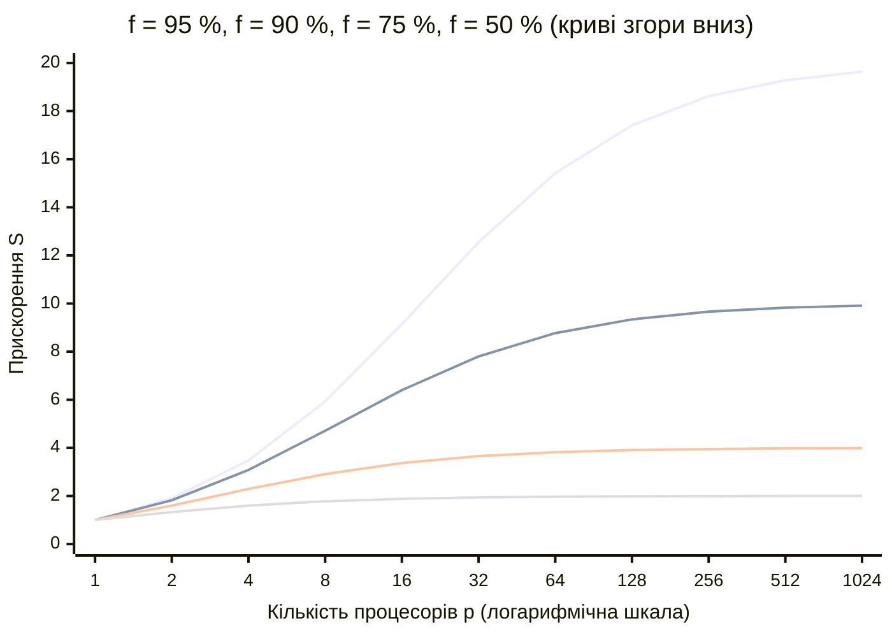
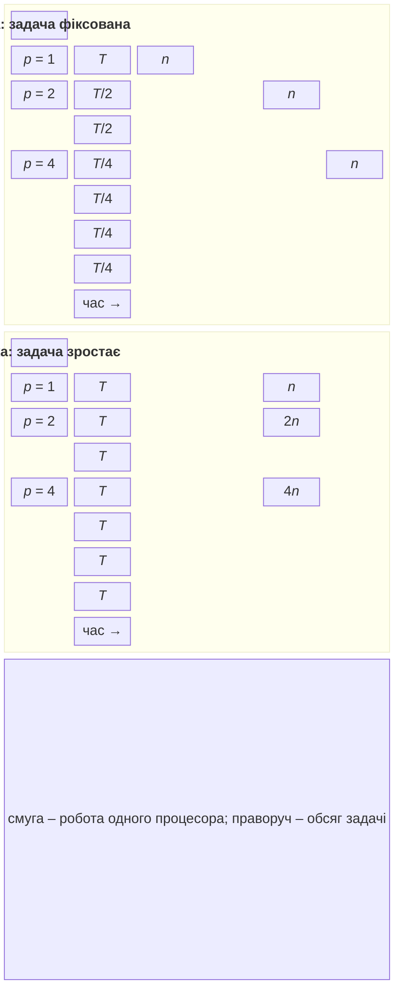

# Моделі, метрики та закони масштабування

## Моделі паралелізму

Спосіб розподілу роботи визначає **модель паралелізму** (табл. 1.1).

Таблиця 1.1. Моделі паралелізму {.caption}

| **Модель** | **Суть** | **У курсі** |
| --- | --- | --- |
| Паралелізм даних (*data parallelism*) | одна операція над різними частинами великого масиву даних | теми 6, 7, 10, 11 |
| Паралелізм задач (*task parallelism*) | різні незалежні задачі виконуються одночасно | теми 5, 10 |
| Конвеєр (*pipeline*) | дані проходять послідовні етапи, кожен етап працює у своєму потоці | теми 4, 15 |
| «Майстер – робітник» (*master–worker*) | головний процес роздає частини роботи робітникам і збирає результати | теми 2, 12, 13 |
| Обмін повідомленнями (*message passing*) | процеси без спільної пам’яті взаємодіють лише повідомленнями | теми 12, 14–16 |

Модель обирають за характером задачі: обробка зображення природно ділиться на частини даних, вебсервер обслуговує незалежні запити-задачі, а обробка потоку подій зручно описується конвеєром.

## Метрики паралельних програм

Нехай $T_{1}$ – час виконання програми на одному процесорі (найкращого послідовного алгоритму), $T_{p}$ – час виконання на $p$ процесорах. Тоді:

- **прискорення** (*speed-up*) $S_{p} = T_{1} / T_{p}$ – у скільки разів паралельна програма швидша за послідовну;
- **ефективність** (*efficiency*) $E_{p} = S_{p} / p$ – частка використання кожного процесора;
- **вартість** (*cost*) $C_{p} = p \cdot T_{p}$ – сумарний процесорний час; за ідеального розпаралелювання вона дорівнює $T_{1}$.

Ідеальне, **лінійне** прискорення $S_{p} = p$ означає ефективність 100 %. На практиці $S_{p} \lt p$ через послідовні частини програми, накладні витрати, конкуренцію за пам’ять і кеш. Інколи спостерігається **надлінійне** прискорення $S_{p} \gt p$. Найчастіша причина – кеш: частина масиву, що припадає на один потік, уміщується в кеш L2 або L3, тоді як увесь масив не вміщувався. Інші причини – пошук, який завершується, щойно один із потоків знайшов відповідь, або невдалий послідовний алгоритм, з яким порівнюють.

Наприклад, якщо $T_{1} = 120$ с, а на 8 ядрах $T_{8} = 20$ с, то $S_{8} = 6$, $E_{8} = 75$ %, а вартість $C_{8} = 160$ с процесорного часу – на 40 с більше, ніж у послідовної програми.

## Закон Амдала

Нехай частка $f$ часу виконання послідовної програми припадає на код, який можна розпаралелити, а частка $1 - f$ – на послідовний код (читання вхідних даних, ініціалізація, запис результату). На $p$ процесорах паралельна частина прискорюється в $p$ разів, а послідовна не змінюється: $$T_{p} = (1 - f) T_{1} + \frac{f T_{1}}{p} .$$ Звідси прискорення за **законом Амдала** (*Amdahl’s law*, 1967): $$S_{p} = \frac{T_{1}}{T_{p}} = \frac{1}{(1 - f) + f / p} .$$

Коли $p \to \infty$, доданок $f / p$ прямує до нуля, і прискорення не може перевищити $$S_{\infty} = \frac{1}{1 - f} .$$ Якщо паралельна частина становить 95 %, програма ніколи не прискориться більше ніж у 20 разів, скільки б процесорів не було; при $f = 90$ % межа – 10 (рис. 1.6). Для 64 процесорів і $f = 90$ % прискорення лише 8,8, а ефективність – 14 %: більшість процесорів простоює, поки виконується послідовна частина.

Рис. 1.6. Прискорення за законом Амдала для різних часток паралельного коду $f$ {.caption}

Висновки із закону Амдала:

- спочатку слід зменшувати послідовну частку програми, а вже потім додавати процесори;
- кожне подвоєння кількості процесорів дає дедалі менший виграш;
- закон не враховує накладних витрат, тому реальне прискорення ще менше: інколи при надмірній кількості потоків час навіть зростає.

## Закон Густафсона–Барсіса та масштабованість

Закон Амдала розглядає **задачу фіксованого розміру**. У 1988 році Джон Густафсон (*John Gustafson*) і Едвін Барсіс (*Edwin Barsis*) звернули увагу, що на більшій кількості процесорів зазвичай розв’язують **більшу** задачу: докладнішу сітку прогнозу погоди, більше пікселів, більше частинок. Послідовна частина (читання параметрів, збирання результату) при цьому зростає мало.

Нехай $s$ – частка послідовного коду, виміряна **на паралельній системі** з $p$ процесорами. Той самий обсяг роботи на одному процесорі тривав би $s + p (1 - s)$, звідки **масштабоване прискорення** за законом Густафсона–Барсіса: $$S_{p} = s + p (1 - s) = p - s (p - 1) .$$ При $s = 5$ % на 64 процесорах $S = 60 {,} 85$ – прискорення зростає майже лінійно.

Два закони не суперечать один одному, а відповідають двом способам оцінювання **масштабованості** (*scalability*) програми (рис. 1.7):

- **сильна масштабованість** (*strong scaling*) – розмір задачі фіксований, кількість процесорів зростає; мета – скоротити час (закон Амдала);
- **слабка масштабованість** (*weak scaling*) – розмір задачі зростає пропорційно кількості процесорів; мета – зберегти час сталим (закон Густафсона).

Рис. 1.7. Сильна та слабка масштабованість {.caption}

### Метрика Карпа–Флатта

Виміряне прискорення можна використати, щоб оцінити, яка частка програми фактично поводиться як послідовна. **Експериментально визначена послідовна частка** (*experimentally determined serial fraction*), або **метрика Карпа–Флатта** (*Karp–Flatt metric*, 1990): $$e = \frac{1 / S_{p} - 1 / p}{1 - 1 / p} .$$ Якщо $e$ майже не змінюється зі зростанням $p$, прискорення обмежує послідовний код. Якщо $e$ зростає, основна причина – накладні витрати (синхронізація, обмін даними, конкуренція за кеш і пам’ять), які збільшуються разом з кількістю потоків. Наприклад, для $S_{8} = 6$ отримуємо $e = (1 / 6 - 1 / 8) / (1 - 1 / 8) \approx 0 {,} 048$.
