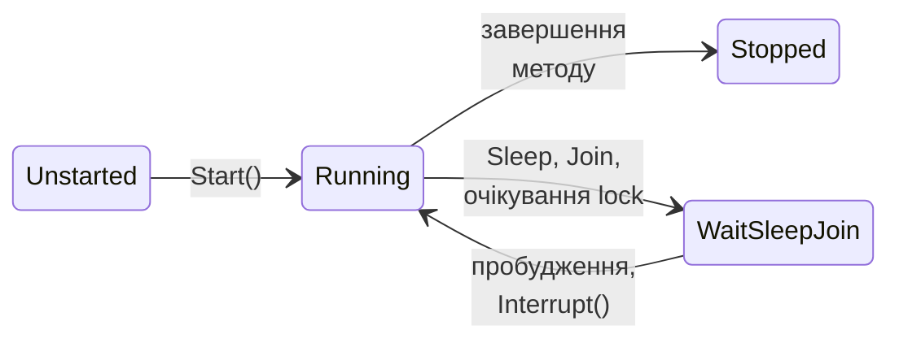

# Процеси та клас Thread у .NET

## Процеси в .NET

Клас `System.Diagnostics.Process` запускає інші програми, дає доступ до запущених процесів (`Process.GetProcesses`, `GetProcessById`, `GetCurrentProcess`) і їхніх властивостей: `Id`, `ProcessName`, `Threads.Count`, `WorkingSet64`, `TotalProcessorTime`, `StartTime`. Параметри запуску описує клас `ProcessStartInfo`:

- `FileName` і `ArgumentList` – програма та аргументи (кожен аргумент окремим рядком, без ручного екранування пробілів);
- `RedirectStandardOutput`, `RedirectStandardError`, `RedirectStandardInput` – перенаправлення потоків введення-виведення в батьківську програму (разом з `UseShellExecute = false`);
- `WorkingDirectory`, `Environment`, `CreateNoWindow`.

Метод `WaitForExit` чекає завершення процесу, а `ExitCode` повертає **код завершення**: 0 – успіх, інше значення – помилка, яку задала програма (значення, повернуте з `Main`, або `Environment.Exit(code)`):

```cs
ProcessStartInfo info = new("dotnet", "--version")
{
    RedirectStandardOutput = true,   // читати вивід програмою
    UseShellExecute = false,
};
using (Process process = Process.Start(info)!)
{
    string version = process.StandardOutput.ReadToEnd().Trim();
    process.WaitForExit();
    Console.WriteLine($"SDK {version}, код {process.ExitCode}");
}
```

```
SDK 10.0.401, код 0
```

Кілька процесів-обчислювачів дають паралелізм без спільної пам’яті: кожен процес отримує свою частину задачі в аргументах і повертає результат через стандартний вивід або код завершення. Цей підхід надійний (збій одного обчислювача не руйнує інших) і масштабується на кілька комп’ютерів, як MPI (тема 12), але запуск процесу коштує десятки мілісекунд, а дані доводиться серіалізувати.

::: tip Увага
Якщо перенаправлено одночасно `StandardOutput` і `StandardError`, а дочірній процес пише багато даних в обидва потоки, послідовне читання `ReadToEnd` одного з них може заблокуватися: буфер іншого потоку переповнюється, і дочірній процес чекає. Великі обсяги читають асинхронно (подія `OutputDataReceived`) або не перенаправляють потік помилок.
:::

## Клас Thread

Клас `System.Threading.Thread` створює окремий потік ОС. Конструктор приймає делегат `ThreadStart` (метод без параметрів) або `ParameterizedThreadStart` (метод з параметром `object?`), а метод `Start` запускає потік. Метод `Join` блокує викликаючий потік, доки потік не завершиться (є варіант із тайм-аутом, що повертає `bool`). Основні члени наведено в табл. 2.2.

```cs
Thread worker = new(() => Console.WriteLine("Робота в потоці"))
{
    Name = "Worker 1",           // ім’я видно в налагоджувачі
    IsBackground = true,         // не утримує процес
};
worker.Start();
worker.Join();                   // очікування завершення

Thread printer = new(s => Console.WriteLine($"Отримано: {s}"));
printer.Start("звіт.txt");       // параметр типу object?
printer.Join();
```

Передавати дані в потік зручніше через лямбда-вираз, що захоплює змінні, ніж через `object?`. У циклі `for` лямбда захоплює одну змінну лічильника, тому значення спочатку копіюють у локальну змінну тіла циклу (`int index = i;`). Результат потоку записують у змінну або елемент масиву, який читають після `Join`; кожен потік має писати у **свій** елемент, щоб потоки не змагалися за одні дані (тема 3).

Таблиця 2.2. Основні члени класу `Thread` {.caption}

| **Член** | **Призначення** |
| --- | --- |
| `Start()`, `Start(object?)` | запуск потоку; повторний виклик – `ThreadStateException` |
| `Join()`, `Join(TimeSpan)` | очікування завершення потоку |
| `Name` | ім’я для налагоджувача та журналів |
| `IsBackground` | фоновий потік не утримує процес від завершення |
| `Priority` | рівень пріоритету `ThreadPriority` (`Lowest`…`Highest`) |
| `ManagedThreadId` | ідентифікатор керованого потоку (також `Environment.CurrentManagedThreadId`) |
| `ThreadState`, `IsAlive` | поточний стан потоку |
| `IsThreadPoolThread` | чи належить потік пулу потоків |
| `Thread.CurrentThread` | об’єкт потоку, що виконує поточний код |

### Основні та фонові потоки

Потік, створений класом `Thread`, за замовчуванням є **основним** (*foreground*): процес не завершиться, доки не завершаться всі основні потоки, навіть якщо метод `Main` уже повернув керування. **Фоновий** потік (*background*, `IsBackground = true`) не утримує процес: коли завершується останній основний потік, середовище виконання зупиняє фонові потоки без виконання блоків `finally`. Тому фоновими роблять допоміжні потоки (моніторинг, періодичне опитування), а роботу, яку не можна обривати (запис файлу), виконують в основному потоці або чекають її завершення через `Join`. Усі потоки пулу потоків фонові.

### Стани потоку

Властивість `ThreadState` повертає стан потоку (рис. 2.6). Новий потік має стан `Unstarted`; після `Start` він `Running` (готовий або виконується – .NET їх не розрізняє); під час `Sleep`, `Join` чи очікування блокування – `WaitSleepJoin`; після завершення методу – `Stopped`. Стан змінюється в будь-який момент, тому використовувати `ThreadState` для керування логікою програми не слід – лише для діагностики.



Рис. 2.6. Основні стани керованого потоку {.caption}

### Очікування: Sleep, Yield, SpinWait

- `Thread.Sleep(ms)` переводить потік у стан очікування щонайменше на заданий час; фактична затримка залежить від таймера ОС (у Windows зазвичай кратна  15,6 мс, якщо програми не підвищили точність). `Thread.Sleep(0)` віддає решту кванта потоку з тим самим пріоритетом.
- `Thread.Yield()` віддає решту кванта будь-якому готовому потоку на **тому самому** ядрі й повертає `true`, якщо перемикання відбулося.
- Структура `SpinWait` виконує **активне очікування** (*spinning*): кілька ітерацій порожнього циклу, а при довшому очікуванні – `Yield` і `Sleep`. Воно вигідне, лише коли умова стане істинною за мікросекунди, бо не витрачає часу на перемикання контексту.

```cs
SpinWait spinner = new();
while (!ready)                   // ready змінює інший потік
    spinner.SpinOnce();          // цикл, потім Yield/Sleep
```

Очікування результату іншого потоку циклом `while (!done) { }` без затримки повністю завантажує ядро. Для очікування подій використовують `Join` та засоби синхронізації (тема 3).

### Зупинка потоку

Безпечного способу примусово «вбити» потік немає. Метод `Thread.Abort` у .NET 5 і новіших генерує `PlatformNotSupportedException`: примусова зупинка могла залишити дані в неузгодженому стані (незавершений запис, незвільнене блокування). Потік зупиняють **кооперативно**: він сам періодично перевіряє прапорець запиту на зупинку й коректно завершує роботу. Прапорець, що змінює інший потік, оголошують полем з модифікатором `volatile`, щоб компілятор JIT не кешував його значення. У темі 5 цю ж ідею реалізує стандартний `CancellationToken`.

```cs
class Scanner
{
    private volatile bool stopRequested;

    public void RequestStop() => stopRequested = true;

    public void Run()
    {
        while (!stopRequested) { /* порція роботи */ }
    }
}
```

Потік, що заблокований у `Sleep`, `Join` або очікуванні, можна розбудити методом `Interrupt`: в ньому виникає `ThreadInterruptedException`, яку потік обробляє й завершується.

```cs
Thread sleeper = new(() =>
{
    try
    {
        Thread.Sleep(Timeout.Infinite);  // очікування «назавжди»
    }
    catch (ThreadInterruptedException)
    {
        Console.WriteLine("Потік перервано під час очікування");
    }
});
sleeper.Start();
Thread.Sleep(100);
sleeper.Interrupt();
sleeper.Join();
```

### Винятки в потоках

Необроблений виняток у будь-якому потоці (створеному через `Thread` чи з пулу) **завершує весь процес**: середовище виконання викликає подію `AppDomain.CurrentDomain.UnhandledException` (лише для журналювання) і аварійно завершує програму. Виняток **не** передається в потік, який викликав `Start` чи `Join`, тому `try` навколо `Start` його не перехопить. Метод потоку сам перехоплює винятки, а виняток або повідомлення про помилку зберігає в полі, яке основний потік перевіряє після `Join`. Задачі TPL (тема 5) роблять це автоматично: виняток задачі повторно генерується під час очікування її результату.

### Локальні дані потоку

Іноді кожен потік потребує власного екземпляра змінної: генератора `Random`, буфера, лічильника. **Локальна пам’ять потоку** (*thread-local storage*) дає кожному потоку окреме значення:

- атрибут `[ThreadStatic]` на статичному полі – кожен потік бачить свою копію; ініціалізатор поля виконується лише в одному потоці, тому в інших потоках поле має значення за замовчуванням;
- клас `ThreadLocal<T>` приймає фабрику значення, яку викликає окремо для кожного потоку; з `trackAllValues: true` властивість `Values` повертає значення всіх потоків.

```cs
using ThreadLocal<int> counter = new(() => 0, trackAllValues: true);
Thread[] threads = new Thread[3];
for (int i = 0; i < threads.Length; i++)
{
    threads[i] = new Thread(() =>
    {
        for (int k = 0; k < 1000; k++) counter.Value++;
    });
    threads[i].Start();
}
foreach (Thread t in threads) t.Join();
Console.WriteLine(string.Join(", ", counter.Values));
```

```
1000, 1000, 1000
```

Потоки пулу повторно використовуються різними роботами, тому значення `ThreadLocal<T>` і `[ThreadStatic]`, записане однією роботою, може «побачити» наступна робота в тому самому потоці.
