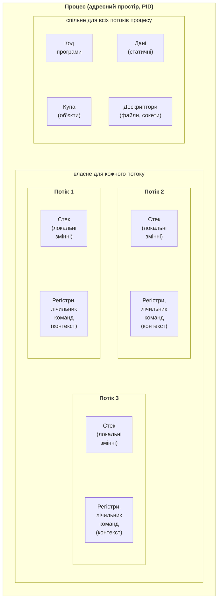

# Процеси та потоки ОС

## Процес і його ресурси

**Процес** (*process*) – це програма під час виконання разом з усіма ресурсами, які операційна система для неї виділила. Кожен процес має:

- власний **віртуальний адресний простір** (*address space*): код програми, статичні дані, купу (*heap*) з об’єктами та стеки потоків; інший процес не може напряму прочитати цю пам’ять;
- **дескриптори** (*handles*) відкритих файлів, сокетів, подій, ключів реєстру;
- ідентифікатор **PID**, змінні середовища, поточний каталог, права користувача;
- щонайменше один **потік**, який виконує код.

Операційна система ізолює процеси один від одного: збій одного процесу не руйнує пам’ять іншого. Ціна ізоляції – обмін даними між процесами можливий лише через засоби міжпроцесної взаємодії (канали, файли, сокети, спільну пам’ять), а створення процесу дорожче, ніж створення потоку. Усі потоки одного процесу спільно використовують його пам’ять і дескриптори, але кожен потік має власний стек і власний набір регістрів (рис. 2.1).



Рис. 2.1. Структура процесу з кількома потоками {.caption}

Процес проходить кілька **станів**: створення, готовність до виконання, виконання, очікування (наприклад, введення з диска) і завершення. Точніше, ці стани мають потоки процесу: процес виконується, доки виконується хоча б один його основний потік (див. «Клас `Thread`»).

### Перегляд процесів у Windows і Linux

У Windows процеси зручно переглядати в **диспетчері завдань** (*Task Manager*, **Ctrl+Shift+Esc**). На вкладці *Details* можна додати стовпці *Threads* і *Handles* (клацнути правою кнопкою заголовок таблиці → *Select columns*) і відсортувати процеси за кількістю потоків (рис. 2.2). Навіть проста консольна програма .NET має кілька потоків: крім основного, середовище виконання створює службові потоки (збирання сміття, фіналізація, таймери, налагодження).

::: info Знімок екрана
Task Manager → Details, right-click header → Select columns → Threads, Handles; sort by Threads; the demo process visible
:::

Рис. 2.2. Кількість потоків процесів у диспетчері завдань {.caption}

У Linux список процесів виводить команда `ps`, а інтерактивний перегляд дають `top` і `htop`. Кожен потік у Linux видно як окреме **завдання** (*task*) зі своїм ідентифікатором TID:

```bash
ps -eo pid,nlwp,comm --sort=-nlwp | head   # nlwp – кількість потоків
ps -T -p 4120                              # потоки процесу 4120
top -H -p 4120                             # top у режимі потоків
grep Threads /proc/4120/status             # з файлової системи /proc
ls /proc/4120/task                         # каталог на кожен потік
```

Віртуальна файлова система `/proc` містить каталог на кожен процес: `status` (стан, пам’ять, кількість потоків), `cmdline`, `fd` (відкриті дескриптори), `task` (потоки). Утиліта `htop` показує процеси деревом, а потоки – як дочірні елементи процесу; імена, задані в коді властивістю `Thread.Name`, стають видимими після ввімкнення відповідного параметра (рис. 2.3).

::: info Знімок екрана
Ubuntu terminal: htop, F2 → Display options → Tree view and Show custom thread names; the .NET demo process expanded with its threads
:::

Рис. 2.3. Потоки процесу .NET в утиліті htop {.caption}

## Потоки операційної системи

**Потік** (*thread*) – найменша одиниця виконання, яку планує операційна система. Потік має:

- **стек** (*stack*) для локальних змінних і адрес повернення; у Windows за замовчуванням для потоку резервується 1 МБ адресного простору;
- **контекст** (*context*) – значення регістрів процесора, зокрема лічильника команд і вказівника стеку;
- стан (виконується, готовий, очікує), пріоритет і маску дозволених процесорів.

У .NET використовується **модель 1:1**: кожен об’єкт `System.Threading.Thread` відповідає одному потоку операційної системи. Тому все, що сказано про потоки ОС, стосується й потоків C#.

### Перемикання контексту

Процесорних ядер зазвичай менше, ніж потоків, готових до виконання. Операційна система по черзі надає ядра потокам. Щоб передати ядро іншому потоку, ядро ОС зберігає контекст поточного потоку й відновлює контекст наступного. Цю операцію називають **перемиканням контексту** (*context switch*). Вона має пряму вартість (перехід у режим ядра, збереження регістрів, вибір потоку) і непряму: новий потік працює з іншими даними, тому вміст кешу процесора стає «холодним». Прямі витрати оцінюють мікросекундами, але за тисяч перемикань на секунду вони помітно сповільнюють обчислення.

Створення потоку також недешеве: ОС виділяє стек і структури ядра, середовище .NET створює керований об’єкт потоку. Створення й запуск потоку вимірюється десятками мікросекунд. Тому для коротких робіт потоки не створюють щоразу, а беруть готові з **пулу потоків** (див. «Пул потоків»).

::: tip Порада
Обчислювальних потоків, що працюють одночасно, не варто створювати більше, ніж логічних процесорів (`Environment.ProcessorCount`): зайві потоки не прискорюють роботу, а лише додають перемикань контексту.
:::
