# Планування та спорідненість

## Планування потоків і пріоритети

**Планувальник** (*scheduler*) операційної системи вирішує, який потік і на якому ядрі виконуватиметься. Windows і Linux використовують **витісняльну багатозадачність** (*preemptive multitasking*): потік отримує **квант часу** (*time slice*, *quantum*) – проміжок тривалістю від одиниць до десятків мілісекунд. Після його завершення або під час очікування (введення-виведення, `Thread.Sleep`, блокування) ОС може передати ядро іншому потоку, не питаючи дозволу в програми (рис. 2.4). Тому момент перемикання між потоками непередбачуваний, а порядок рядків, які виводять різні потоки, змінюється від запуску до запуску.

```mermaid
gantt
  title Межа між відрізками – перемикання контексту
  dateFormat x
  axisFormat %S
  tickInterval 1second
  section Ядро 0
    T1 · квант часу : 0, 2000ms
    T3 : 2000, 2000ms
    T1 : 4000, 2000ms
    T4 : 6000, 1000ms
    T3 : 7000, 2000ms
  section Ядро 1
    T2 : 0, 2000ms
    T4 : 2000, 2000ms
    T2 чекає введення-виведення і віддає решту кванта : 4000, 1200ms
    T4 : 5200, 3800ms
```



Рис. 2.4. Планування чотирьох потоків на двох ядрах {.caption}

### Пріоритети у Windows

Windows планує потоки за **пріоритетом** від 0 до 31: завжди виконуються готові потоки з найвищим пріоритетом, а потоки з однаковим пріоритетом отримують кванти по колу (*round-robin*). Базовий пріоритет потоку визначають два значення: **клас пріоритету процесу** і **рівень пріоритету потоку** в межах класу (табл. 2.1). У .NET їм відповідають перелічення `ProcessPriorityClass` (властивість `Process.PriorityClass`) і `ThreadPriority` (властивість `Thread.Priority`).

Таблиця 2.1. Базовий пріоритет потоку у Windows за класом процесу та рівнем потоку (`ThreadPriority`) {.caption}

| **Клас процесу** <br>**(`ProcessPriorityClass`)** | `Lowest` | `BelowNormal` | `Normal` | `AboveNormal` | `Highest` |
| --- | --- | --- | --- | --- | --- |
| `Idle` | 2 | 3 | 4 | 5 | 6 |
| `BelowNormal` | 4 | 5 | 6 | 7 | 8 |
| `Normal` | 6 | 7 | **8** | 9 | 10 |
| `AboveNormal` | 8 | 9 | 10 | 11 | 12 |
| `High` | 11 | 12 | 13 | 14 | 15 |
| `RealTime` | 22 | 23 | 24 | 25 | 26 |

За замовчуванням процес має клас `Normal`, а потік – рівень `Normal`, тобто базовий пріоритет 8. Windows тимчасово **підвищує** пріоритет (*priority boost*) потокам, що дочекалися введення або належать активному вікну, щоб інтерфейс лишався чуйним.

Підвищувати пріоритет обчислювальних потоків небезпечно: потік із високим пріоритетом, який постійно зайнятий, не дає процесорного часу іншим потокам, зокрема системним. Клас `RealTime` майже ніколи не використовують, бо він витісняє навіть потоки обробки миші й клавіатури. Фонову обчислювальну роботу, навпаки, розумно запускати з класом `BelowNormal` або `Idle`, щоб не заважати користувачеві.

### Планувальник Linux (огляд)

У Linux звичайні потоки належать до політики `SCHED_OTHER` (`SCHED_NORMAL`). Їхню вагу задає **значення nice** від −20 (найвищий пріоритет) до 19 (найнижчий), за замовчуванням 0. Кожна одиниця різниці nice змінює частку процесорного часу приблизно в 1,25 раза. Команда `nice` запускає програму з іншим значенням, `renice` змінює його для запущеного процесу (зменшувати nice нижче 0 може лише адміністратор):

```bash
nice -n 10 dotnet Render.dll        # запуск із нижчим пріоритетом
renice -n 5 -p 4120                 # змінити nice процесу 4120
```

Починаючи з ядра Linux 6.6, звичайні потоки планує алгоритм **EEVDF** (*Earliest Eligible Virtual Deadline First*), що замінив планувальник CFS (*Completely Fair Scheduler*). EEVDF рахує для кожного потоку, чи отримав він свою справедливу частку часу, і серед потоків, які мають право на виконання, обирає потік із найранішим **віртуальним дедлайном**. Потоки з коротшим запитаним квантом отримують ядро швидше, що покращує чуйність. Окремо існують політики реального часу `SCHED_FIFO` і `SCHED_RR` зі статичними пріоритетами 1–99, які завжди витісняють звичайні потоки.

Параметр `Thread.Priority` у .NET має сенс насамперед у Windows. У Linux зміна пріоритету потоку без прав адміністратора може не діяти, тому для керування використовують `nice` процесу.

## Спорідненість процесорів

**Спорідненість процесорів** (*processor affinity*) – обмеження множини логічних процесорів, на яких планувальник може виконувати потоки процесу. Без обмежень ОС переносить потік між ядрами **міграція потоків** (*thread migration*): після перенесення кеш нового ядра «холодний». Спорідненість використовують, щоб:

- ізолювати важкі обчислення на частині ядер і залишити інші ядра для системи;
- відтворювано вимірювати прискорення на 1, 2, 4 ядрах одного комп’ютера;
- прив’язати потоки до ядер одного вузла NUMA (тема 10).

Маску задають бітами: біт 0 – логічний процесор 0, біт 1 – процесор 1 і так далі. Значення `0b0101` дозволяє процесори 0 і 2. У .NET маску процесу читає й змінює властивість `Process.ProcessorAffinity` типу `nint` (Windows і Linux); значення за замовчуванням – $2^{n} - 1$ для $n$ процесорів:

```cs
using Process self = Process.GetCurrentProcess();
self.ProcessorAffinity = 0b0101;       // лише процесори 0 і 2
self.PriorityClass = ProcessPriorityClass.BelowNormal;
```

Так само маску можна задати під час запуску програми або для запущеного процесу:

```powershell
cmd /c start /belownormal /affinity 5 Render.exe   # маска 0x5
```

```bash
taskset -c 0,2 dotnet Render.dll    # запуск на процесорах 0 і 2
taskset -cp 0-3 4120                # змінити маску процесу 4120
```

У диспетчері завдань Windows маску змінюють через контекстне меню процесу на вкладці *Details* → *Set affinity* (рис. 2.5). На процесорах із технологією SMT (*Hyper-Threading*) два логічні процесори одного фізичного ядра мають сусідні номери, тому маска `0b11` зазвичай дає лише одне фізичне ядро (приклад «Спорідненість і пріоритет»).

::: info Знімок екрана
Task Manager → Details → right-click the demo process → Set affinity; only CPU 0 and CPU 1 checked
:::

Рис. 2.5. Задання спорідненості процесу в диспетчері завдань {.caption}

Прив’язка може й зашкодити: якщо обмежити процес двома логічними процесорами й запустити 16 обчислювальних потоків, вони чергуватимуться на двох ядрах. Не варто фіксувати спорідненість без вимірювань.
