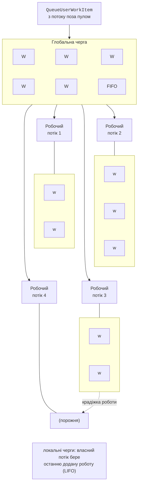

# Пул потоків і моніторинг

## Пул потоків

**Пул потоків** (*thread pool*) – набір фонових робочих потоків, які середовище .NET створює один раз і повторно використовує для коротких робіт. У процесі є один пул. Роботу ставлять у чергу методом `ThreadPool.QueueUserWorkItem`; вільний потік пулу бере її з черги й виконує. Пул використовують задачі `Task` і `Parallel` (теми 5–6), продовження `async`/`await`, таймери та обробка завершення введення-виведення.

```cs
ThreadPool.QueueUserWorkItem(_ => Console.WriteLine("Робота в пулі"));
ThreadPool.QueueUserWorkItem(n => Console.WriteLine(n * n), 12,
    preferLocal: false);                   // типізований стан int
```

`QueueUserWorkItem` не повертає об’єкта для очікування, тому завершення робіт чекають окремим засобом (у прикладі «Пул потоків» – готовим класом `CountdownEvent`, детально – у темі 3).

### Черги та потоки пулу

Пул має **глобальну чергу** робіт і **локальну чергу** в кожного робочого потоку (рис. 2.7). Роботи з потоків поза пулом потрапляють у глобальну чергу (FIFO). Робота, додана з потоку пулу (`preferLocal: true` або задачі TPL), потрапляє в його локальну чергу: власник бере з неї останню додану роботу, бо її дані ще в кеші. Потік із порожньою чергою бере роботу з глобальної черги, а якщо й вона порожня – «краде» найстарішу роботу з локальної черги іншого потоку (**крадіжка роботи**, *work stealing*). Так навантаження вирівнюється без центрального координатора.



Рис. 2.7. Черги пулу потоків .NET {.caption}

Пул має два види потоків: **робочі** (*worker threads*) для обчислень і потоки **завершення введення-виведення** (*I/O completion threads*). Методи `GetMinThreads`/`GetMaxThreads` повертають межі кількості потоків, `ThreadPool.ThreadCount` – поточну кількість, `PendingWorkItemCount` – довжину черги, `CompletedWorkItemCount` – кількість виконаних робіт.

До досягнення **мінімуму** (за замовчуванням – кількість логічних процесорів) пул створює потоки одразу на вимогу. Понад мінімум кількість потоків регулює алгоритм **hill climbing** («сходження на пагорб»): пул пробно додає або прибирає потік і залишає зміну, якщо зросла пропускна здатність (кількість виконаних робіт за одиницю часу). Нові потоки додаються поступово, із затримкою.

### Голодування пулу

Якщо роботи в пулі **блокуються** (`Thread.Sleep`, синхронне очікування мережі чи файлу), потоки пулу простоюють, а черга зростає. Це **голодування пулу** (*thread pool starvation*): нові роботи довго чекають старту, хоча процесор вільний. Програма ставить 40 робіт, кожна з яких блокує потік на 3 с, і двічі на секунду виводить кількість потоків пулу та довжину черги:

```cs
using System.Diagnostics;

Console.OutputEncoding = System.Text.Encoding.UTF8;

if (args is ["--min", var text])            // напр. --min 48
{
    ThreadPool.GetMinThreads(out _, out int io);
    ThreadPool.SetMinThreads(int.Parse(text), io);
}

// 40 робіт блокують потоки пулу на 3 с кожна.
for (int i = 0; i < 40; i++)
    ThreadPool.QueueUserWorkItem(_ => Thread.Sleep(3_000));

Stopwatch clock = Stopwatch.StartNew();
while (clock.ElapsedMilliseconds < 3_000)
{
    Console.WriteLine(
        $"{clock.ElapsedMilliseconds,5} мс: потоків " +
        $"{ThreadPool.ThreadCount,2}, у черзі " +
        $"{ThreadPool.PendingWorkItemCount,2}");
    Thread.Sleep(500);
}
```

```
PS> .\S2Starve.exe
    0 мс: потоків  3, у черзі 37
  514 мс: потоків 16, у черзі 24
 1029 мс: потоків 17, у черзі 23
 1546 мс: потоків 17, у черзі 23
 2062 мс: потоків 18, у черзі 22
 2563 мс: потоків 18, у черзі 22
PS> .\S2Starve.exe --min 48
    0 мс: потоків  2, у черзі 39
  504 мс: потоків 41, у черзі  0
```

Пул швидко створює 16 потоків (мінімум на комп’ютері з 16 логічними процесорами), а далі додає приблизно по одному потоку за пів секунди–секунду: 22 роботи чекають у черзі. Після `SetMinThreads(48, …)` усі роботи стартують одразу. Проте збільшення мінімуму лише маскує проблему: правильне рішення – не блокувати потоки пулу (асинхронне введення-виведення, тема 5), а довгі блокувальні роботи виконувати в окремих потоках `Thread`.

Окремі потоки `Thread` замість пулу потрібні, якщо потоку потрібен особливий пріоритет, ім’я або стабільна ідентичність, він працює весь час життя програми або довго блокується, чи має бути основним (*foreground*).

### Таймер System.Threading.Timer

Клас `System.Threading.Timer` періодично викликає метод у потоці пулу. Конструктор приймає делегат `TimerCallback`, стан, затримку першого виклику (`dueTime`) і період (`period`). Метод `Change` змінює розклад, а `Dispose` зупиняє таймер:

```cs
int ticks = 0;
using (Timer timer = new(_ =>
{
    int n = Interlocked.Increment(ref ticks);
    Console.WriteLine($"Тік {n} у потоці пулу: " +
        Thread.CurrentThread.IsThreadPoolThread);
}, null, dueTime: 0, period: 100))
{
    Thread.Sleep(350);
}
```

```
Тік 1 у потоці пулу: True
Тік 2 у потоці пулу: True
Тік 3 у потоці пулу: True
Тік 4 у потоці пулу: True
```

Обробник таймера має бути коротким. Якщо він виконується довше за період, наступний виклик стартує в іншому потоці пулу паралельно з попереднім, тому спільні дані захищають (тут – атомарне збільшення `Interlocked.Increment`, тема 3). Посилання на таймер потрібно зберігати: таймер, на який немає посилань, може знищити збирач сміття.

## Розбиття обчислення на N потоків

Найпростіший паралельний алгоритм для масиву – **розбиття на частини** (*partitioning*):

- масив довжини $L$ ділять на $N$ суміжних частин довжини $L / N$ (остання частина забирає залишок);
- кожен потік обробляє свою частину й записує результат у свій елемент масиву результатів;
- основний потік чекає всіх потоків через `Join` і об’єднує часткові результати;
- результат порівнюють з послідовним обчисленням.

Прискорення $S_{N} = T_{1} / T_{N}$ і ефективність $E_{N} = S_{N} / N$ (тема 1) вимірюють для $N = 1 , 2 , 4 , …$ з прогріванням і медіаною кількох запусків у конфігурації *Release*. На практиці прискорення обмежують:

- **накладні витрати** на створення потоків (для малих масивів паралельна версія повільніша);
- **пропускна здатність пам’яті**: прості операції над великими масивами впираються не в ядра, а в швидкість читання пам’яті;
- **SMT**: 16 логічних процесорів i9-11900KF – це 8 фізичних ядер, і другий логічний процесор ядра додає значно менше, ніж окреме ядро;
- **нерівномірність** роботи в частинах (наприклад, перевірка простоти великих чисел довша), через яку потоки простоюють, чекаючи найповільнішого;
- спільні дані та синхронізація (теми 3–4).

Оптимальну кількість потоків визначають вимірюванням; для обчислювальних задач це зазвичай кількість фізичних ядер або логічних процесорів (`Environment.ProcessorCount`).

## Інструменти моніторингу потоків

### Вікно потоків у налагоджувачі Rider

Під час налагодження в JetBrains Rider (<https://www.jetbrains.com/help/rider/Debugging_Code.html>) вкладка *Debugger* вікна *Debug* показує ліворуч список потоків і стек викликів вибраного потоку (рис. 2.8). Потоки, яким у коді задано `Name`, легко знайти за іменем; вибір потоку перемикає змінні та стек на цей потік. Вкладка *Parallel Stacks* показує стеки всіх потоків одним графом. Точка зупину в методі потоку зупиняє весь процес, тому інші потоки теж «застигають».

::: info Знімок екрана
Rider: breakpoint inside the worker method of lecture example 1, Debug (Shift+F9); Debug tool window → Debugger tab, Threads pane with Worker 1…4, the current thread selected
:::

Рис. 2.8. Потоки процесу в налагоджувачі Rider {.caption}

### Лічильники dotnet-counters

Утиліта `dotnet-counters` (<https://learn.microsoft.com/dotnet/core/diagnostics/dotnet-counters>) показує лічильники середовища виконання запущеного процесу без його зупинки. Для програм .NET 9 і новіших лічильник `System.Runtime` містить метрики пулу потоків `dotnet.thread_pool.thread.count` (кількість потоків), `dotnet.thread_pool.queue.length` (довжина черги) і `dotnet.thread_pool.work_item.count` (виконані роботи), а також `dotnet.monitor.lock_contentions` і `dotnet.process.cpu.time` (рис. 2.9):

```powershell
dotnet tool install --global dotnet-counters
dotnet-counters ps                                  # процеси .NET
dotnet-counters monitor -n PoolDemo --counters System.Runtime
```

Без встановлення утиліту запускає команда `dnx dotnet-counters monitor …` (з .NET SDK 10). Під час голодування пулу видно, що довжина черги зростає, а кількість потоків збільшується повільно.

::: info Знімок екрана
Windows Terminal: dotnet-counters monitor -n PoolDemo –counters System.Runtime while the starvation demo runs; dotnet.thread\_pool.thread.count, queue.length, work\_item.count visible
:::

Рис. 2.9. Лічильники пулу потоків у dotnet-counters {.caption}
