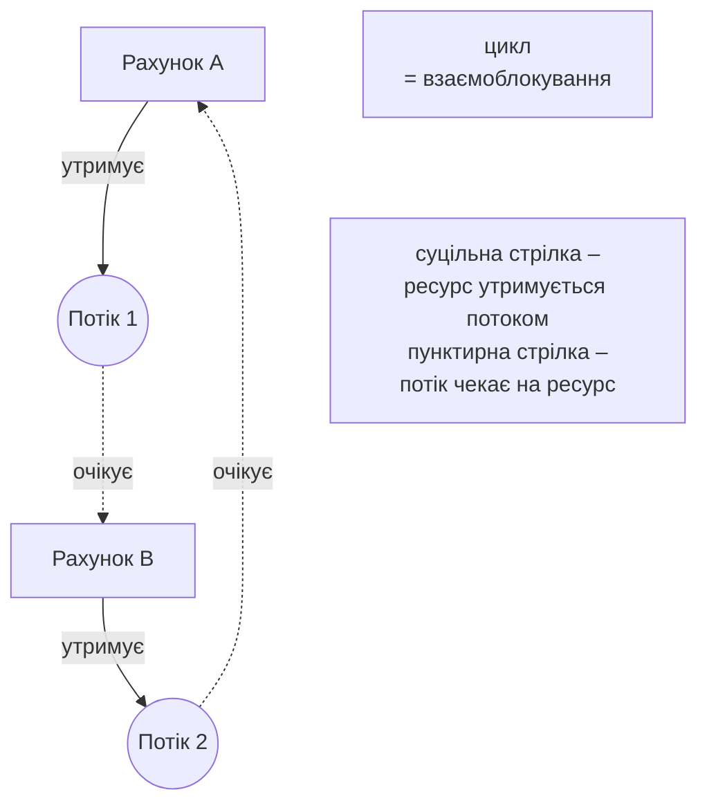
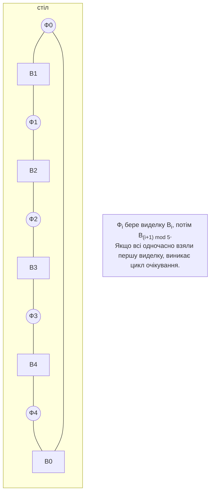

# Взаємоблокування та ціна синхронізації

## Взаємоблокування

**Взаємоблокування** (*deadlock*) – стан, у якому кожен потік групи чекає ресурс, захоплений іншим потоком тієї ж групи, тому жоден не може продовжити роботу. Класичний приклад – переказ коштів: потік 1 переказує з рахунку A на B і блокує спочатку A, потім B; потік 2 одночасно переказує з B на A і блокує спочатку B, потім A. Якщо кожен встиг захопити перший рахунок, обидва чекають вічно (рис. 3.4). Процес не завершується, процесор не завантажений, у журналі немає помилок.



Рис. 3.4. Граф розподілу ресурсів при взаємоблокуванні {.caption}

### Умови Коффмана

Взаємоблокування можливе лише тоді, коли одночасно виконуються чотири **умови Коффмана** (E. Coffman, 1971):

1. **взаємне виключення** – ресурс може використовувати лише один потік;
2. **утримання й очікування** (*hold and wait*) – потік утримує ресурс і чекає інший;
3. **відсутність витіснення** (*no preemption*) – ресурс не можна примусово відібрати в потоку;
4. **циклічне очікування** (*circular wait*) – існує цикл потоків, кожен з яких чекає ресурс наступного.

У **графі розподілу ресурсів** потоки зображують колами, ресурси – прямокутниками, стрілка від ресурсу до потоку означає «утримує», від потоку до ресурсу – «очікує». Цикл у графі з ресурсами в одному екземплярі означає взаємоблокування.

### Способи боротьби

Взаємоблокуванню **запобігають**, порушуючи одну з умов:

- **упорядкування блокувань** (порушує циклічне очікування) – усі потоки захоплюють замки в одному глобальному порядку, наприклад за номером рахунку. Це основний практичний спосіб;
- **захоплення з таймаутом** (порушує утримання й очікування) – `Monitor.TryEnter` чи `Lock.TryEnter` з таймаутом; у разі невдачі потік звільняє вже захоплені замки, чекає випадковий час і повторює спробу;
- **захоплення всіх ресурсів одразу** або один спільний замок для групи ресурсів – просто, але зменшує паралелізм;
- **не викликати зовнішній код під замком** і не тримати два замки, якщо без цього можна обійтися.

Інші стратегії – **уникнення** (система видає ресурс, лише якщо стан залишається безпечним, алгоритм банкіра Дейкстри) та **виявлення з відновленням** (періодичний пошук циклу в графі очікування й перезапуск одного з потоків) – використовуються в ОС і СУБД. Наприклад, сервер баз даних виявляє взаємоблокування транзакцій і скасовує одну з них.

### Діагностика

Якщо програма «зависла», у JetBrains Rider її запускають під налагоджувачем (*Run → Debug…*), а після зависання натискають кнопку *Pause Program* (**Ctrl+Pause**) у вікні *Debug*. Вкладка *Parallel Stacks* показує всі потоки у вигляді діаграми стеків: потоки взаємоблокування стоять у `Monitor.Enter` (для `Lock` – у `Lock.Enter`) усередині методів переказу (рис. 3.5). Документація: <https://www.jetbrains.com/help/rider/Debugging_Multithreaded_Applications.html>.

::: info Знімок екрана
Rider: debug lecture example «Банківські перекази» with argument `naive`, Pause Program (Ctrl+Pause), Debug tool window → Parallel Stacks; two threads blocked in `Monitor.Enter` inside `TransferNaive`
:::

Рис. 3.5. Взаємоблокування у вкладці Parallel Stacks {.caption}

На сервері без IDE знімають **дамп** процесу утилітою `dotnet-dump` (<https://learn.microsoft.com/dotnet/core/diagnostics/dotnet-dump>) і аналізують його командами SOS:

```powershell
dotnet tool install --global dotnet-dump
dotnet-dump ps                           # список процесів .NET
dotnet-dump collect -n Deadlock -o deadlock.dmp
dotnet-dump analyze deadlock.dmp
> syncblk                                # хто володіє моніторами
> clrstack -all                          # стеки всіх потоків
> parallelstacks                         # об’єднані стеки
```

Фрагмент реального аналізу дампу програми з прикладу «Банківські перекази» (адреси й довгі рядки скорочено, рис. 3.6):

```
> syncblk
Index SyncBlock MonitorHeld Recursion Owning Thread Info  Owner
    1 ...C268           3         1 ...BC90 6368   9    System.Object
    2 ...C2C0           3         1 ...8460 4040   8    System.Object
> parallelstacks
      ~~~~ 4040
         1 System.Threading.Monitor.Enter(Object, Boolean ByRef)
         1 Program.<<Main>$>g__TransferNaive|0_3(Account, ...)
      ~~~~ 6368
         1 System.Threading.Monitor.Enter(Object, Boolean ByRef)
         1 Program.<<Main>$>g__TransferNaive|0_3(Account, ...)
```

Два об’єкти-монітори належать потокам 4040 і 6368 (стовпець *Owning Thread Info*), а стеки показують, що обидва потоки чекають у `Monitor.Enter` усередині `TransferNaive`, тобто кожен чекає замок, яким володіє інший. Команда `syncblk` показує лише монітори (`lock` для `object`); замки типу `Lock` у ній не відображаються, їх шукають за стеками.

::: info Знімок екрана
Windows Terminal: `dotnet-dump collect -n Deadlock`, `dotnet-dump analyze <file>`, commands `syncblk` and `clrstack -all` (trimmed); owning thread IDs visible
:::

Рис. 3.6. Аналіз дампу процесу командами syncblk і clrstack {.caption}

## Голодування, livelock, інверсія пріоритетів і конвой блокувань

Взаємоблокування – не єдине порушення живучості.

**Голодування** (*starvation*) – потік може працювати, але постійно не отримує ресурс, бо його обганяють інші. Причини: потоки з вищим пріоритетом (тема 2), несправедливий замок (монітор і семафор не гарантують порядок FIFO), потік, що довго утримує замок у циклі, «жадібні» читачі, які не дають увійти письменнику. Запобігання: коротко утримувати замки, не змінювати пріоритети без потреби, використовувати справедливі черги (наприклад, власну чергу заявок з номерами) і вимірювати максимальний час очікування.

**Активне взаємоблокування** (*livelock*) – потоки не заблоковані, постійно виконують дії, але прогресу немає. Приклад – двоє людей у вузькому коридорі одночасно відступають в один бік, потім в інший. У програмі це два потоки, які захоплюють перший замок, не отримують другий, звільняють перший і одночасно повторюють спробу. Рішення – **випадкова затримка** перед повтором (*randomized backoff*), як у мережі Ethernet.

**Інверсія пріоритетів** (*priority inversion*) – потік з низьким пріоритетом утримує замок, потрібний потоку з високим пріоритетом, а потік із середнім пріоритетом витісняє низькопріоритетний і не дає йому звільнити замок. Високопріоритетний потік фактично чекає середньопріоритетний. Відомий випадок – перезавантаження апарата Mars Pathfinder у 1997 році. ОС пом’якшують проблему **успадкуванням пріоритету** або тимчасовим підвищенням пріоритету потоків, що довго чекають: Windows періодично підвищує пріоритет потоків, які тривалий час не отримували процесорного часу.

**Конвой блокувань** (*lock convoy*) – багато потоків часто захоплюють один замок на короткий час. Потоки шикуються в чергу, кожне звільнення будить наступний потік, і більшість часу витрачається на перемикання контексту, а не на роботу. Ознаки: високе завантаження процесора в режимі ядра, пропускна здатність не зростає або падає зі збільшенням кількості потоків. Рішення – зменшити частоту захоплень (обробляти дані пакетами, накопичувати локально).

## Класичні задачі синхронізації

Класичні задачі описують типові схеми взаємодії потоків; реальні програми зазвичай є їх варіантами.

**Обмежений буфер** (*bounded buffer*), або «виробник–споживач»: виробники додають елементи в буфер фіксованої ємності, споживачі забирають. Виробник чекає, коли буфер повний, споживач – коли порожній. Розв’язання – монітор з умовними змінними (приклад «Обмежений буфер») або два семафори «вільні місця» й «елементи». У темі 4 для цього використовують готові `BlockingCollection<T>` і канали.

**Читачі–письменники** (*readers–writers*): читачі можуть працювати одночасно, письменник – лише сам. Варіанти з перевагою читачів ризикують голодуванням письменників, і навпаки. Розв’язання в .NET – `ReaderWriterLockSlim`.

**Обідаючі філософи** (*dining philosophers*, Е. Дейкстра): п’ять філософів сидять за круглим столом, між сусідами лежить одна виделка, і щоб їсти, філософ бере дві виделки – ліву й праву (рис. 3.7). Якщо кожен одночасно візьме ліву виделку, виникає цикл очікування.



Рис. 3.7. Задача про обідаючих філософів {.caption}

Розв’язання:

- **упорядкування ресурсів** – кожен бере спочатку виделку з меншим номером (останній філософ бере виделки в іншому порядку, і цикл неможливий);
- **офіціант** – семафор на `N - 1` філософів: за столом одночасно їдять не більше чотирьох;
- **таймаут і відступ** – узяти ліву виделку, спробувати праву з таймаутом, у разі невдачі покласти ліву й почекати випадковий час.

**Сплячий перукар** (*sleeping barber*): перукар спить, доки немає клієнтів; клієнт будить його або сідає в чергу на одне з N крісел, а якщо вільних крісел немає – іде. Задача моделює сервер з обмеженою чергою запитів і відмовою в обслуговуванні; розв’язується семафорами або монітором.

## Ціна синхронізації

Синхронізація робить програму коректною, але критична секція виконується послідовно. За законом Амдала (тема 1) вона обмежує прискорення, а конкуренція за замок додає накладні витрати. Приклад «Лічильник відвідувачів» вимірює 8 000 000 збільшень лічильника, розділених між 1–16 потоками (табл. 3.3, медіана п’яти запусків на Intel Core i9-11900KF; на іншому комп’ютері числа будуть іншими).

Таблиця 3.3. Час 8 млн збільшень лічильника залежно від способу синхронізації {.caption}

| **Спосіб** | **1 потік, мс** | **2 потоки, мс** | **8 потоків, мс** | **16 потоків, мс** |
| --- | --- | --- | --- | --- |
| без синхронізації (результат неправильний) | 2,3 | 5,7 | 4,3 | 3,7 |
| `Interlocked.Increment` | 33,9 | 66,0 | 77,8 | 79,8 |
| `lock (object)` | 118,7 | 207,5 | 264,9 | 258,6 |
| `lock (Lock)` | 106,3 | 213,9 | 519,1 | 560,4 |
| локальний лічильник + `Interlocked.Add` | 2,4 | 1,4 | 0,8 | 1,0 |

Висновки з вимірювань:

- без синхронізації програма швидка, але втрачає до 70 % збільшень;
- `Interlocked` на одному потоці в десятки разів повільніший за звичайне збільшення (яке JIT до того ж може оптимізувати), а на кількох потоках ще вдвічі повільніший, бо потоки конкурують за кеш-лінію однієї змінної;
- `lock` на одному потоці коштує близько 15 нс на вхід і вихід, а з ростом кількості потоків час зростає в 2–5 разів: з’являється конвой блокувань. У цьому тесті з украй короткою секцією `Lock` під сильною конкуренцією виявився повільнішим за монітор, тому рішення про засіб синхронізації потрібно ухвалювати за вимірюваннями, а не за загальними порадами;
- **жоден** спосіб синхронізації не дав прискорення: робота складається лише з критичної секції. Прискорення дав тільки локальний лічильник, який усуває спільний стан у циклі й звертається до спільної змінної один раз на потік.

Звідси правила **зернистості блокувань** (*lock granularity*):

- **груба** зернистість (один замок на всю структуру) проста й безпечна, але потоки частіше чекають;
- **дрібна** (окремий замок на кожен рахунок чи сегмент таблиці) краще масштабується, але ускладнює код і створює ризик взаємоблокування;
- найкраще – зменшити кількість звернень до спільних даних: обчислювати локально, під замком лише об’єднувати результати.

Результат запуску прикладу в терміналі показано на рис. 3.8.

::: info Знімок екрана
Windows Terminal: `dotnet run -c Release` in the Visitors project (lecture example 1); the table with columns method, threads, result, time ms
:::

Рис. 3.8. Порівняння засобів синхронізації {.caption}
