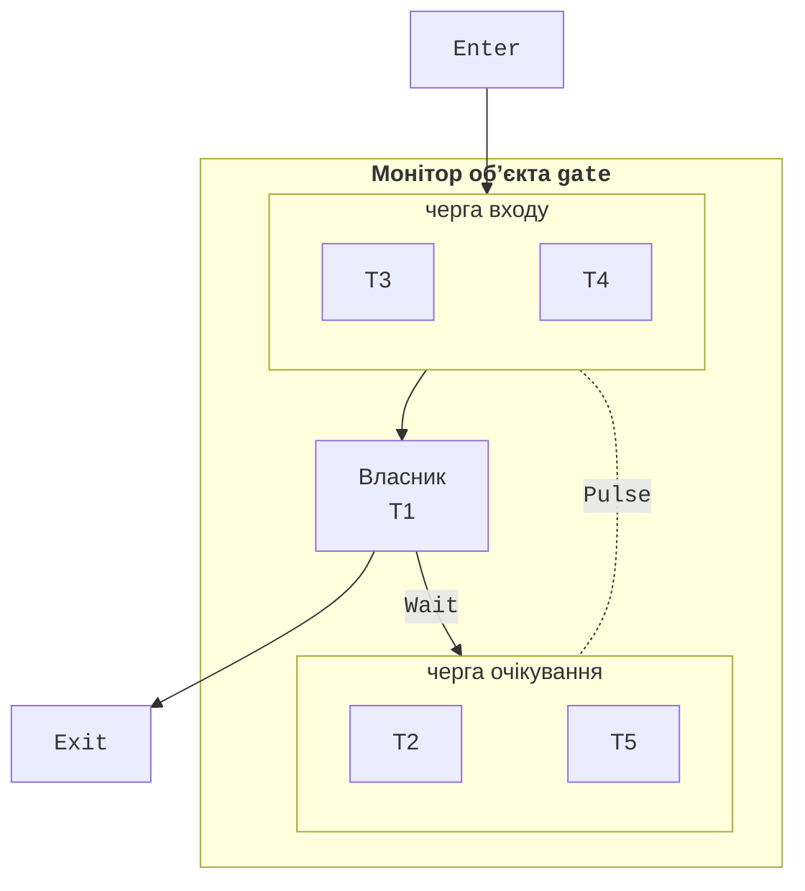

# Блокування та умовні змінні

## Оператор `lock`, тип `Lock` і клас `Monitor`

Оператор `lock` виконує блок інструкцій як критичну секцію: потік **захоплює** замок, виконує блок і **звільняє** замок навіть тоді, коли в блоці виник виняток. Інші потоки, що намагаються захопити той самий замок, чекають.

Починаючи з .NET 9 і C# 13, для блокування рекомендовано окремий об’єкт типу `System.Threading.Lock` (<https://learn.microsoft.com/dotnet/api/system.threading.lock>):

```cs
class BankAccount
{
    private readonly Lock balanceLock = new();
    private decimal balance;

    public bool Withdraw(decimal sum)
    {
        lock (balanceLock)               // перевірка й дія – разом
        {
            if (balance < sum) return false;
            balance -= sum;
            return true;
        }
    }
}
```

Компілятор перетворює `lock` для змінної типу `Lock` на `using (balanceLock.EnterScope()) { … }`, а для будь-якого іншого посилального типу – на виклики `Monitor.Enter` і `Monitor.Exit` у блоці `try…finally` (<https://learn.microsoft.com/dotnet/csharp/language-reference/statements/lock>). Тип `Lock` має методи `Enter`, `TryEnter` (без очікування або з таймаутом), `Exit`, `EnterScope` і властивість `IsHeldByCurrentThread`. Якщо об’єкт `Lock` перетворити на `object` і заблокувати, компілятор видає попередження CS9216: у такому разі буде використано звичайний монітор, а не `Lock`.

Обидва механізми **реентрантні** (*reentrant*): потік, що вже тримає замок, може захопити його повторно (наприклад, у рекурсивному виклику) і має стільки ж разів його звільнити.

### Клас `Monitor`

Будь-який об’єкт посилального типу в .NET можна використати як замок через статичні методи класу `Monitor`: `Enter`, `Exit` і `TryEnter`. Явні виклики потрібні, коли `lock` недостатньо, зокрема для спроби входу з таймаутом: `Monitor.TryEnter(sync, TimeSpan.FromMilliseconds(100), ref taken)` повертає керування, навіть якщо замок не вдалося захопити, а змінна `taken` показує результат; `Monitor.Exit(sync)` викликають у блоці `finally`, лише якщо `taken` дорівнює `true`. Лише потік-власник може звільнити монітор (`Monitor.Exit` в іншому потоці спричиняє `SynchronizationLockException`): монітор має **спорідненість із потоком** (*thread affinity*).

### Вибір об’єкта блокування

- Блокувати **окремий приватний** об’єкт `private readonly Lock gate = new();` (або `object` у коді до .NET 9), призначений лише для синхронізації.
- Не блокувати `this`, об’єкти `Type` (`typeof(Account)`) і рядки: до них мають доступ інші частини програми, які можуть захопити той самий замок і спричинити взаємоблокування. Рядкові літерали до того ж **інтерновані** – однаковий літерал у різних класах є одним об’єктом.
- Значущі типи блокувати неможливо: `lock (count)` для `int` дає помилку CS0185.
- Той самий ресурс завжди захищати **тим самим** замком; різні незалежні ресурси – різними.
- Усередині `lock` заборонено `await` (помилка CS1996): після `await` код може продовжитися в іншому потоці. Асинхронне очікування розглядається в темі 5.
- Утримувати замок якомога коротше і не викликати в критичній секції невідомий код (події, делегати, віртуальні методи), який може захопити інші замки.

## Умовні змінні: `Monitor.Wait`, `Pulse`, `PulseAll`

Часто потік має не просто ввійти в критичну секцію, а **дочекатися умови**: у черзі з’явився елемент, у буфері звільнилося місце. Перевіряти умову в циклі із `Thread.Sleep` неефективно. Для цього в моніторі є **умовна змінна** (*condition variable*) – черга потоків, які чекають сигналу (рис. 3.3):

- `Monitor.Wait(obj)` – власник **звільняє** замок і переходить у чергу очікування; після сигналу потік переходить у чергу входу і, коли знову захопить замок, продовжить роботу після `Wait`;
- `Monitor.Pulse(obj)` – переводить **один** потік з черги очікування в чергу входу;
- `Monitor.PulseAll(obj)` – переводить **усі** очікувальні потоки.



Рис. 3.3. Черги монітора: власник, черга входу та черга очікування {.caption}

Усі три методи можна викликати лише всередині `lock` для того самого об’єкта, інакше виникає `SynchronizationLockException`. Тип `Lock` не має методів `Wait` і `Pulse`, тому для умовних змінних використовують звичайний об’єкт і `Monitor`. Шаблон очікування умови:

```cs
lock (gate)
{
    while (items.Count == 0)     // саме while, а не if
    {
        Monitor.Wait(gate);      // звільняє gate і чекає сигналу
    }
    item = items.Dequeue();
    Monitor.PulseAll(gate);      // повідомити тих, хто чекає місця
}
```

Умову перевіряють у циклі `while`, бо між сигналом і повторним захопленням замка інший потік може ввійти першим і знову зробити умову хибною («украдене» пробудження). Крім того, `PulseAll` будить потоки, які чекають **різних** умов, а `Wait` з таймаутом повертає керування без сигналу. Якщо `Pulse` викликано, коли ніхто не чекає, сигнал **губиться** – на відміну від семафора, монітор не запам’ятовує сигналів. Тому стан, про який сигналізують, завжди зберігають у спільних змінних і перевіряють під замком.

`Pulse` ефективніший, але безпечний лише тоді, коли всі очікувальні потоки чекають однієї умови і будь-який з них може її обробити. У решті випадків використовують `PulseAll`.

## `Mutex`, `Semaphore` і `SemaphoreSlim`

**М’ютекс** (*mutex*, від *mutual exclusion*) – замок, який реалізує операційна система. Клас `System.Threading.Mutex` має спорідненість із потоком, як і монітор, але кожна операція є системним викликом, тому він у десятки разів повільніший за `lock`. Його перевага – **іменований** м’ютекс видимий усім процесам і синхронізує їх між собою. Типове застосування – заборона запуску другого екземпляра програми:

```cs
using Mutex single = new(false, @"Local\PrintQueueDemo");
if (!single.WaitOne(TimeSpan.Zero))
{
    Console.Error.WriteLine("Програму вже запущено");
    return 1;
}
try
{
    Console.WriteLine("Працюю… Enter – вихід");
    Console.ReadLine();
}
finally
{
    single.ReleaseMutex();
}
return 0;
```

Префікс `Local\` (типовий) обмежує видимість сеансом користувача, `Global\` – робить м’ютекс видимим у всій системі. У Linux іменовані м’ютекси реалізовано через файлову систему. Якщо потік-власник завершився, не звільнивши м’ютекс, наступний `WaitOne` генерує `AbandonedMutexException`: дані, які захищав м’ютекс, можуть бути неузгодженими.

**Семафор** (*semaphore*) – лічильник дозволів: `Wait` зменшує лічильник або чекає, якщо він дорівнює нулю, `Release` збільшує лічильник і пропускає потік, що чекає. Семафор обмежує **кількість** потоків, які одночасно працюють з ресурсом: місця на парковці, з’єднання з базою даних, одночасні завантаження. Семафор не має спорідненості з потоком: звільнити дозвіл може інший потік.

- `SemaphoreSlim` – легкий семафор усередині процесу: `Wait()`, `Wait(timeout)`, `WaitAsync` (тема 5), `Release()`, `CurrentCount`; виклик `Release` розміщують у блоці `finally` (приклад «Парковка»).
- `Semaphore` – системний семафор; іменований (`new Semaphore(2, 2, "Scanners")`) синхронізує процеси, але іменовані семафори підтримуються лише у Windows.

Порядок, у якому очікувальні потоки проходять семафор, не гарантовано (ні FIFO, ні LIFO). Зайвий виклик `Release` понад максимальне значення генерує `SemaphoreFullException`. Семафор з одним дозволом (*binary semaphore*) схожий на м’ютекс, але не має власника й не підтримує реентрантність.
