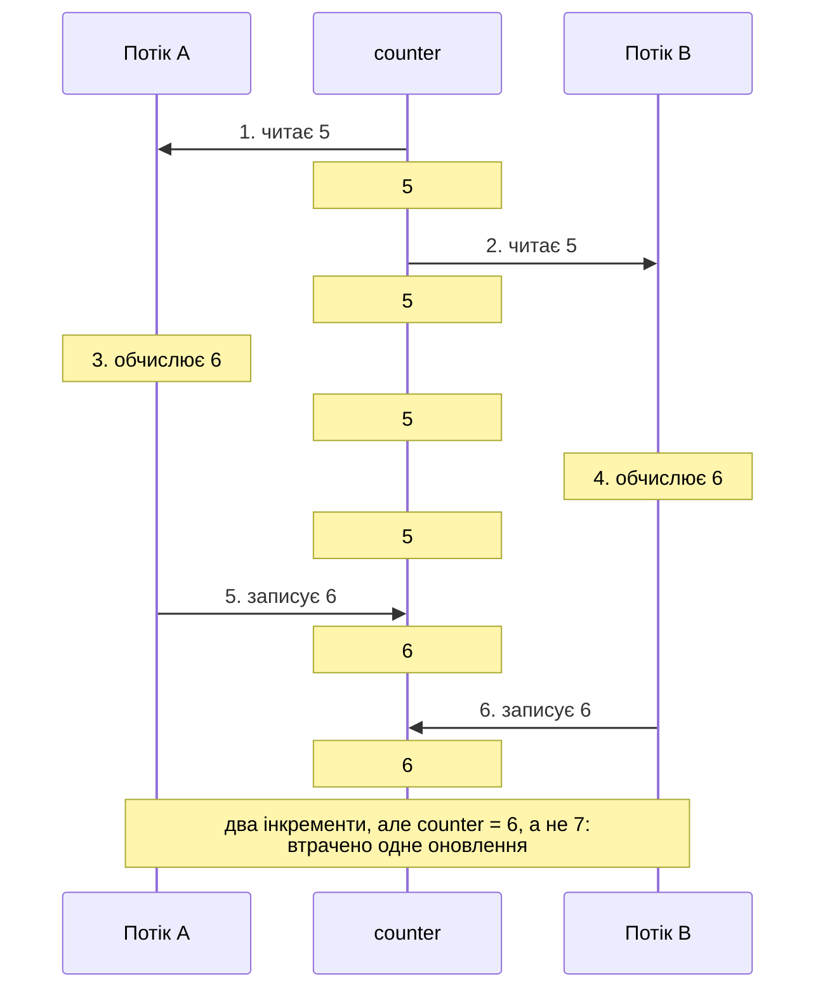
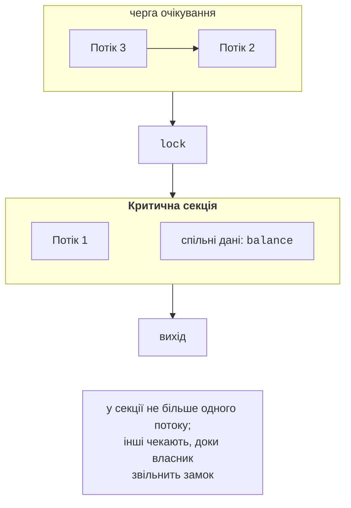

# Стан гонитви та взаємне виключення

## Спільний стан і стан гонитви

У темі 2 потоки обробляли окремі частини масиву й не заважали один одному. На практиці потокам часто потрібні **спільні дані** (*shared state*): лічильник запитів, баланс рахунку, кеш, черга завдань. Спільними є статичні поля, поля об’єкта, доступного кільком потокам, і локальні змінні, захоплені лямбдою, яку виконують кілька потоків. Локальні змінні методу, що не захоплені лямбдою, лежать у стеку свого потоку й іншим потокам недоступні.

Фрагмент коду, який звертається до спільних даних і не повинен виконуватися кількома потоками одночасно, називають **критичною секцією** (*critical section*). Якщо критичну секцію не захистити, результат програми залежить від того, як планувальник ОС перемежує команди потоків. Така ситуація називається **станом гонитви** (*race condition*).

Найпростіший приклад – збільшення лічильника чотирма потоками:

```cs
int counter = 0;
Thread[] threads = new Thread[4];
for (int t = 0; t < threads.Length; t++)
{
    threads[t] = new Thread(() =>
    {
        for (int i = 0; i < 1_000_000; i++) counter++;
    });
    threads[t].Start();
}
foreach (Thread t in threads) t.Join();
Console.WriteLine(counter);          // очікується 4000000
```

Три запуски в конфігурації *Release* вивели `1073918`, `1219211` і `1304128`: близько двох третин збільшень утрачено, і щоразу інша кількість. Причина в тому, що `counter++` – не одна дія, а три: **прочитати** значення в регістр, **обчислити** нове значення, **записати** його назад. Якщо потік B прочитає змінну між читанням і записом потоку A, обидва запишуть однаковий результат і одне збільшення зникне (рис. 3.1).



Рис. 3.1. Втрата оновлення при одночасному виконанні `counter++` {.caption}

Неатомарними є й інші операції, які здаються «одним рядком»:

- `total += x` для `long`, `double` чи `decimal` – те саме «читання–зміна–запис»; у 32-бітному процесі запис 64-бітного `long` виконується двома машинними командами, тому інший потік може прочитати «розірване» значення (половина старого, половина нового);
- копіювання структури з кількох полів (`Point`, `decimal`, `DateTime`);
- **перевірка–дія** (*check-then-act*): `if (cache == null) cache = Load();` або `if (balance >= sum) balance -= sum;` – між перевіркою та дією умову може змінити інший потік;
- операції зі звичайними колекціями: одночасні `List<T>.Add` чи `Dictionary<TKey,TValue>` із записом можуть не лише втратити елементи, а й пошкодити внутрішню структуру колекції (тема 4).

Присвоєння посилання (`current = newObject;`) атомарне, але послідовність «прочитати посилання, створити змінену копію, записати» знову є гонитвою.

Помилки гонитви важко відтворювати: програма може роками працювати правильно на двоядерному ноутбуці й збоїти на 16-ядерному сервері, а під налагоджувачем помилка часто «зникає», бо зупинки змінюють часові співвідношення. Тому синхронізацію проєктують заздалегідь, а не шукають помилки після появи.

## Вимоги до взаємного виключення

**Взаємне виключення** (*mutual exclusion*) – властивість, за якої критичну секцію в кожний момент виконує не більше одного потоку. Коректне розв’язання задачі критичної секції має забезпечити:

- **безпеку** (*safety*): у критичній секції не буває двох потоків одночасно, інваріанти даних не порушуються;
- **живучість** (*liveness*), або прогрес: якщо секція вільна й потоки хочуть увійти, хтось обов’язково ввійде; потоки не блокують один одного назавжди;
- **справедливість** (*fairness*), або обмежене очікування: потік, що чекає, увійде через скінченну кількість входів інших потоків і не голодуватиме.

Крім того, розв’язок не повинен спиратися на швидкість процесорів чи кількість ядер, а потік поза критичною секцією не повинен заважати іншим входити в неї. На рис. 3.2 один потік виконує критичну секцію, а інші чекають у черзі, доки він звільнить замок.



Рис. 3.2. Критична секція та взаємне виключення {.caption}

Чи потрібна синхронізація взагалі, можна перевірити за **умовами Бернштейна**. Нехай фрагмент $P_{1}$ читає множину змінних $R_{1}$ і записує множину $W_{1}$, а фрагмент $P_{2}$ – відповідно $R_{2}$ і $W_{2}$. Фрагменти можна виконувати паралельно без синхронізації, якщо $$W_{1} \cap W_{2} = \varnothing , \quad R_{1} \cap W_{2} = \varnothing , \quad W_{1} \cap R_{2} = \varnothing .$$

Наприклад, `a[i] = b[i] * 2` для різних `i` задовольняє умови: кожна ітерація записує свій елемент. Фрагменти `sum += a[i]` порушують першу умову (обидва записують `sum`), тому потребують синхронізації або перебудови: кожен потік рахує локальну суму, а результати додаються в кінці.

Існує три підходи до спільного стану:

1. **блокування** (*locking*) – потоки по черзі захоплюють замок (`lock`, `Mutex`, семафори);
2. **неблокуючі атомарні операції** – клас `Interlocked` і алгоритми на основі порівняння з обміном;
3. **уникнення спільного стану** – локальні змінні потоків, незмінні (*immutable*) дані, обмін повідомленнями через потокобезпечні черги й канали (тема 4).

Третій підхід найефективніший, тому спершу варто спробувати позбутися спільних даних і лише потім їх захищати.

## Атомарні операції: клас `Interlocked`

Клас `System.Threading.Interlocked` виконує прості операції над змінною **атомарно**: жоден інший потік не побачить проміжного стану. Методи використовують спеціальні команди процесора (на x64 – `lock xadd`, `lock cmpxchg`) і не переводять потік в очікування, тому дуже швидкі.

Таблиця 3.1. Основні методи класу `Interlocked` {.caption}

| **Метод** | **Дія (атомарно)** |
| --- | --- |
| `Increment(ref x)`, `Decrement(ref x)` | збільшує або зменшує на 1, повертає нове значення |
| `Add(ref x, n)` | додає `n`, повертає нове значення |
| `Exchange(ref x, v)` | записує `v`, повертає старе значення |
| `CompareExchange(ref x, v, expected)` | записує `v`, лише якщо `x == expected`; завжди повертає старе значення |
| `Read(ref long x)` | читає 64-бітне значення цілим (важливо для 32-бітних процесів) |
| `And`, `Or` | побітові «і» та «або» з записом результату |

Виправлений лічильник: `Interlocked.Increment(ref counter);`. Методи працюють з полями, елементами масивів і захопленими змінними, але не з властивостями, бо потрібне посилання `ref`.

Операція **порівняння з обміном** (*compare-and-swap*, CAS) дозволяє атомарно виконати довільне оновлення за схемою **CAS-циклу**: прочитати значення, обчислити нове й записати його, лише якщо змінна за цей час не змінилася; інакше повторити:

```cs
static void UpdateMax(ref int max, int value)
{
    int seen;
    do
    {
        seen = max;                      // 1. знімок
        if (value <= seen) return;       // 2. оновлення не потрібне
    }                                    // 3. запис, якщо без змін
    while (Interlocked.CompareExchange(ref max, value, seen) != seen);
}
```

CAS-цикл не блокує потоки: якщо інший потік встиг змінити `max`, поточний просто повторює спробу. Такі алгоритми називають **неблокуючими** (*lock-free*). Вони не можуть спричинити взаємоблокування, але при частих конфліктах потоки марно повторюють обчислення. Складніші неблокуючі структури (стек Трейбера, проблема ABA) розглядаються в темі 4.

### Модифікатор `volatile`

Компілятор JIT і процесор можуть кешувати значення поля в регістрі та переставляти операції читання й запису. Для поля, яке один потік змінює, а інший лише читає (наприклад, прапорець зупинки `private volatile bool stopRequested;`, який робочий потік перевіряє в циклі `while (!stopRequested)`), модифікатор `volatile` забороняє такі оптимізації. Методи `Volatile.Read(ref x)` і `Volatile.Write(ref x, v)` дають той самий ефект для полів без модифікатора (приклад 1 лабораторної роботи). Важливо: `volatile` **не робить** складені операції атомарними – `volatileCounter++` залишається гонитвою; для неї потрібен `Interlocked` або `lock`.
