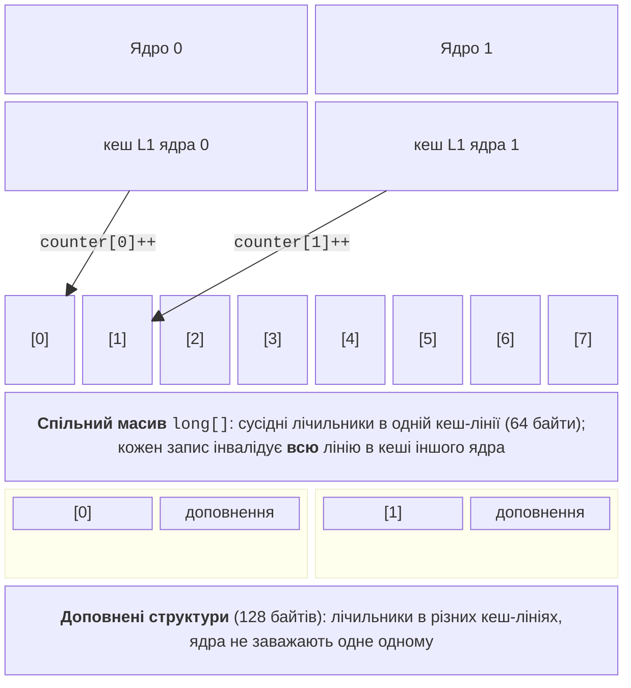

# Кеш, хибне розділення та профілювання

## Кеш процесора та локальність даних

Потокобезпечність – лише половина справи: паралельна програма має ще й **масштабуватися**. На швидкість багатопотокового коду сильно впливає кеш процесора (тема 1). Процесор Intel Core i9-11900KF лабораторного ПК має на кожне ядро кеш L1 даних 48 КіБ, кеш L1 команд 32 КіБ і кеш L2 512 КіБ, а кеш L3 обсягом 16 МіБ спільний для всіх ядер (дані функції Windows `GetLogicalProcessorInformation`).

Дані переміщуються між оперативною пам’яттю й кешем блоками фіксованого розміру – **кеш-лініями** (*cache lines*). На сучасних процесорах x86-64 кеш-лінія має 64 байти. Звертання до байта, якого немає в кеші, – **промах кешу** (*cache miss*): процесор чекає, поки лінія завантажиться з повільнішого рівня. Кеш ефективний завдяки **локальності** (*locality*):

- **просторовій**: поруч із щойно використаними даними скоро знадобляться сусідні (обхід масиву);
- **часовій**: щойно використані дані скоро знадобляться знову (лічильник циклу).

Тому масив структур обробляється швидше за зв’язний список з тими самими даними, а обхід двовимірного масиву за рядками – швидше, ніж за стовпцями. Для паралельних програм важливо ще одне: кожне ядро має **власні** копії ліній у кешах L1 і L2. Коли одне ядро **записує** в лінію, копії цієї лінії в кешах інших ядер стають недійсними, і перед наступним звертанням ці ядра мають отримати свіжу копію. Узгодження копій забезпечує апаратний протокол (наприклад, MESI), і воно коштує часу.

## Хибне розділення кешу

**Хибне розділення** (*false sharing*) виникає, коли потоки записують **різні** змінні, які випадково лежать в **одній** кеш-лінії. Логічно потоки не мають спільних даних і не потребують синхронізації, але апаратно кожен запис одного потоку інвалідує лінію в кеші іншого ядра, і лінія постійно «перестрибує» між ядрами (рис. 4.5). На відміну від справжнього розділення, коли потоки змінюють ту саму змінну, програма правильна, але повільна.



Рис. 4.5. Хибне розділення кешу {.caption}

Класичний приклад – масив лічильників `long[] counters`, де потік `i` у циклі збільшує свій елемент `counters[i]++`. Елементи `long[]` займають по 8 байтів, тому до восьми лічильників потрапляють в одну лінію. Симптоми хибного розділення: прискорення значно менше за очікуване, а зі збільшенням кількості потоків час майже не зменшується або навіть зростає. У прикладі «Хибне розділення» нижче вісім потоків зі спільним масивом прискорили підрахунок лише в 1,6 раза, а з локальними змінними – у 6,3 раза.

Способи усунення:

1. **локальні змінні**: потік накопичує результат у локальній змінній (регістрі процесора або власному стеку) і записує його в спільний масив один раз наприкінці – найкраще рішення;
2. **доповнення** (*padding*) **структур**: кожен лічильник займає структуру, більшу за кеш-лінію, тож сусідні лічильники гарантовано лежать у різних лініях (див. нижче);
3. **розділення даних за потоками**: кожен потік працює з власним об’єктом (локальна гістограма, локальний словник), а результати зливаються після завершення; окремі об’єкти в купі не завжди далеко один від одного, тому гарячі поля все одно краще тримати в локальних змінних.

```cs
[StructLayout(LayoutKind.Sequential, Size = 128)]
struct PaddedCounter
{
    public long Value;
}
```

Атрибут `StructLayout` з простору імен `System.Runtime.InteropServices` задає розмір структури. Для лінії 64 байти достатньо розміру 64, але беруть 128 із запасом: на деяких процесорах лінія більша, а апаратна попередня вибірка (*prefetching*) завантажує сусідні лінії. Хибне розділення стосується лише **записів**: потоки, які тільки читають спільні дані, лінії не інвалідують.

## Вибір структури даних

Вибір залежить від того, хто читає й записує дані та чи потрібне очікування (табл. 4.3).

Таблиця 4.3. Вибір структури даних під сценарій {.caption}

| **Сценарій** | **Структура** |
| --- | --- |
| Спільний словник з частими записами (лічильники, кеш) | `ConcurrentDictionary<TKey, TValue>`, `AddOrUpdate`, `GetOrAdd` з `Lazy<T>` |
| Черга завдань без очікування, опитування `TryDequeue` | `ConcurrentQueue<T>` |
| Ті самі потоки додають і беруть елементи, порядок неважливий | `ConcurrentBag<T>` |
| Виробники й споживачі на звичайних потоках, обмежена ємність | `BlockingCollection<T>` |
| Асинхронний конвеєр, зворотний тиск, відкидання елементів | `Channel<T>` (`CreateBounded`) |
| Рідкі оновлення, дуже часті читання, потрібні знімки | незмінні колекції + `ImmutableInterlocked` |
| Довідник, створений один раз під час запуску | `FrozenDictionary<TKey, TValue>` |
| Кожен потік рахує свій результат | локальні змінні або локальні колекції зі злиттям наприкінці (без спільних даних) |

Найшвидша синхронізація – її відсутність: якщо потоки можуть працювати з власними даними й об’єднати результати наприкінці, це майже завжди краще за будь-яку спільну колекцію.

## Вимірювання та профілювання

### BenchmarkDotNet

Для порівняння варіантів коду використовують знайому з теми 1 бібліотеку **BenchmarkDotNet** (<https://benchmarkdotnet.org/>). Вона сама прогріває код, виконує достатню кількість ітерацій, відкидає викиди й обчислює статистику. Пакет додають командою `dotnet add package BenchmarkDotNet`, методи для вимірювання позначають атрибутом `[Benchmark]`:

```cs
using BenchmarkDotNet.Attributes;
using BenchmarkDotNet.Running;

BenchmarkRunner.Run<CounterBenchmarks>();

public class CounterBenchmarks
{
    private int[] data = [];

    [Params(8)]                      // кількість потоків
    public int Threads { get; set; }

    [GlobalSetup]                    // один раз перед вимірюваннями
    public void Setup() { /* заповнити data */ }

    [Benchmark(Baseline = true)]     // базовий варіант
    public long SharedArray() { /* … */ return 0; }

    [Benchmark]                      // так само LocalVariable
    public long PaddedStruct() { /* … */ return 0; }
}
```

Тіла методів – ті самі, що в прикладі «Хибне розділення»; метод `LocalVariable` оголошено так само. Клас і методи мають бути відкритими (`public`), а запускають вимірювання лише в конфігурації Release: `dotnet run -c Release`. BenchmarkDotNet 0.15.8 на лабораторному ПК вивів таку таблицю (скорочено):

```
| Method        | Threads | Mean      | StdDev    | Ratio |
|-------------- |-------- |----------:|----------:|------:|
| SharedArray   | 8       | 202.99 ms | 12.178 ms |  1.00 |
| LocalVariable | 8       |  51.05 ms |  0.516 ms |  0.25 |
| PaddedStruct  | 8       |  78.78 ms |  2.745 ms |  0.39 |
```

Стовпець *Mean* – середній час, *StdDev* – стандартне відхилення, *Ratio* – відношення до базового методу (`Baseline = true`). BenchmarkDotNet використовує крапку як десятковий роздільник незалежно від регіональних налаштувань. Повний звіт містить також стовпці *Error* і *RatioSD*, версії .NET і процесор (рис. 4.6).

::: info Знімок екрана
Windows Terminal: `dotnet run -c Release` in the FalseSharingBench project; the Summary table with SharedArray, LocalVariable, PaddedStruct and columns Mean, Error, StdDev, Ratio
:::

Рис. 4.6. Результати BenchmarkDotNet для хибного розділення {.caption}

### Профілювальник dotTrace у Rider

BenchmarkDotNet показує, **скільки** триває код, а профілювальник – **чому**. У JetBrains Rider вбудовано профілювальник **dotTrace**. За документацією JetBrains, плагін dotTrace і dotMemory доступний у Rider лише власникам підписок dotUltimate або All Products Pack, тому перед заняттям перевірте ліцензію лабораторних ПК. Для багатопотокових програм найкорисніший тип профілювання – **Timeline**: він збирає часову діаграму станів потоків (виконується, чекає, заблокований).

Порядок роботи:

1. вибрати конфігурацію запуску програми (наприклад, `PipelineDemo`) на панелі інструментів;
2. вибрати *Run → Switch Profiling Configuration → Timeline*;
3. запустити *Run → Profile 'PipelineDemo' with 'Timeline'*; у Windows для Timeline потрібна служба JetBrains ETW Host Service, яку Rider пропонує встановити з правами адміністратора;
4. після завершення програми знімок відкривається у вікні *dotTrace Profiler*.

На часовій діаграмі кожен потік – окрема смуга (рис. 4.7). У конвеєрі видно, що споживачі частину часу чекають на дані, а при заповненому каналі чекають уже виробники. Якщо смуги робочих потоків здебільшого в стані очікування блокування, вузьке місце – синхронізація.

::: info Знімок екрана
Rider: Run → Switch Profiling Configuration → Timeline; Run → Profile 'PipelineDemo' with 'Timeline'; snapshot in the dotTrace Profiler window, thread lanes with running and waiting states of producers and consumers
:::

Рис. 4.7. Часова діаграма потоків у dotTrace {.caption}

### perf c2c у Linux

У Linux хибне розділення знаходить утиліта **`perf c2c`** («cache to cache», <https://man7.org/linux/man-pages/man1/perf-c2c.1.html>). Вона аналізує звертання до пам’яті та знаходить кеш-лінії, які різні ядра одночасно змінюють і читають (події HITM – читання лінії, зміненої іншим ядром). Команда `perf c2c record` записує вибірку, а `perf c2c report` виводить таблиці, зокрема *Shared Data Cache Line Table* з найбільш «гарячими» лініями та *Shared Cache Line Distribution Pareto* зі зміщеннями звертань у кожній лінії.

```bash
export DOTNET_PerfMapEnabled=3        # імена JIT-методів для perf
perf c2c record -- dotnet FalseSharing.dll
perf c2c report --stdio | less
```

Змінна `DOTNET_PerfMapEnabled=3` змушує середовище .NET записувати файл `/tmp/perf-<pid>.map` з іменами JIT-скомпільованих методів, інакше `perf` показує лише адреси. `perf c2c` потребує апаратних лічильників: на Intel – подій затримки завантаження (PEBS), на AMD – IBS, на Arm64 – SPE. У віртуальних машинах і WSL2 ці лічильники часто недоступні, тому звіт знімають на фізичному Linux-вузлі (рис. 4.8).

::: info Знімок екрана
Ubuntu 26.04 terminal on a physical machine (or VM with PMU passthrough): `perf c2c record -- dotnet FalseSharing.dll`, then `perf c2c report --stdio`; top of the Shared Data Cache Line Table
:::

Рис. 4.8. Звіт `perf c2c` для C#-програми в Linux {.caption}
