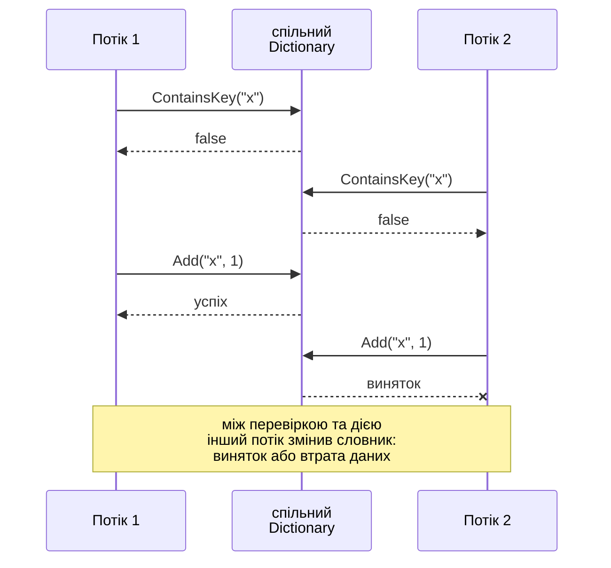
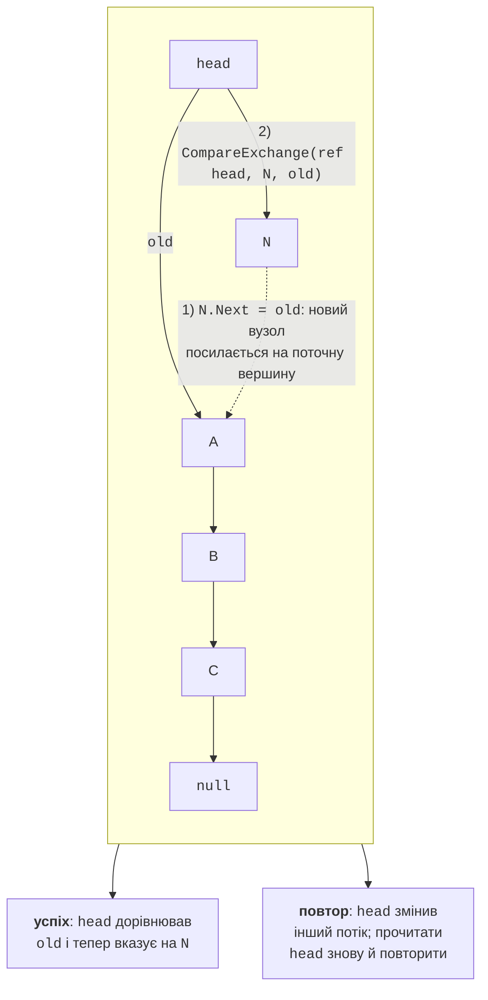

# Колекції та неблокуючі алгоритми

## Звичайні колекції в багатопотоковій програмі

У темі 3 спільні змінні захищали блокуваннями та класом `Interlocked`. Колекції – найчастіший вид спільних даних: потоки складають результати в список, рахують слова у словнику, передають завдання через чергу. Класи простору імен `System.Collections.Generic` (`List<T>`, `Dictionary<TKey, TValue>`, `Queue<T>`) **не є потокобезпечними** (*thread-safe*): вони розраховані на те, що змінює колекцію лише один потік. Одночасне **читання** без записів безпечне, а одночасні записи пошкоджують внутрішній стан.

Наприклад, метод `List<T>.Add` виконує дві дії: записує елемент у комірку внутрішнього масиву `_items[_size]` і збільшує `_size`. Два потоки можуть записати елементи в ту саму комірку, і один елемент зникне; під час збільшення масиву один потік може писати в старий масив, поки інший уже копіює його в новий. Під час перевірки на цьому ПК чотири потоки, що додавали по 200 000 чисел у спільний `List<int>`, зберегли близько 600 000–800 000 елементів з 800 000 без жодного винятку. Спільний `Dictionary<TKey, TValue>` поводиться ще гірше:

- втрачає пари «ключ – значення»;
- генерує `InvalidOperationException` з повідомленням «Operations that change non-concurrent collections must have exclusive access…», `IndexOutOfRangeException` або `ArgumentException`;
- може **зациклитися**, якщо пошкоджено ланцюжки кошиків: в одному з пробних запусків потоки не завершилися й за 20 с.

::: tip Увага
Помилки звичайних колекцій з’являються не в кожному запуску. Те, що програма «спрацювала», не доводить її коректності.
:::

### Складені операції «перевірити – діяти»

Навіть потокобезпечна колекція не робить атомарною **послідовність** викликів. Типова помилка – операція **«перевірити – діяти»** (*check-then-act*): спочатку перевірити умову, потім змінити колекцію на її підставі (рис. 4.1).

```cs
if (!cache.ContainsKey(key))       // 1. перевірити
{
    cache.Add(key, Load(key));     // 2. діяти: інший потік міг
}                                  //    уже додати цей ключ
```



Рис. 4.1. Гонитва складеної операції «перевірити – діяти» {.caption}

Між перевіркою та дією інший потік може змінити колекцію, тому результат перевірки застаріває. Інші приклади таких операцій: «якщо `Count > 0`, то `Dequeue()`», «прочитати значення, збільшити, записати назад». Є два виправлення: захистити всю послідовність одним блокуванням або використати метод, що виконує її атомарно: `TryAdd`, `GetOrAdd`, `AddOrUpdate`, `TryDequeue`. Саме такі методи мають конкурентні колекції .NET.

## Неблокуючі алгоритми

Блокування прості, але потік, що чекає на блокування, простоює, а при великій конкуренції витрати на очікування й перемикання контексту стають помітними. **Неблокуючі алгоритми** (*lock-free algorithms*) змінюють спільні дані без блокувань: потоки ніколи не чекають один одного, а в разі конфлікту повторюють операцію. Гарантія неблокуючого алгоритму: за будь-якого планування потоків хоча б один потік просувається вперед.

Основа таких алгоритмів – атомарна операція процесора **«порівняти й замінити»** (*compare-and-swap*, **CAS**). У .NET її виконує метод `Interlocked.CompareExchange(ref location, value, comparand)`: якщо в `location` зараз `comparand`, записати туди `value`. Метод повертає значення, яке було в `location` до виклику, тож операція вдалася, якщо результат дорівнює `comparand`.

### Стек Трейбера

Найпростіша неблокуюча структура – **стек Трейбера** (*Treiber stack*), однозв’язний список з посиланням `head` на вершину. Додавання елемента (рис. 4.2):

1. створити вузол `N` і запам’ятати поточну вершину `old = head`;
2. записати `N.Next = old`;
3. виконати `CompareExchange(ref head, N, old)`: якщо `head` досі дорівнює `old`, вершиною стає `N`; інакше інший потік устиг змінити стек, і кроки 2–3 повторюють з новим значенням `head`.

```cs
public void Push(T item)
{
    Node node = new(item, null);
    while (true)
    {
        Node? current = head;
        node.Next = current;
        if (Interlocked.CompareExchange(
                ref head, node, current) == current)
        {
            return;                // успіх
        }                          // інакше – повтор
    }
}
```



Рис. 4.2. Неблокуючий стек Трейбера {.caption}

Вилучення `TryPop` симетричне: прочитати `current = head` і замінити `head` на `current.Next` тим самим `CompareExchange`. Цикл повторів іноді доповнюють структурою `SpinWait`, яка при частих конфліктах коротко «прокручує» процесор, а потім поступається часом іншим потокам.

### Проблема ABA

**Проблема ABA** (*ABA problem*) виникає, коли потік прочитав значення `A`, інший потік змінив його на `B`, а потім знову на `A`. CAS бачить `A` і вважає, що нічого не змінилося. У стеку це небезпечно: потік 1 прочитав вершину `A` та її наступник `B`; потік 2 вилучив `A` і `B`, а потім знову додав **той самий вузол** `A`; CAS потоку 1 успішний і робить вершиною вже вилучений вузол `B`. У мовах із ручним керуванням пам’яттю (C, C++) звільнений вузол повторно використовується для нового елемента, тому ABA – реальна загроза, від якої захищаються лічильниками версій або відкладеним звільненням пам’яті.

У .NET проблема **менш гостра**: збирач сміття (*garbage collector*) не звільняє вузол, поки на нього є посилання хоча б з одного потоку, а кожен `Push` створює новий об’єкт. Тому посилання на «той самий» вузол не може з’явитися знову випадково. ABA залишається можливою, якщо програма сама повторно використовує вузли (пул об’єктів) або порівнює значення, а не посилання.
