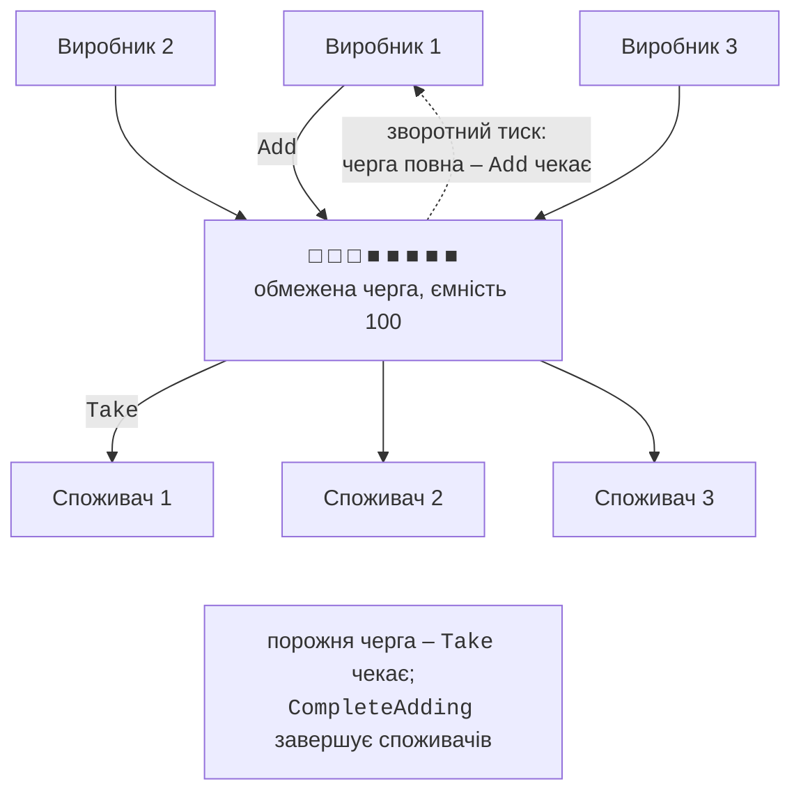
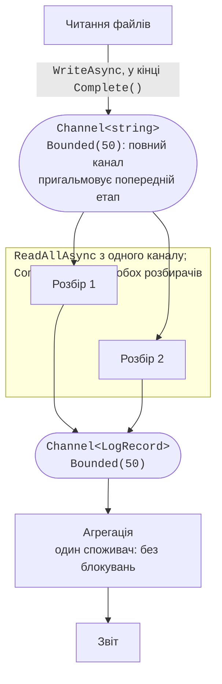

# Патерн «виробник–споживач» і канали

## Колекція BlockingCollection

**`BlockingCollection<T>`** – обгортка над будь-якою колекцією з інтерфейсом `IProducerConsumerCollection<T>` (за замовчуванням `ConcurrentQueue<T>`), яка додає **блокування** та **обмеження ємності**:

- `Add` блокує потік, якщо задано ємність (`boundedCapacity`) і колекція заповнена;
- `Take` блокує потік, поки колекція порожня;
- `CompleteAdding()` повідомляє, що нових елементів не буде; після цього `Add` генерує виняток, а `IsAddingCompleted` дорівнює `true`;
- `IsCompleted` дорівнює `true`, коли додавання завершено й колекція порожня;
- `GetConsumingEnumerable()` повертає послідовність, яка **вилучає** елементи та завершується після `CompleteAdding` і спорожнення колекції;
- `TryAdd` і `TryTake` з тайм-аутом і `CancellationToken` не чекають безкінечно; статичні методи `AddToAny` і `TakeFromAny` працюють з масивом колекцій.

Типове використання показано в прикладі «Черга замовлень». Щоб отримати стек або мішок з блокуванням, вкладену колекцію передають у конструктор: `new BlockingCollection<int>(new ConcurrentStack<int>(), 100)`. `BlockingCollection<T>` реалізує `IDisposable`, тому її звільняють `using`. Її методи блокують **потоки** ОС, тож кожен очікувальний споживач займає потік; в асинхронному коді замість неї використовують канали.

## Патерн «виробник – споживач»

**Патерн «виробник – споживач»** (*producer–consumer*) розділяє програму на частини, які створюють роботу (**виробники**), і частини, які її виконують (**споживачі**). Між ними стоїть потокобезпечна черга (рис. 4.3). Переваги патерну:

- виробники й споживачі не знають одне про одного й працюють з різною швидкістю;
- кількість споживачів підбирають під навантаження та кількість ядер;
- черга згладжує короткочасні сплески навантаження.



Рис. 4.3. Патерн «виробник – споживач» {.caption}

### Обмежена черга та зворотний тиск

Якщо виробники швидші за споживачів, необмежена черга росте, доки не закінчиться пам’ять. **Обмежена** (*bounded*) черга зупиняє виробника, коли заповнена: `Add` чекає, поки споживач звільнить місце. Це **зворотний тиск** (*back pressure*): повільний етап автоматично пригальмовує швидкий. Ємність вибирають так, щоб згладжувати сплески, але не накопичувати мільйони елементів; альтернатива очікуванню – відкидати елементи (див. режими каналів нижче), якщо втрата допустима, наприклад для показів датчиків.

### Коректне завершення

Споживач має знати, коли роботи більше не буде, інакше він чекатиме вічно, а програма не завершиться. Способи:

- **сигнал завершення**: після завершення **всіх** виробників викликати `CompleteAdding()` (`BlockingCollection<T>`) або `Writer.Complete()` (канал); споживачі дочитують залишок і виходять з циклу;
- **«отруйна пігулка»** (*poison pill*): спеціальний елемент (наприклад, `null` або замовлення з `Id = -1`), отримавши який, споживач завершується; для N споживачів потрібно N пігулок, і їх додають після всіх звичайних елементів.

Сигнал завершення надійніший: не потрібно домовлятися про особливе значення та рахувати споживачів. Виклик `CompleteAdding()` одним із кількох виробників – помилка: інші виробники отримають виняток під час `Add`.

### Конвеєр етапів

**Конвеєр** (*pipeline*) – ланцюжок етапів, де споживач одного етапу є виробником для наступного: «читання файлів → розбір рядків → агрегація → звіт». Кожен етап має свою чергу та свою кількість обробників: повільний розбір можна виконувати в кількох потоках, а агрегацію – в одному, без блокувань (рис. 4.4). Після завершення етапу закривають його вихідну чергу, і сигнал завершення по черзі проходить весь конвеєр.

## Канали System.Threading.Channels

**Канал** (*channel*) з простору імен `System.Threading.Channels` – сучасна реалізація патерну «виробник – споживач» для асинхронного коду. Канал `Channel<T>` має дві сторони: `Writer` типу `ChannelWriter<T>` для виробників і `Reader` типу `ChannelReader<T>` для споживачів. Канали входять до спільної бібліотеки .NET і не потребують пакетів NuGet.

```cs
// Необмежений канал: запис завжди миттєвий.
Channel<int> unbounded = Channel.CreateUnbounded<int>();

// Обмежений канал на 100 елементів з параметрами.
Channel<Reading> readings = Channel.CreateBounded<Reading>(
    new BoundedChannelOptions(100)
    {
        FullMode = BoundedChannelFullMode.DropOldest,
        SingleReader = true,       // обіцянка: один споживач
    });
```

Поведінку заповненого обмеженого каналу задає `BoundedChannelFullMode` (табл. 4.2). У режимах відкидання можна передати в `CreateBounded` другий аргумент – делегат `itemDropped`, який отримує кожен відкинутий елемент (наприклад, для підрахунку втрат). Параметри `SingleReader` і `SingleWriter` дозволяють каналу використати простішу й швидшу реалізацію, якщо програма гарантує одного споживача чи виробника.

Таблиця 4.2. Режими BoundedChannelFullMode {.caption}

| **Значення** | **Поведінка при заповненому каналі** |
| --- | --- |
| `Wait` (за замовчуванням) | `WriteAsync` чекає на вільне місце; `TryWrite` одразу повертає `false` |
| `DropNewest` | вилучити **найновіший** елемент каналу й записати новий |
| `DropOldest` | вилучити **найстаріший** елемент каналу й записати новий |
| `DropWrite` | відкинути елемент, який записують |

Основні методи сторін каналу:

- `ChannelWriter<T>`: `TryWrite` (синхронна спроба), `WriteAsync` (асинхронне очікування місця), `WaitToWriteAsync`, `Complete()` і `TryComplete()` (більше записів не буде);
- `ChannelReader<T>`: `TryRead`, `ReadAsync`, `WaitToReadAsync`, `ReadAllAsync()` (асинхронна послідовність усіх елементів до закриття каналу), властивість `Completion`.

Запис у закритий канал генерує `ChannelClosedException`. Як і для `CompleteAdding`, з кількома виробниками `Complete()` викликають лише після завершення **всіх**.

### Мінімум про await

Методи каналів асинхронні: вони повертають `ValueTask`, а результат отримують оператором `await`. На відміну від `Take` у `BlockingCollection<T>`, `await reader.ReadAsync()` **не блокує потік**: поки даних немає, потік повертається в пул і виконує іншу роботу, а після появи елемента метод продовжується. Цикл `await foreach` перебирає асинхронну послідовність `ReadAllAsync()`. Метод `Task.Run(async () => …)` запускає асинхронний етап у пулі потоків, а `await Task.WhenAll(tasks)` чекає на завершення кількох етапів. Детально задачі та `async/await` розглядаються в темі 5; для конвеєрів на каналах цього мінімуму достатньо (приклад «Конвеєр журналів» нижче).



Рис. 4.4. Конвеєр на каналах {.caption}

`BlockingCollection<T>` добре підходить для програм на звичайних потоках (тема 2), а канали – для асинхронних застосунків: вебсерверів, служб, конвеєрів з введенням-виведенням, де тисячі очікувальних споживачів не повинні займати тисячі потоків.
