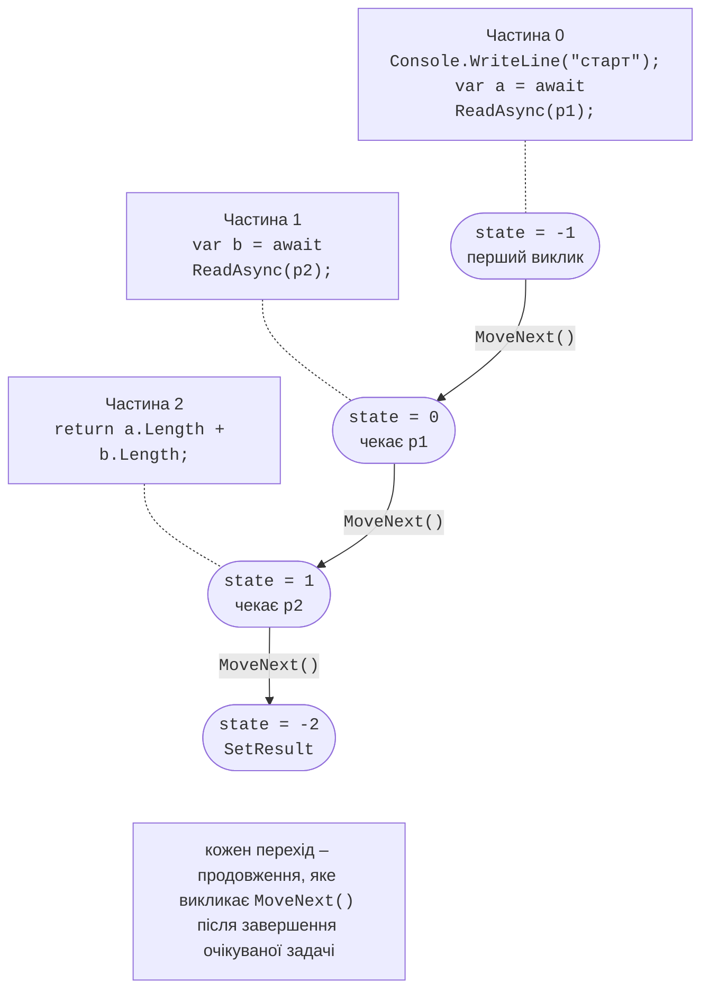

# Модель async/await

## Модель `async`/`await`

Ключове слово `async` дозволяє використовувати в методі оператор `await`. Такий метод повертає `Task`, `Task<TResult>`, `ValueTask`, `ValueTask<TResult>` або `IAsyncEnumerable<T>` (для обробників подій – `void`). Оператор `await task`:

1. перевіряє, чи задача вже завершена; якщо так, виконання продовжується синхронно;
2. якщо ні – реєструє **продовження** (решту методу) і **повертає керування** викликальникові разом із незавершеною задачею;
3. коли задача завершиться, продовження виконується, а `await` повертає результат або кидає виняток.

Посібник: <https://learn.microsoft.com/dotnet/csharp/asynchronous-programming/>.

### Машина станів

Компілятор перетворює `async`-метод на **машину станів** (*state machine*): структуру (у конфігурації Release) або клас (у Debug) з методом `MoveNext()`. Код методу ділиться на частини в точках `await`, поле `<>1__state` зберігає номер точки, у якій метод чекає, а локальні змінні, потрібні після `await`, стають полями (рис. 5.5). Кожне продовження – це повторний виклик `MoveNext()`, який переходить до наступної частини.



Рис. 5.5. Перетворення async-методу компілятором {.caption}

Згенерований код можна переглянути в Rider: *Tools → IL Viewer*, режим *Low-Level C#* на панелі інструментів вікна (рис. 5.6). Для методу `ReadAsync` компілятор створює вкладений тип `<ReadAsync>d__0` з полями `<>1__state`, `<>t__builder` і `<>u__1` (очікувач задачі). Опис вікна: <https://www.jetbrains.com/help/rider/Viewing_Intermediate_Language.html>.

::: info Знімок екрана
Rider: caret in `ReadAsync`, Tools → IL Viewer, toolbar mode Low-Level C#; visible struct `<ReadAsync>d__0` with `MoveNext` and field `<>1__state`
:::

Рис. 5.6. Згенерована машина станів у IL Viewer {.caption}

### Контекст синхронізації та `ConfigureAwait`

Де виконається продовження після `await`? Оператор запам’ятовує поточний `SynchronizationContext` (або планувальник задач, якщо він не стандартний):

- у WPF, WinForms, MAUI контекст повертає продовження в потік інтерфейсу, тому після `await` можна змінювати елементи вікна;
- у консольних програмах, службах і ASP.NET Core контексту немає (властивість `SynchronizationContext.Current` дорівнює `null`), і продовження виконується на будь-якому потоці пулу. Тому до і після `await` значення `Environment.CurrentManagedThreadId` часто різне.

Виклик `await task.ConfigureAwait(false)` вказує не повертатися в захоплений контекст. Бібліотечний код, що не працює з інтерфейсом, використовує `ConfigureAwait(false)`: це трохи швидше і знімає ризик взаємоблокування, якщо хтось викличе бібліотеку синхронно через `Result`. У коді застосунку (обробники кнопок) `ConfigureAwait(false)` не пишуть, бо після `await` потрібен потік інтерфейсу. Починаючи з .NET 8, перевантаження з `ConfigureAwaitOptions` дає додаткові режими, наприклад `ForceYielding` (завжди звільнити потік) і `SuppressThrowing`.

### Обчислювальні операції та операції вводу-виводу

`async` не робить код паралельним і не створює потоків. Важливо розрізняти два види роботи (рис. 5.7):

- **операції вводу-виводу** (*I/O-bound*): читання файлів, мережа, бази даних. Під час очікування жоден потік не потрібен: драйвер повідомляє про завершення через порт завершення вводу-виводу, і лише тоді продовження займає потік пулу. Для них використовують асинхронні методи бібліотеки (`ReadAllTextAsync`, `GetAsync`) і `await`;
- **обчислювальні операції** (*CPU-bound*): вони займають процесор увесь час. Щоб не блокувати викликальника, їх запускають через `await Task.Run(...)`, а для прискорення розбивають на частини (тема 6).

```mermaid
gantt
  dateFormat x
  axisFormat %S
  tickInterval 1second
  section Синхронно: потік 4 зайнятий увесь час
    обчислення : 300, 700ms
    чекає I/O (заблокований потік) : 1000, 2600ms
    обчислення : 3600, 700ms
    чекає I/O (заблокований потік) : 4300, 2600ms
    обчислення : 6900, 700ms
    чекає I/O (заблокований потік) : 7600, 2600ms
    обчислення : 10200, 600ms
  section Асинхронно: потік зайнятий лише під час обчислень
    потік 4 : 300, 700ms
    потік у пулі (очікування без потоку) : 1000, 2600ms
    потік 7 : 3600, 700ms
    потік у пулі (очікування без потоку) : 4300, 2600ms
    потік 5 : 6900, 700ms
    потік у пулі (очікування без потоку) : 7600, 2600ms
    потік 4 : 10200, 600ms
```



Рис. 5.7. Синхронне й асинхронне очікування вводу-виводу {.caption}

Сервер, що обробляє 10 000 одночасних запитів з очікуванням бази даних, у синхронному варіанті потребував би 10 000 заблокованих потоків (гігабайти стеків), а в асинхронному обходиться кількома десятками потоків пулу.

## `ValueTask`, асинхронні потоки та `PeriodicTimer`

### `ValueTask<TResult>`

`Task<TResult>` – клас, тому кожен виклик асинхронного методу виділяє об’єкт у купі. Якщо метод здебільшого завершується синхронно (наприклад, значення вже в кеші або в буфері), цей об’єкт зайвий. Структура `ValueTask<TResult>` містить або готовий результат (`ValueTask.FromResult(value)` без виділення пам’яті), або посилання на задачу, якщо значення доведеться чекати.

Обмеження `ValueTask`: його можна очікувати **лише один раз**, не можна очікувати одночасно з кількох місць і не можна читати `Result` до завершення. Якщо потрібні комбінатори (`WhenAll`), його перетворюють методом `AsTask()`. За замовчуванням у власних API повертають `Task`; `ValueTask` обирають, коли вимірювання показують, що виділення пам’яті є проблемою.

### `IAsyncEnumerable<T>` і `await foreach`

**Асинхронний потік** (*async stream*) – послідовність, елементи якої з’являються з часом: показники датчика, рядки великого файла, сторінки відповіді сервера. Метод-генератор оголошують як `async IAsyncEnumerable<T>` і повертають елементи через `yield return`, а споживач перебирає їх циклом `await foreach`. Токен скасування потрапляє в генератор через параметр з атрибутом `[EnumeratorCancellation]` і метод `WithCancellation(token)`. Повний приклад генератора з `PeriodicTimer` наведено в лабораторній роботі 5. Опис: <https://learn.microsoft.com/dotnet/csharp/asynchronous-programming/generate-consume-asynchronous-stream>.

Інтерфейс `IAsyncDisposable` з методом `DisposeAsync()` дає змогу асинхронно звільнити ресурс, який під час закриття записує дані (потоки файлів, мережеві з’єднання). Його використовують через `await using`.

### `PeriodicTimer`

`PeriodicTimer` (.NET 6 і новіші) – таймер для асинхронних циклів. Метод `WaitForNextTickAsync(token)` повертає `ValueTask<bool>`, що завершується на кожному тіку, а після `Dispose()` – повертає `false`. На відміну від `System.Threading.Timer`, обробник не викликається повторно, поки попередня ітерація не завершилася, і не потрібно блокування:

```cs
using PeriodicTimer timer = new(TimeSpan.FromSeconds(1));
while (await timer.WaitForNextTickAsync(token))
{
    await PollSensorsAsync(token);   // ітерації не перекриваються
}
```

## `TaskCompletionSource<T>`: перетворення подій на задачі

Не кожна асинхронна операція має метод `…Async`. Старі API повідомляють про завершення подією або зворотним викликом. Клас `TaskCompletionSource<T>` (TCS) створює задачу, стан якої задають вручну: `TrySetResult(value)`, `TrySetException(ex)`, `TrySetCanceled()`. Задача `tcs.Task` перебуває в стані `WaitingForActivation`, доки один із методів не буде викликано; далі її можна очікувати `await`, поєднувати з `WhenAny` і `WaitAsync`.

Параметр `RunContinuationsAsynchronously` бажано вказувати завжди: інакше продовження `await tcs.Task` виконається синхронно всередині `TrySetResult`, тобто в потоці, що згенерував подію, і може надовго його затримати. Методи `Try…` не кидають винятку, якщо задачу вже завершено (подія могла надійти двічі). Повний приклад із `FileSystemWatcher` наведено в розділі «Приклади програм».
