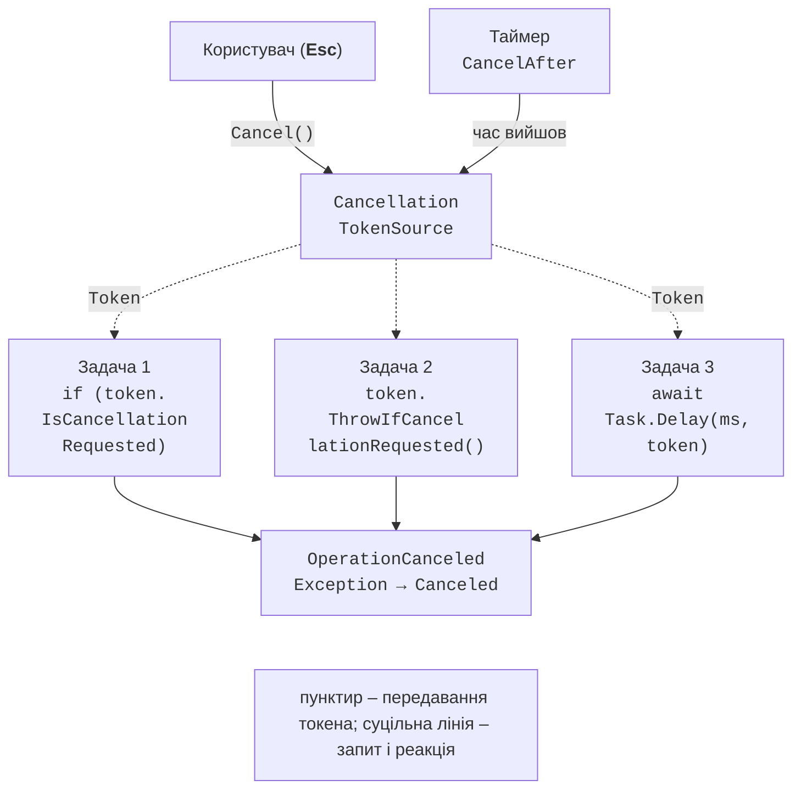

# Винятки, скасування та таймаути

## Обробка винятків

Виняток, не оброблений усередині задачі, не завершує процес одразу: TPL перехоплює його та зберігає в задачі, яка переходить у стан `Faulted`. Виняток «повертається» в код, що очікує задачу. Документація: <https://learn.microsoft.com/dotnet/standard/parallel-programming/exception-handling-task-parallel-library>.

Оскільки задача може зібрати кілька винятків (дочірні задачі, `WhenAll` для кількох задач), її властивість `Exception` має тип `AggregateException`, а окремі винятки лежать у колекції `InnerExceptions`. Поведінка очікування відрізняється:

- `Wait()`, `Result`, `WaitAll` кидають `AggregateException` з усіма винятками;
- `await` кидає **перший** внутрішній виняток, щоб звичайний `catch (IOException)` працював так само, як у синхронному коді. Щоб побачити всі винятки після `await Task.WhenAll(...)`, читають властивість `Exception` задачі, яку повернув `WhenAll`.

```cs
Task all = Task.WhenAll(tasks);
try
{
    await all;
}
catch (Exception first)
{
    Console.WriteLine($"перший: {first.Message}");
    foreach (Exception ex in all.Exception!.InnerExceptions)
    {
        Console.WriteLine($"  {ex.GetType().Name}: {ex.Message}");
    }
}
```

У налагоджувачі Rider виняток задачі зупиняє програму в місці `await`, а у вкладці *Threads & Variables* видно вміст `InnerExceptions` (рис. 5.3).

::: info Знімок екрана
Rider: Run → Debug the statistics example with two failing parts; exception popup at `await all` and Threads & Variables with `all.Exception.InnerExceptions` expanded (2 items)
:::

Рис. 5.3. Виняток `AggregateException` у налагоджувачі Rider {.caption}

### Методи `Flatten` і `Handle`

Для дочірніх задач `AggregateException` утворює дерево: виняток батьківської задачі містить `AggregateException` кожної дочірньої. Метод `Flatten()` повертає новий виняток з плоским списком усіх внутрішніх винятків. Метод `Handle(predicate)` викликає умову для кожного внутрішнього винятку; винятки, для яких умова повернула `true`, вважаються обробленими, а з решти створюється й кидається новий `AggregateException`:

```cs
try
{
    // батько кинув InvalidOperationException,
    // дві дочірні задачі – FormatException та IOException
    parent.Wait();
}
catch (AggregateException ae)
{
    Console.WriteLine(ae.InnerExceptions.Count);    // 3
    AggregateException flat = ae.Flatten();  // плоский список
    flat.Handle(ex => ex is IOException or FormatException);
    // Handle кидає новий AggregateException
    // з необробленим InvalidOperationException
}
```

### Незаспостережені винятки

Якщо задачу з винятком ніхто не очікує і не читає її `Exception`, виняток залишається **незаспостереженим** (*unobserved*). Починаючи з .NET Framework 4.5, це не завершує процес: коли збирач сміття фіналізує таку задачу, виникає подія `TaskScheduler.UnobservedTaskException`. Її використовують для журналювання (обробник може викликати `e.SetObserved()`), а не як спосіб обробки.

Подія спрацьовує не одразу, а лише після збирання сміття, тому помилки «забутих» задач легко пропустити. Кожну запущену задачу слід очікувати або явно обробляти її винятки.

## Кооперативне скасування

У .NET потік чи задачу не можна безпечно «вбити» ззовні: операція могла б залишити дані в неузгодженому стані. Замість цього використовується **кооперативне скасування** (*cooperative cancellation*): код, що ініціює скасування, лише **просить** зупинитися, а сама операція періодично перевіряє запит і коректно завершує роботу (рис. 5.4). Документація: <https://learn.microsoft.com/dotnet/standard/threading/cancellation-in-managed-threads>.



Рис. 5.4. Кооперативне скасування {.caption}

Учасники механізму:

- `CancellationTokenSource` – джерело скасування; метод `Cancel()` (або `CancelAsync()`) надсилає запит, `CancelAfter(TimeSpan)` робить це за таймером; джерело реалізує `IDisposable`;
- `CancellationToken` – легка структура-«квиток», яку передають в операції; сам токен не може скасувати операцію, лише перевірити запит: `IsCancellationRequested`, `ThrowIfCancellationRequested()`;
- `Register(callback)` – реєстрація дії, яка виконається під час скасування (наприклад, закрити сокет чи зупинити сервер);
- `OperationCanceledException` (і похідний `TaskCanceledException`) – стандартний спосіб повідомити, що операцію скасовано.

```cs
static long CountPrimes(int limit, CancellationToken token)
{
    long count = 0;
    for (int n = 2; n <= limit; n++)
    {
        if (n % 10_000 == 0)
        {
            token.ThrowIfCancellationRequested();  // точка перевірки
        }
        if (IsPrime(n)) count++;
    }
    return count;
}

using CancellationTokenSource cts = new();
cts.CancelAfter(TimeSpan.FromSeconds(2));
Task<long> task = Task.Run(() => CountPrimes(50_000_000, cts.Token),
    cts.Token);
```

Точки перевірки розміщують так, щоб між ними минало не більше десятків мілісекунд, але не в кожній короткій ітерації. Бібліотечні асинхронні методи (`Task.Delay`, `File.ReadAllTextAsync`, `HttpClient.GetAsync`, `SemaphoreSlim.WaitAsync`) приймають токен і самі кидають `OperationCanceledException`.

### Стан `Canceled` чи `Faulted`

Задача переходить у стан `Canceled`, якщо вона кинула `OperationCanceledException` **з тим самим токеном**, який передано в `Task.Run(..., token)`. Якщо токен у `Task.Run` не передано, той самий виняток переведе задачу в стан `Faulted`. Крім того, якщо токен скасовано ще до запуску, задача з токеном узагалі не почне виконуватися. Для `async`-методів стан `Canceled` встановлюється для будь-якого `OperationCanceledException`, що вийшов з методу.

Під час очікування скасування перехоплюють окремим блоком `catch (OperationCanceledException)`. Фільтр `when (cts.IsCancellationRequested)` відрізняє «наше» скасування від таймауту всередині бібліотеки.

### Пов’язані токени

Часто операцію треба скасувати з кількох причин: користувач натиснув **Esc**, минув загальний таймаут або завершується весь застосунок. Метод `CancellationTokenSource.CreateLinkedTokenSource(token1, token2)` створює джерело, скасоване, щойно скасовано будь-який із вихідних токенів. Пов’язане джерело обов’язково звільняють (`using`), інакше воно залишається зареєстрованим у батьківських токенах.

## Прогрес і таймаути

Тривала операція повинна повідомляти про хід виконання. Стандартний інтерфейс – `IProgress<T>` з єдиним методом `Report(T value)`. Операція приймає `IProgress<T>?` і не знає, як саме відображається прогрес: у консолі, в індикаторі вікна чи в журналі.

Клас `Progress<T>` під час створення запам’ятовує поточний `SynchronizationContext` і викликає обробник через нього: у WPF чи WinForms обробник виконується в потоці інтерфейсу, тому може змінювати елементи вікна. У консольній програмі контексту немає, і обробники ставляться в пул потоків, тобто можуть виконуватися **паралельно й не по порядку**. Під час перевірки на i9-11900KF п’ять викликів `Report(0)`…`Report(4)` вивели значення в порядку 0, 3, 2, 1, 4 з різних потоків. Тому в консольних програмах зручно реалізувати `IProgress<T>` власним класом, який виводить повідомлення одразу (приклад «Хешування файлів зі скасуванням»).

Таймаут без окремого джерела скасування задає метод `WaitAsync(TimeSpan)`: він повертає задачу, яка завершиться разом з вихідною або кине `TimeoutException`, якщо час вийшов: `await File.ReadAllTextAsync(path).WaitAsync(TimeSpan.FromSeconds(3))`.

`WaitAsync` припиняє лише **очікування**: сама операція продовжує виконуватися. Якщо її треба зупинити, у неї передають токен джерела з `CancelAfter`.
